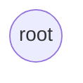
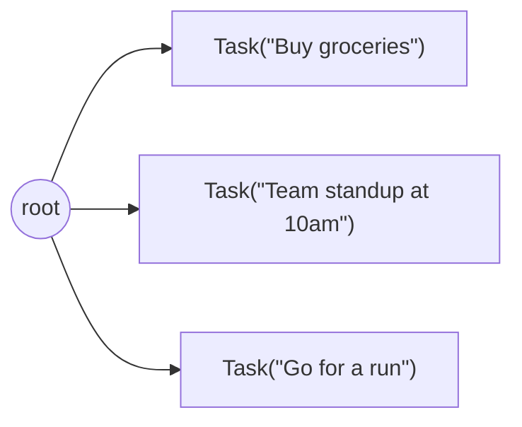
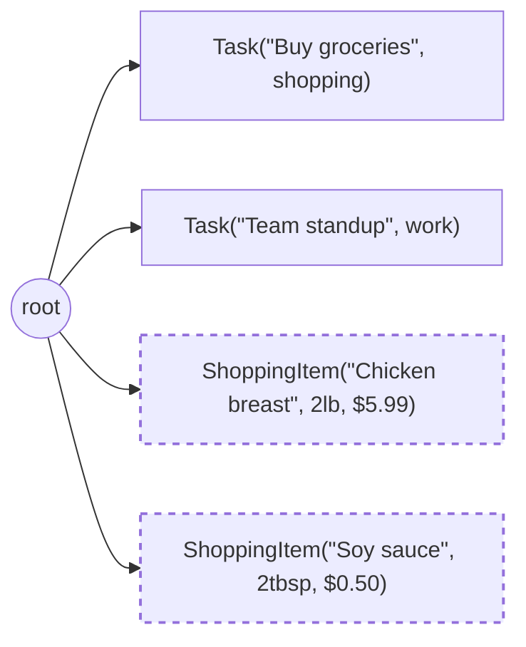
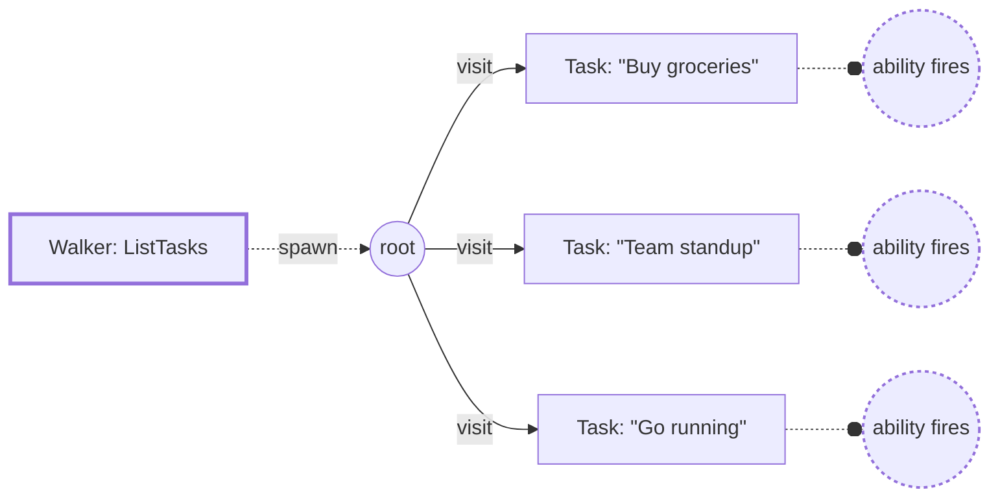

# Build an AI Day Planner with Jac

In this tutorial, you'll build a full-stack AI day planner from scratch -- a single application that manages daily tasks (auto-categorized by AI) and generates meal shopping lists from natural language descriptions. Each part introduces new concepts incrementally, so by the end you'll have hands-on experience with every major feature of the Jac programming language.

**Prerequisites:** [Installation](../../quick-guide/install.md) complete.

**Required Packages:** This tutorial uses **jaclang**, **jac-client**, **jac-scale**, and **byllm**. Install everything at once with:

```bash
pip install jaseci
```

Verify your versions meet the minimum requirements:

```bash
jac --version
pip show jac-client jac-scale byllm
```

| Package | Minimum Version |
|---------|----------------|
| jaclang | 0.11.0 |
| jac-client | 0.3.0 |
| jac-scale | 0.2.0 |
| byllm | 0.5.0 |

**API Key:** Parts 5+ use AI features powered by Anthropic's Claude. Set your API key as an environment variable before running those sections:

```bash
export ANTHROPIC_API_KEY="your-key-here"
```

The tutorial is split into seven parts. Each builds on the last:

| Part | What You'll Build | Key Concepts |
|------|-------------------|--------------|
| [1](#part-1-your-first-lines-of-jac) | [Hello World](#part-1-your-first-lines-of-jac) | Syntax basics, types, functions |
| [2](#part-2-modeling-data-with-nodes) | [Task data model](#part-2-modeling-data-with-nodes) | Nodes, graphs, root, edges |
| [3](#part-3-building-the-backend-api) | [Backend API](#part-3-building-the-backend-api) | `def:pub`, imports, collections, list comprehensions |
| [4](#part-4-a-reactive-frontend) | [Working frontend](#part-4-a-reactive-frontend) | Client-side code, lambdas, JSX, reactive state |
| [5](#part-5-making-it-smart-with-ai) | [AI features](#part-5-making-it-smart-with-ai) | `by llm()`, `obj`, `sem`, structured output |
| [6](#part-6-authentication-and-multi-file-organization) | [Authentication](#part-6-authentication-and-multi-file-organization) | Login, signup, `def:priv`, per-user data, multi-file |
| [7](#part-7-object-spatial-programming-with-walkers) | [Walkers & OSP](#part-7-object-spatial-programming-with-walkers) | Walkers, abilities, graph traversal |

---

## Part 1: Your First Lines of Jac

Before building anything complex, it's important to get comfortable with Jac's syntax. Jac is a programming language whose compiler can generate Python bytecode, ES JavaScript, and native binaries. Its design is rooted in Python, so if you have Python experience, much of Jac will feel familiar -- but there are deliberate differences: curly braces replace indentation for block scoping, semicolons terminate statements, and the language has built-in support for graphs, AI, and full-stack web development. **The goal** of this section is to give you a solid foundation in the basics so that everything that follows feels natural.

**Hello, World**

Create a file called `hello.jac`:

```jac
with entry {
    print("Hello, World!");
}
```

Run it:

```bash
jac hello.jac
```

In Jac, any free-floating code in a module must live inside a `with entry { }` block. These blocks execute when you run a `.jac` file as a script, and also at the point it's imported -- similar to top-level code in Python. The reason Jac requires this explicit demarcation is an important design principle: code that runs once on module load is a common source of subtle bugs in larger programs. By making it visually distinct, Jac ensures you're always intentional about side effects at the module level.

!!! info "Why `with entry`?"
    Python was originally designed as a replacement for bash, and its initial version didn't even have import statements. Jac slightly discourages mistakes stemming from free-floating module code by making it an intentional, visible choice in the language.

**Variables and Types**

Understanding Jac's type system is essential for everything that follows, especially the AI features in later parts. Jac has four basic scalar types: `str`, `int`, `float`, and `bool`. When you declare a variable with an explicit type, a type annotation is required:

```jac
with entry {
    name: str = "My Day Planner";
    version: int = 1;
    rating: float = 4.5;
    ready: bool = True;

    # Type can be inferred from the value
    greeting = f"Welcome to {name} v{version}!";
    print(greeting);
}
```

Jac supports **f-strings** for string interpolation (just like Python), **comments** with `#`, and introduces **block comments** with `#* ... *#`:

```jac
# This is a line comment

#* This is a
   block comment *#
```

**Functions**

Functions in Jac use the familiar `def` keyword. A key difference from Python is that both parameters and return values require type annotations. This strictness pays off later -- when you delegate functions to an LLM in Part 5, the type signatures become the specification that guides the AI's output:

```jac
def greet(name: str) -> str {
    return f"Good morning, {name}! Let's plan your day.";
}

def add(a: int, b: int) -> int {
    return a + b;
}

with entry {
    print(greet("Alice"));
    print(add(2, 3));  # 5
}
```

Functions that don't return a value use `-> None` (or you can omit the return type annotation entirely).

**Control Flow**

Jac uses curly braces `{}` for all blocks, which means indentation is purely cosmetic -- there's no significant whitespace. This is a deliberate departure from Python that eliminates an entire class of formatting bugs:

```jac
def check_time(hour: int) -> str {
    if hour < 12 {
        return "Good morning!";
    } elif hour < 17 {
        return "Good afternoon!";
    } else {
        return "Good evening!";
    }
}

with entry {
    # For loop over a list
    tasks = ["Buy groceries", "Team standup", "Go running"];
    for task in tasks {
        print(f"- {task}");
    }

    # Range-based loop
    for i in range(5) {
        print(i);  # 0, 1, 2, 3, 4
    }

    # While loop
    count = 3;
    while count > 0 {
        print(f"Countdown: {count}");
        count -= 1;
    }

    # Ternary expression
    hour = 10;
    mood = "energized" if hour < 12 else "tired";
    print(mood);
}
```

Jac provides two pattern-matching constructs, each designed for a different purpose. **`switch`/`case`** is for classic simple value matching -- there's no fall-through and no `break` needed, which avoids a common source of bugs in C-family languages:

```jac
def categorize(fruit: str) -> str {
    switch fruit {
        case "apple":
            return "pome";
        case "banana" | "plantain":
            return "berry";
        default:
            return "unknown";
    }
}
```

**`match`/`case`**, on the other hand, is for Python-style structural pattern matching -- use it when you need to destructure values or match more complex patterns:

```jac
def describe(value: any) -> str {
    match value {
        case 0:
            return "zero";
        case 1 | 2 | 3:
            return "small number";
        case _:
            return "something else";
    }
}
```

**Classes and Objects**

Since Jac's design is based on Python, it supports Python-style classes directly with the `class` keyword. This is a good starting point if you're coming from Python, but pay attention to what comes after -- Jac offers a better alternative:

```jac
class Animal {

    # __init__ works here too
    def init(self: Animal, name: str, sound: str) {
        self.name = name;
        self.sound = sound;
    }

    def speak(self: Animal) -> str {
        return f"{self.name} says {self.sound}!";
    }
}

with entry {
    dog = Animal("Rex", "Woof");
    print(dog.speak());  # Rex says Woof!
}
```

This works, but notice the boilerplate: you must write `self` in every method signature, and the `init` method manually assigns each parameter to an instance variable. This repetitive pattern is exactly the kind of ceremony that slows down development. Jac addresses this with **`obj`** -- a first-class construct where fields declared with `has` are automatically initialized (like a dataclass), and `self` is implicitly available in methods without being listed in parameters.

!!! note "Why `obj`?"
    Python's `dataclass` decorator was an admission that traditional classes have too much boilerplate for simple data types. Jac's `obj` builds this idea into the language itself. For a deeper dive, see [Dataclasses: Python's Admission That Classes Are Broken](https://www.mars.ninja/blog/2025/10/25/dataclasses-and-jac-objects/).

```jac
obj Animal {
    has name: str,
        sound: str;

    def speak -> str {
        return f"{self.name} says {self.sound}!";
    }
}

with entry {
    dog = Animal(name="Rex", sound="Woof");
    print(dog.speak());  # Rex says Woof!
}
```

Take a moment to compare the two versions. With `obj`, you don't write `self` in method signatures -- it's always available inside the body. Fields listed in `has` become constructor parameters automatically, so there's no `init` method to write for simple cases. This isn't just syntactic sugar -- it's a design philosophy: the less ceremony around data types, the more clearly your code expresses its intent. Throughout this tutorial, we'll use `obj` for plain data types and `node` (introduced in Part 2) for data that lives in the graph.

**What You Learned**

- **`with entry { }`** -- program entry point
- **Types**: `str`, `int`, `float`, `bool`
- **`def`** -- function declaration with typed parameters and return types
- **Control flow**: `if` / `elif` / `else`, `for`, `while`, `switch`, `match` -- all with braces
- **`class`** -- Python-style classes with explicit `self`
- **`obj`** -- Jac data types with `has` fields and implicit `self`
- **`#`** -- line comments (`#* block comments *#`)
- **f-strings** -- string interpolation with `f"...{expr}..."`
- **Ternary** -- `value if condition else other`

For a quick reference of all Jac syntax, see the [Syntax Cheatsheet](../../quick-guide/syntax-cheatsheet.md).

!!! example "Try It Yourself"
    Write a `plan_day` function that takes a list of task names and an `hour: int`, and returns a formatted string like `"Good morning! Today's tasks: Buy groceries, Go running"`. Use `check_time` for the greeting and a `for` loop to build the task list.

---

## Part 2: Modeling Data with Nodes

In most programming languages, data lives in one of a few places: local variables, object instances in memory, or rows in a database. Each has trade-offs -- variables are temporary, objects require manual serialization to persist, and databases demand configuration, schemas, and query languages. Jac introduces a fundamentally different option: **nodes** that live in a **graph** and persist automatically. There's no database to set up, no ORM to configure, and no SQL to write. **The goal** of this section is to help you understand graphs as a first-class citizen of the language and see how the traditional database layer can disappear entirely.

**What is a Node?**

A node is structurally similar to an `obj` -- it's declared with the `node` keyword and its fields use `has`, just like you learned in Part 1. The difference is what the runtime does with it:

```jac
node Task {
    has id: str,
        title: str,
        done: bool = False;
}
```

The syntax looks almost identical to an `obj`, but nodes have a crucial additional capability: they can be connected to other nodes with **edges** (also `obj`-style classes), forming a graph. Think about the difference this makes. In traditional programming, objects exist independently in memory -- relationships between them must be maintained manually through references, foreign keys, or join tables. In Jac, relationships are structural. Objects are connected, and those connections form first-class graphs in the language.

This becomes especially powerful when coupled with one more abstraction: the self-referential `root`.

**The Root Node and the Graph**

Every Jac program has a built-in `root` node -- the entry point of the graph. This is a concept worth pausing on, because it's central to how Jac works. Just as `self` in an object method is a self-referential pointer to the *current instance*, `root` is a self-referential pointer to the *current runner* of the program -- whether that's you executing a script or an authenticated user making a request. And like `self`, `root` is ambiently available everywhere; you never import or declare it, it's just there in every code block. Think of it as the top of a tree of everything that should persist:



Here's the key insight: any node connected to `root` (directly or through a chain of edges) is **persistent** -- it survives across requests, program runs, and server restarts. You don't configure a database or write SQL; connecting a node to `root` *is* the declaration that it should be saved. This is a fundamentally different model from traditional persistence, where you explicitly serialize data to a database. In Jac, persistence is a property of graph connectivity. Nodes that are *not* reachable from `root` behave like regular objects -- they live in memory for the duration of the current execution and are then garbage collected, though you can still connect them to other nodes for utility while they exist.

When your app serves multiple users, each user gets their **own isolated `root`**. User A's tasks and User B's tasks live in completely separate graphs -- same code, isolated data, enforced by the runtime. Connections *between* user graphs are possible when explicitly created, but by default each user's `root` is a private, independent entry point. We'll see this in action in [Part 6](#part-6-authentication-and-multi-file-organization) when we add authentication.

Now that you understand the concept, let's see it in practice by creating nodes and connecting them with edges.

**Creating and Connecting Nodes**

The `++>` operator creates a node and connects it to an existing node with an edge. This single operator does what would typically require multiple steps in traditional code: instantiating an object, saving it to a database, and creating a foreign key relationship:

```jac
node Task {
    has id: str,
        title: str,
        done: bool = False;
}

with entry {
    # Create tasks and connect them to root
    root ++> Task(id="1", title="Buy groceries");
    root ++> Task(id="2", title="Team standup at 10am");
    root ++> Task(id="3", title="Go for a run");

    print("Created 3 tasks!");
}
```

Run it with `jac <your-filename>.jac`. Your graph now looks like:

!!! tip "Running examples multiple times"
    Nodes connected to `root` persist between runs. If you run an example again, you'll see duplicate data. To start fresh, run `jac clean --all` to clear the graph database.



The `++>` operator returns a list containing the newly created node. You can capture it:

<!-- jac-skip -->
```jac
result = root ++> Task(id="1", title="Buy groceries");
task = result[0];  # The new Task node
print(task.title);  # "Buy groceries"
```

**Filter Comprehensions**

Before querying the graph, it's worth learning a Jac feature that works on *any* collection of objects, not just graph queries: **filter comprehensions**. Understanding this distinction is important -- filter comprehensions are a general-purpose tool that happens to work beautifully with graph queries. The `(?...)` syntax filters a list by field conditions, and `(?:Type)` filters by type:

```jac
obj Dog { has name: str, age: int; }
obj Cat { has name: str, age: int; }

with entry {
    pets: list = [
        Dog(name="Rex", age=5),
        Cat(name="Whiskers", age=3),
        Dog(name="Buddy", age=2)
    ];

    # Filter by type -- keep only Dogs
    dogs = pets(?:Dog);
    print(dogs);  # [Dog(name='Rex', age=5), Dog(name='Buddy', age=2)]

    # Filter by field condition
    young = pets(?age < 4);
    print(young);  # [Cat(name='Whiskers', age=3), Dog(name='Buddy', age=2)]

    # Combined type + field filter
    young_dogs = pets(?:Dog, age < 4);
    print(young_dogs);  # [Dog(name='Buddy', age=2)]
}
```

This works on any list of objects -- not just graph queries. That's important for what comes next.

**Querying the Graph**

Now here's where the two concepts come together. The `[-->]` syntax gives you a list of connected nodes -- and because filter comprehensions work on any list, they apply to graph queries seamlessly:

```jac
with entry {
    root ++> Task(id="1", title="Buy groceries");
    root ++> Task(id="2", title="Team standup at 10am");

    # Get ALL nodes connected from root
    everything = [root-->];

    # Filter by node type -- same (?:Type) syntax
    tasks = [root-->](?:Task);
    for task in tasks {
        status = "done" if task.done else "pending";
        print(f"[{status}] {task.title}");
    }

    # Filter by field value
    grocery_tasks = [root-->](?:Task, title == "Buy groceries");
}
```

`[root-->]` reads as "all nodes connected *from* root." The `(?:Task)` filter keeps only nodes of type `Task`. Notice the elegance of this design: there's nothing special about graph queries. `[-->]` returns a plain list, and `(?...)` filters it, using the same mechanism it uses on any collection. This composability -- where general-purpose features combine naturally -- is a recurring theme in Jac.

Other directions work too:

- `[node-->]` -- outgoing connections (forward)
- `[node<--]` -- incoming connections (backward)
- `[node<-->]` -- both directions

**Deleting Nodes**

Use `del` to remove a node from the graph:

<!-- jac-skip -->
```jac
for task in [root-->](?:Task) {
    if task.id == "2" {
        del task;
    }
}
```

**Debugging Tip**

You can inspect the graph at any time by printing connected nodes:

<!-- jac-skip -->
```jac
print([root-->]);           # All nodes connected to root
print([root-->](?:Task));   # Just Task nodes
```

This is useful when data isn't appearing as expected.

??? info "Advanced: Custom Edges"
    So far, the edges between nodes are generic -- they just mean "connected." Jac also supports **typed edges** with their own data:

    ```jac
    edge Scheduled {
        has time: str,
            priority: int = 1;
    }
    ```

    Connect with a typed edge using `+>: EdgeType :+>`:

    ```jac
    root +>: Scheduled(time="9:00am", priority=3) :+> Task(id="1", title="Morning run");
    ```

    And filter queries by edge type:

    ```jac
    scheduled_tasks = [root->:Scheduled:->](?:Task);
    urgent = [root->:Scheduled:priority>=3:->](?:Task);
    ```

    We won't use custom edges in this tutorial (default edges are sufficient), but they're useful for modeling relationships like social networks, org charts, and dependency graphs.

**What You Learned**

- **`node`** -- a persistent data type that lives in the graph
- **`has`** -- declares fields with types and optional defaults
- **`root`** -- the built-in entry point of the graph, self-referential to the current runner
- **`++>`** -- create a node and connect it with an edge
- **`(?condition)`** -- filter comprehensions on any list of objects
- **`(?:Type)`** -- typed filter comprehension, works on any collection
- **`(?:Type, field == val)`** -- combined type and field filtering
- **`[root-->]`** -- query all connected nodes (returns a list, filterable like any other)
- **`del`** -- remove a node from the graph

!!! example "Try It Yourself"
    After creating three tasks, mark one as done (`task.done = True`), then use `[root-->](?:Task, done == False)` to list only pending tasks. Verify that the completed task doesn't appear.

---

## Part 3: Building the Backend API

With the fundamentals of Jac syntax and graph data in place, you're now ready to build something practical. In this part, you'll create HTTP endpoints that manage tasks -- and you'll see how Jac eliminates the boilerplate that typically comes with web frameworks: no route decorators, no serializers, no request/response handling code.

**Create the Project**

```bash
jac create day-planner --use client
cd day-planner
```

You can delete the scaffolded `main.jac` -- you'll replace it with the code below. Also create a `styles.css` file in the project root (we'll fill it in Part 4).

**Imports**

An important feature of Jac is full interoperability with the Python ecosystem. You can import any Python package -- from the standard library or from PyPI. Here, we need `uuid` for generating unique task IDs:

```jac
import from uuid { uuid4 }
```

The syntax is `import from module { names }` -- it imports `uuid4` from Python's standard library `uuid` module. You can import anything from PyPI the same way.

**def:pub -- Functions as Endpoints**

This is one of the most powerful ideas in Jac. Simply mark a function `def:pub` and the compiler automatically generates an HTTP endpoint for it -- complete with request parsing, response serialization, and API documentation:

```jac
"""Add a task and return it."""
def:pub add_task(title: str) -> dict {
    task = root ++> Task(id=str(uuid4()), title=title);
    return {"id": task[0].id, "title": task[0].title, "done": task[0].done};
}
```

That single annotation transforms the function into two things simultaneously:

- A server-side function you can call from Jac code
- An HTTP endpoint that clients can call over the network

Consider what this replaces in a traditional web framework: you'd need a route decorator, a request parser to extract `title` from the request body, serialization logic to convert the response to JSON, and error handling for malformed requests. In Jac, the function signature *is* the API contract. The function's parameters define the request schema, and its return type defines the response format.

**Building the CRUD Endpoints**

With that understanding, here are all four CRUD (Create, Read, Update, Delete) operations for managing tasks:

```jac
import from uuid { uuid4 }

node Task {
    has id: str,
        title: str,
        done: bool = False;
}

"""Add a task and return it."""
def:pub add_task(title: str) -> dict {
    task = root ++> Task(id=str(uuid4()), title=title);
    return {"id": task[0].id, "title": task[0].title, "done": task[0].done};
}

"""Get all tasks."""
def:pub get_tasks -> list {
    return [{"id": t.id, "title": t.title, "done": t.done} for t in [root-->](?:Task)];
}

"""Toggle a task's done status."""
def:pub toggle_task(id: str) -> dict {
    for task in [root-->](?:Task) {
        if task.id == id {
            task.done = not task.done;
            return {"id": task.id, "title": task.title, "done": task.done};
        }
    }
    return {};
}

"""Delete a task."""
def:pub delete_task(id: str) -> dict {
    for task in [root-->](?:Task) {
        if task.id == id {
            del task;
            return {"deleted": id};
        }
    }
    return {};
}
```

Before moving on, let's examine the new patterns used in this code. These are foundational data structures you'll use throughout the rest of the tutorial.

**Collections**

**Lists** work like Python -- create with `[]`, access by index, iterate with `for`:

<!-- jac-skip -->
```jac
tasks = ["Buy groceries", "Go running", "Read a book"];
first = tasks[0];          # "Buy groceries"
last = tasks[-1];          # "Read a book"
length = len(tasks);       # 3
tasks.append("Cook dinner");
```

**Dictionaries** use `{"key": value}` syntax:

<!-- jac-skip -->
```jac
task_data = {"id": "1", "title": "Buy groceries", "done": False};
print(task_data["title"]);  # "Buy groceries"
task_data["done"] = True;   # Update a value
```

**List comprehensions** build lists in a single expression:

<!-- jac-skip -->
```jac
# Build a list of dicts from all Task nodes
[{"id": t.id, "title": t.title} for t in [root-->](?:Task)]

# With a filter condition
[t.title for t in [root-->](?:Task) if not t.done]
```

**Run It**

Even without a frontend, you can start the server and interact with your API right away. This is a good practice for verifying your backend logic works correctly before adding UI complexity:

```bash
jac start main.jac
```

The server starts on port 8000 by default. Use `--port 3000` to pick a different port.

Open [http://localhost:8000/docs](http://localhost:8000/docs) to see Swagger UI with all your endpoints listed. You can test each one interactively -- expand an endpoint, click "Try it out", fill in the parameters, and hit "Execute." This is a great way to verify your backend works before building a frontend.

You can also visit [http://localhost:8000/graph](http://localhost:8000/graph) to see a visual representation of the data graph attached to `root`. Right now it will be empty, but once you add tasks (try it from the Swagger UI!), you'll see them appear as nodes connected to `root`.

!!! info "`jac` vs `jac start`"
    In Parts 1-2 we used `jac <file>` to run scripts. `jac start <file>` launches a web server that serves `def:pub` endpoints and any frontend components. Use `jac` for scripts, `jac start` for web apps.

!!! warning "Common issue"
    If you see "Address already in use", another process is on that port. Use `--port` to pick a different one.

**What You Learned**

- **`def:pub`** -- functions that auto-become HTTP endpoints
- **`import from module { name }`** -- import Python (or any) packages
- **List comprehensions** -- `[expr for x in list]` and `[expr for x in list if cond]`
- **Dictionaries** -- `{"key": value}` for structured data
- **`jac start`** -- run the web server

!!! example "Try It Yourself"
    Add a `get_pending_tasks` endpoint that returns only tasks where `done` is `False`. Hint: add an `if not t.done` condition to the list comprehension from `get_tasks`.

---

## Part 4: A Reactive Frontend

So far, you've been working entirely on the server side. Now you'll learn how Jac handles the frontend. Unlike most backend languages that require a separate JavaScript project for the UI, Jac can render full UIs in the browser using JSX syntax -- similar to React, but without requiring a separate JavaScript toolchain or build system.

**The cl Prefix**

Jac uses the `cl` (client) prefix to distinguish between server-side and browser-side code. Any code marked with `cl` is compiled to JavaScript and runs in the **browser**, not on the server:

```jac
cl import "./styles.css";
```

This loads a CSS file client-side. Add this line at the top of your `main.jac`, after the `uuid` import.

**Building the Component**

A `cl def:pub` function returning `JsxElement` is a UI component:

```jac
cl def:pub app -> JsxElement {
    has tasks: list = [],
        task_text: str = "";

    # ... methods and render tree ...
}
```

Notice the `has` keyword appearing again -- you first saw it in `obj` and `node` declarations. Inside a component, `has` declares **reactive state**. When any of these values change, the UI automatically re-renders to reflect the new data. If you're familiar with React, this is the same concept as `useState`, but expressed as simple property declarations rather than hook function calls.

??? info "You can also use React's `useState` directly"
    Since Jac's client-side code compiles to JavaScript that runs in a React context, you can import and use `useState` from React directly if you prefer:

    ```jac
    cl import from react { useState }

    cl def:pub app -> JsxElement {
        (tasks, set_tasks) = useState([]);
        (task_text, set_task_text) = useState("");

        # Use set_tasks([...]) and set_task_text("...") to update state
    }
    ```

    The `has` syntax is Jac's idiomatic approach -- it's more concise and handles the getter/setter pattern for you behind the scenes. But if you're coming from React and prefer the explicit `useState` hook, it works just the same.

**Lifecycle Hooks**

**`can with entry`** runs when the component first mounts (like React's `useEffect` on mount):

```jac
    async can with entry {
        tasks = await get_tasks();
    }
```

This fetches all tasks from the server when the page loads.

??? info "You can also use React's `useEffect` directly"
    If you prefer React's hooks, you can import and use `useEffect` directly:

    ```jac
    cl import from react { useEffect }

    cl def:pub app -> JsxElement {
        # ...

        useEffect(lambda -> None {
            async def load -> None {
                tasks = await get_tasks();
            }
            load();
        }, []);
    }
    ```

    The `can with entry` syntax is Jac's shorthand for a `useEffect` with an empty dependency array (run once on mount). For more advanced cases like watching specific dependencies, you can use `useEffect` directly with the appropriate dependency list.

**Lambdas**

Before building the UI, you need to understand **lambdas** -- Jac's anonymous functions. These are essential for event handlers in JSX, where you need to pass small inline functions to respond to user actions like clicks and key presses:

<!-- jac-skip -->
```jac
# Lambda with typed parameters
double = lambda x: int -> int { return x * 2; };

# Lambda with no parameters
say_hi = lambda -> str { return "hi"; };
```

The syntax is `lambda params -> return_type { body }`. In JSX, you'll use them inline to handle user events:

<!-- jac-skip -->
```jac
onChange={lambda e: any -> None { task_text = e.target.value; }}
```

**Transparent Server Calls**

This is one of the most important concepts to understand in Jac's full-stack model: **`await add_task(text)`** calls the server function as if it were local code. Behind the scenes, because `add_task` is `def:pub`, Jac generated both an HTTP endpoint on the server *and* a matching client stub in the browser automatically. The client stub handles the HTTP request, JSON serialization, and response parsing for you. You never write fetch calls, parse JSON, or handle HTTP status codes -- the boundary between client and server becomes invisible.

```jac
    async def add_new_task -> None {
        if task_text.strip() {
            task = await add_task(task_text.strip());
            tasks = tasks + [task];
            task_text = "";
        }
    }
```

**Rendering Lists and Conditionals**

**`{[... for t in tasks]}`** renders a list of elements. Each item needs a unique `key` prop:

<!-- jac-skip -->
```jac
{[
    <div key={t.id} class="task-item">
        <span>{t.title}</span>
    </div> for t in tasks
]}
```

**Conditional rendering** uses Jac's ternary expression inside JSX:

<!-- jac-skip -->
```jac
<span class={"task-title " + ("task-done" if t.done else "")}>
    {t.title}
</span>
```

**Building the Frontend Step by Step**

Now that you understand the individual pieces -- reactive state, lifecycle hooks, lambdas, transparent server calls, and JSX rendering -- it's time to assemble them into a working component. Add `cl import "./styles.css";` after your existing import. Start with the input, add button, and a basic task list:

```jac
cl def:pub app -> JsxElement {
    has tasks: list = [],
        task_text: str = "";

    async can with entry {
        tasks = await get_tasks();
    }

    async def add_new_task -> None {
        if task_text.strip() {
            task = await add_task(task_text.strip());
            tasks = tasks + [task];
            task_text = "";
        }
    }

    return
        <div class="container">
            <h1>Day Planner</h1>
            <div class="input-row">
                <input
                    class="input"
                    value={task_text}
                    onChange={lambda e: any -> None { task_text = e.target.value; }}
                    onKeyPress={lambda e: any -> None {
                        if e.key == "Enter" { add_new_task(); }
                    }}
                    placeholder="What needs to be done today?"
                />
                <button class="btn-add" onClick={add_new_task}>Add</button>
            </div>
            {[
                <div key={t.id} class="task-item">
                    <span class="task-title">{t.title}</span>
                </div> for t in tasks
            ]}
        </div>;
}
```

This is already functional -- you can type a task, press Enter, and see it appear. Take a moment to appreciate how the concepts you've learned work together: reactive `has` state re-renders the UI automatically when data changes, the lifecycle hook loads existing data on mount, and `await add_task()` transparently calls the server without any HTTP code.

**Adding Toggle and Delete**

Now add checkboxes, delete buttons, and a task counter. Insert these methods after `add_new_task`, and update the task list rendering:

```jac
cl def:pub app -> JsxElement {
    has tasks: list = [],
        task_text: str = "";

    async can with entry {
        tasks = await get_tasks();
    }

    async def add_new_task -> None {
        if task_text.strip() {
            task = await add_task(task_text.strip());
            tasks = tasks + [task];
            task_text = "";
        }
    }

    async def toggle(id: str) -> None {
        await toggle_task(id);
        tasks = [
            {"id": t.id, "title": t.title, "done": not t.done}
            if t.id == id else t
            for t in tasks
        ];
    }

    async def remove(id: str) -> None {
        await delete_task(id);
        tasks = [t for t in tasks if t.id != id];
    }

    remaining = len([t for t in tasks if not t.done]);

    return
        <div class="container">
            <h1>Day Planner</h1>
            <div class="input-row">
                <input
                    class="input"
                    value={task_text}
                    onChange={lambda e: any -> None { task_text = e.target.value; }}
                    onKeyPress={lambda e: any -> None {
                        if e.key == "Enter" { add_new_task(); }
                    }}
                    placeholder="What needs to be done today?"
                />
                <button class="btn-add" onClick={add_new_task}>Add</button>
            </div>
            {[
                <div key={t.id} class="task-item">
                    <input
                        type="checkbox"
                        checked={t.done}
                        onChange={lambda -> None { toggle(t.id); }}
                    />
                    <span class={"task-title " + ("task-done" if t.done else "")}>
                        {t.title}
                    </span>
                    <button
                        class="btn-delete"
                        onClick={lambda -> None { remove(t.id); }}
                    >
                        X
                    </button>
                </div> for t in tasks
            ]}
            <div class="count">{remaining} tasks remaining</div>
        </div>;
}
```

There are several important patterns to understand in this code:

- **List comprehensions** transform and filter lists inline (e.g., `[expr for t in tasks]`, `[t for t in tasks if cond]`). These are the same Python-style comprehensions you may already know, and they're essential for working with reactive state.
- **Conditional comprehensions** update matching items (e.g., `[updated if t.id == id else t for t in tasks]`). This pattern creates a new list where one item is modified -- crucial for immutable state updates.
- **`tasks + [task]`** creates a new list with the item appended, rather than mutating the existing list. This immutability is important because the reactive system needs to detect that the list has changed.
- **`async`** marks methods that call the server, since network calls are inherently asynchronous.

**Add Styles**

Now fill in `styles.css` in your project root:

```css
.container { max-width: 500px; margin: 40px auto; font-family: system-ui; padding: 20px; }
h1 { text-align: center; margin-bottom: 24px; color: #333; }
.input-row { display: flex; gap: 8px; margin-bottom: 20px; }
.input { flex: 1; padding: 10px; border: 1px solid #ddd; border-radius: 6px; font-size: 1rem; }
.btn-add { padding: 10px 20px; background: #4CAF50; color: white; border: none; border-radius: 6px; cursor: pointer; font-weight: 600; }
.task-item { display: flex; align-items: center; padding: 10px; border-bottom: 1px solid #eee; gap: 10px; }
.task-title { flex: 1; }
.task-done { text-decoration: line-through; color: #888; }
.btn-delete { background: #e53e3e; color: white; border: none; border-radius: 4px; padding: 5px 10px; cursor: pointer; }
.count { text-align: center; color: #888; margin-top: 16px; font-size: 0.9rem; }
```

**Run It**

??? note "Complete `main.jac` for Parts 1–4"

    ```jac
    import from uuid { uuid4 }
    cl import "./styles.css";

    node Task {
        has id: str,
            title: str,
            done: bool = False;
    }

    """Add a task and return it."""
    def:pub add_task(title: str) -> dict {
        task = root ++> Task(id=str(uuid4()), title=title);
        return {"id": task[0].id, "title": task[0].title, "done": task[0].done};
    }

    """Get all tasks."""
    def:pub get_tasks -> list {
        return [{"id": t.id, "title": t.title, "done": t.done} for t in [root-->](?:Task)];
    }

    """Toggle a task's done status."""
    def:pub toggle_task(id: str) -> dict {
        for task in [root-->](?:Task) {
            if task.id == id {
                task.done = not task.done;
                return {"id": task.id, "title": task.title, "done": task.done};
            }
        }
        return {};
    }

    """Delete a task."""
    def:pub delete_task(id: str) -> dict {
        for task in [root-->](?:Task) {
            if task.id == id {
                del task;
                return {"deleted": id};
            }
        }
        return {};
    }

    cl def:pub app -> JsxElement {
        has tasks: list = [],
            task_text: str = "";

        async can with entry {
            tasks = await get_tasks();
        }

        async def add_new_task -> None {
            if task_text.strip() {
                task = await add_task(task_text.strip());
                tasks = tasks + [task];
                task_text = "";
            }
        }

        async def toggle(id: str) -> None {
            await toggle_task(id);
            tasks = [
                {"id": t.id, "title": t.title, "done": not t.done}
                if t.id == id else t
                for t in tasks
            ];
        }

        async def remove(id: str) -> None {
            await delete_task(id);
            tasks = [t for t in tasks if t.id != id];
        }

        remaining = len([t for t in tasks if not t.done]);

        return
            <div class="container">
                <h1>Day Planner</h1>
                <div class="input-row">
                    <input
                        class="input"
                        value={task_text}
                        onChange={lambda e: any -> None { task_text = e.target.value; }}
                        onKeyPress={lambda e: any -> None {
                            if e.key == "Enter" { add_new_task(); }
                        }}
                        placeholder="What needs to be done today?"
                    />
                    <button class="btn-add" onClick={add_new_task}>Add</button>
                </div>
                {[
                    <div key={t.id} class="task-item">
                        <input
                            type="checkbox"
                            checked={t.done}
                            onChange={lambda -> None { toggle(t.id); }}
                        />
                        <span class={"task-title " + ("task-done" if t.done else "")}>
                            {t.title}
                        </span>
                        <button
                            class="btn-delete"
                            onClick={lambda -> None { remove(t.id); }}
                        >
                            X
                        </button>
                    </div> for t in tasks
                ]}
                <div class="count">{remaining} tasks remaining</div>
            </div>;
    }
    ```

```bash
jac start main.jac
```

Open [http://localhost:8000](http://localhost:8000). You should see a clean day planner with an input field and an "Add" button. Try it:

1. Type "Buy groceries" and press Enter -- the task appears
2. Click the checkbox -- it gets crossed out
3. Click X -- it disappears
4. Stop the server and restart it -- your tasks are still there

That last point deserves emphasis. You didn't write any code to save data or load it on startup -- the data persisted automatically because the task nodes are connected to `root` in the graph. This is the persistence model you learned in Part 2 working seamlessly with the full-stack architecture.

!!! tip "Visualize the graph"
    Visit [http://localhost:8000/graph](http://localhost:8000/graph) to see your tasks as nodes connected to `root`. This visual view updates live as you add, toggle, and delete tasks.

**What You Learned**

- **`cl`** -- prefix for client-side (browser) code
- **`cl import`** -- load CSS (or npm packages) in the browser
- **`cl def:pub app -> JsxElement`** -- the main UI component
- **`has`** (in components) -- reactive state that triggers re-renders on change
- **`lambda`** -- anonymous functions: `lambda params -> type { body }`
- **`can with entry`** -- lifecycle hook that runs on component mount
- **`await func()`** -- transparent server calls from the client (no HTTP code)
- **`async`** -- marks functions that perform asynchronous operations
- **JSX syntax** -- `{expression}`, `{[... for x in list]}`, event handlers with lambdas
- **List comprehensions and `+` operator** -- `[expr for x in list]`, `[x for x in list if cond]`, and `list + [item]` for immutable state updates

!!! example "Try It Yourself"
    Add a "Clear All" button below the task count that deletes every task. You'll need a new `def:pub clear_all_tasks` endpoint on the server and an `async` method in the component that calls it and resets the `tasks` list.

---

## Part 5: Making It Smart with AI

Your day planner works, but it doesn't leverage AI yet. This part introduces one of Jac's most distinctive capabilities: the ability to delegate functions to a large language model using nothing more than type signatures and semantic hints. You'll add two AI features -- **automatic task categorization** and a **meal shopping list generator** -- and in doing so, you'll see how Jac's type system becomes a bridge between traditional programming and AI.

!!! tip "Starting fresh"
    If you have leftover data from Parts 1–4, delete the `.jac/data/` directory before running Part 5. The schema changes (adding `category` to Task) may conflict with old nodes.

**Set Up Your API Key**

Jac's AI features use an LLM under the hood. You need an API key from Anthropic (or another provider). Set it as an environment variable:

```bash
export ANTHROPIC_API_KEY="your-key-here"
```

!!! info "Free and Alternative Models"
    **Anthropic API keys are not free** -- you'll need API credits at [console.anthropic.com](https://console.anthropic.com).

    **Free alternative:** Use Google Gemini with [Gemini API](https://ai.google.dev/):
    ```jac
    glob llm = Model(model_name="gemini/gemini-2.5-flash");
    ```

    **Self-hosted:** Run models locally with [Ollama](https://ollama.ai/):
    ```jac
    glob llm = Model(model_name="ollama/llama3.2:1b");
    ```

    Jac's AI plugin wraps [LiteLLM](https://docs.litellm.ai/docs/providers), supporting OpenAI, Anthropic, Google, Azure, and many more.

**Configure the LLM**

Add the AI import and model initialization to the top of `main.jac`, right after the existing imports:

```jac
import from uuid { uuid4 }
import from byllm.lib { Model }
cl import "./styles.css";

glob llm = Model(model_name="claude-sonnet-4-20250514");
```

`import from byllm.lib { Model }` loads Jac's AI plugin. `glob llm = Model(...)` initializes the model at module level -- the **`glob`** keyword declares a module-level variable, accessible everywhere in the file.

**Enums as Output Constraints**

Before using AI, you need a way to constrain its output. An **enum** defines a fixed set of named values -- and when used as a return type for an AI function, it forces the LLM to pick from your predefined options. Access values with `Category.WORK` and convert to string with `str(Category.WORK)`:

```jac
enum Category { WORK, PERSONAL, SHOPPING, HEALTH, FITNESS, OTHER }
```

This is a crucial concept: the enum constrains the AI to return *exactly one* of these predefined values. Without it, an LLM might return "shopping", "Shopping", "groceries", or "grocery shopping" -- all meaning the same thing but impossible to handle consistently in code. The enum eliminates that ambiguity entirely, making AI output as predictable as any other function return value.

**by llm() -- AI Function Delegation**

Now for the core idea. Pay close attention, because this pattern is central to how Jac integrates AI:

```jac
def categorize(title: str) -> Category by llm();
sem categorize = "Categorize a task based on its title";
```

That's the **entire function**. There's no body to write -- `by llm()` tells Jac to delegate the implementation to the LLM. The compiler constructs a prompt from everything it knows about the function:

- The **function name** -- `categorize` tells the LLM what to do
- The **parameter names and types** -- `title: str` is what the LLM receives
- The **return type** -- `Category` constrains output to one of the enum values
- The **`sem` hint** -- additional context for the LLM

This is why the type annotations you learned in Part 1 matter so much. The function name, parameter names, types, and `sem` hint collectively **are the specification**. The LLM fulfills it. In other words, the same type system that catches bugs at compile time also guides the AI at runtime.

!!! info "`sem` vs docstrings"
    Use **`sem`** to provide semantic context for any declaration that the LLM needs to understand. While docstrings describe code for humans (and auto-generate API docs), `sem` is specifically designed to guide the LLM compiler. Always prefer `sem` for `by llm()` functions and their parameters.

**Wire It Into the Task Flow**

Two changes. First, add a `category` field to the `Task` node:

```jac
node Task {
    has id: str,
        title: str,
        done: bool = False,
        category: str = "other";
}
```

Then update `add_task` to call the AI:

```jac
"""Add a task with AI categorization."""
def:pub add_task(title: str) -> dict {
    category = str(categorize(title)).split(".")[-1].lower();
    task = root ++> Task(id=str(uuid4()), title=title, category=category);
    return {
        "id": task[0].id, "title": task[0].title,
        "done": task[0].done, "category": task[0].category
    };
}
```

`str(categorize(title)).split(".")[-1].lower()` converts `Category.SHOPPING` to `"shopping"` for clean display.

Also update `get_tasks` and `toggle_task` to include `"category"` in their return dictionaries:

```jac
"""Get all tasks."""
def:pub get_tasks -> list {
    return [
        {"id": t.id, "title": t.title, "done": t.done, "category": t.category}
        for t in [root-->](?:Task)
    ];
}

"""Toggle a task's done status."""
def:pub toggle_task(id: str) -> dict {
    for task in [root-->](?:Task) {
        if task.id == id {
            task.done = not task.done;
            return {
                "id": task.id, "title": task.title,
                "done": task.done, "category": task.category
            };
        }
    }
    return {};
}
```

`delete_task` doesn't need changes -- it doesn't return task data.

**Structured Output with obj and sem**

Now for a more advanced use case: the shopping list. The `categorize` function returns a single enum value -- simple. But what if you need the AI to return *structured* data -- not just a string or a category, but a list of ingredients, each with a name, quantity, unit, and estimated cost? This is where `obj` and `sem` come together.

**`obj`** defines a structured data type that serves as an output schema for the LLM. Unlike `node`, objects aren't stored in the graph -- they're data containers that describe the *shape* of what the AI should return:

```jac
enum Unit { PIECE, LB, OZ, CUP, TBSP, TSP, BUNCH }

obj Ingredient {
    has name: str;
    has quantity: float;
    has unit: Unit;
    has cost: float;
    has carby: bool;
}
```

**`sem`** adds a semantic hint that tells the LLM what an ambiguous field means:

```jac
sem Ingredient.cost = "Estimated cost in USD";
sem Ingredient.carby = "True if this ingredient is high in carbohydrates";
```

Consider why this matters: without `sem`, `cost: float` is ambiguous to the LLM -- cost in what currency? Per unit or total? Per serving? With the semantic hint, the LLM knows exactly what to generate. This is a general principle: **the more precise your types and hints, the more reliable the AI output**.

Now the AI function:

```jac
def generate_shopping_list(meal_description: str) -> list[Ingredient] by llm();
sem generate_shopping_list = "Generate a shopping list of ingredients needed for a described meal";
```

The LLM returns a `list[Ingredient]` -- a list of typed objects, each with name, quantity, unit, cost, and carb flag. Jac validates the structure automatically, ensuring every field has the correct type. If the LLM produces malformed output, the runtime catches it rather than letting bad data propagate through your application.

**Shopping List Nodes and Endpoints**

Now you need to persist the AI-generated ingredients in the graph. Notice that `Ingredient` (an `obj`) is used for AI output, while `ShoppingItem` (a `node`) is used for persistence. This separation is intentional -- the AI schema and the storage schema can evolve independently:

```jac
node ShoppingItem {
    has name: str,
        quantity: float,
        unit: str,
        cost: float,
        carby: bool;
}
```

And three new endpoints:

```jac
"""Generate a shopping list from a meal description."""
def:pub generate_list(meal: str) -> list {
    # Clear old items
    for item in [root-->](?:ShoppingItem) {
        del item;
    }
    # Generate new ones
    ingredients = generate_shopping_list(meal);
    result: list = [];
    for ing in ingredients {
        data = {
            "name": ing.name,
            "quantity": ing.quantity,
            "unit": str(ing.unit).split(".")[-1].lower(),
            "cost": ing.cost,
            "carby": ing.carby
        };
        root ++> ShoppingItem(
            name=data["name"], quantity=data["quantity"],
            unit=data["unit"], cost=data["cost"], carby=data["carby"]
        );
        result.append(data);
    }
    return result;
}

"""Get the current shopping list."""
def:pub get_shopping_list -> list {
    return [
        {"name": s.name, "quantity": s.quantity, "unit": s.unit,
         "cost": s.cost, "carby": s.carby}
        for s in [root-->](?:ShoppingItem)
    ];
}

"""Clear the shopping list."""
def:pub clear_shopping_list -> dict {
    for item in [root-->](?:ShoppingItem) {
        del item;
    }
    return {"cleared": True};
}
```

Notice how `generate_list` clears old shopping items before generating new ones -- this ensures you always see a fresh list. The graph now holds both task and shopping data, demonstrating how different types of nodes coexist naturally:



**Update the Frontend**

The frontend needs a two-column layout: tasks on the left, shopping list on the right. Update the component with new state, methods, and the shopping panel:

```jac
cl def:pub app -> JsxElement {
    has tasks: list = [],
        task_text: str = "",
        meal_text: str = "",
        ingredients: list = [],
        generating: bool = False;

    async can with entry {
        tasks = await get_tasks();
        ingredients = await get_shopping_list();
    }

    async def add_new_task -> None {
        if task_text.strip() {
            task = await add_task(task_text.strip());
            tasks = tasks + [task];
            task_text = "";
        }
    }

    async def toggle(id: str) -> None {
        await toggle_task(id);
        tasks = [
            {
                "id": t.id, "title": t.title,
                "done": not t.done, "category": t.category
            }
            if t.id == id else t
            for t in tasks
        ];
    }

    async def remove(id: str) -> None {
        await delete_task(id);
        tasks = [t for t in tasks if t.id != id];
    }

    async def generate_meal_list -> None {
        if meal_text.strip() {
            generating = True;
            ingredients = await generate_list(meal_text.strip());
            generating = False;
        }
    }

    async def clear_list -> None {
        await clear_shopping_list();
        ingredients = [];
        meal_text = "";
    }

    remaining = len([t for t in tasks if not t.done]);
    total_cost = 0.0;
    for ing in ingredients { total_cost = total_cost + ing.cost; }

    return
        <div class="container">
            <h1>AI Day Planner</h1>
            <div class="two-column">
                <div class="column">
                    <h2>Today's Tasks</h2>
                    <div class="input-row">
                        <input
                            class="input"
                            value={task_text}
                            onChange={lambda e: any -> None { task_text = e.target.value; }}
                            onKeyPress={lambda e: any -> None {
                                if e.key == "Enter" { add_new_task(); }
                            }}
                            placeholder="What needs to be done today?"
                        />
                        <button class="btn-add" onClick={add_new_task}>Add</button>
                    </div>
                    {[
                        <div key={t.id} class="task-item">
                            <input
                                type="checkbox"
                                checked={t.done}
                                onChange={lambda -> None { toggle(t.id); }}
                            />
                            <span class={"task-title " + ("task-done" if t.done else "")}>
                                {t.title}
                            </span>
                            {(
                                <span class="category">{t.category}</span>
                            ) if t.category and t.category != "other" else None}
                            <button
                                class="btn-delete"
                                onClick={lambda -> None { remove(t.id); }}
                            >
                                X
                            </button>
                        </div> for t in tasks
                    ]}
                    <div class="count">{remaining} tasks remaining</div>
                </div>
                <div class="column">
                    <h2>Meal Shopping List</h2>
                    <div class="input-row">
                        <input
                            class="input"
                            value={meal_text}
                            onChange={lambda e: any -> None { meal_text = e.target.value; }}
                            onKeyPress={lambda e: any -> None {
                                if e.key == "Enter" { generate_meal_list(); }
                            }}
                            placeholder="Describe a meal, e.g. 'chicken stir fry for 4'"
                        />
                        <button
                            class="btn-generate"
                            onClick={generate_meal_list}
                            disabled={generating}
                        >
                            {("Generating..." if generating else "Generate")}
                        </button>
                    </div>
                    {(
                        <div class="generating-msg">Generating with AI...</div>
                    ) if generating else None}
                    {[
                        <div key={ing.name} class="ingredient-item">
                            <div class="ing-info">
                                <span class="ing-name">{ing.name}</span>
                                <span class="ing-qty">
                                    {ing.quantity} {ing.unit}
                                </span>
                            </div>
                            <div class="ing-meta">
                                {(
                                    <span class="carb-badge">Carbs</span>
                                ) if ing.carby else None}
                                <span class="ing-cost">${ing.cost.toFixed(2)}</span>
                            </div>
                        </div> for ing in ingredients
                    ]}
                    {(
                        <div class="shopping-footer">
                            <span class="total">Total: ${total_cost.toFixed(2)}</span>
                            <button class="btn-clear" onClick={clear_list}>Clear</button>
                        </div>
                    ) if len(ingredients) > 0 else None}
                </div>
            </div>
        </div>;
}
```

**Update Styles**

Replace `styles.css` with the expanded version that supports the two-column layout and shopping list:

```css
.container { max-width: 900px; margin: 40px auto; font-family: system-ui; padding: 20px; }
h1 { text-align: center; margin-bottom: 24px; color: #333; }
h2 { margin: 0 0 16px 0; font-size: 1.2rem; color: #444; }
.two-column { display: grid; grid-template-columns: 1fr 1fr; gap: 24px; }
@media (max-width: 700px) { .two-column { grid-template-columns: 1fr; } }
.input-row { display: flex; gap: 8px; margin-bottom: 16px; }
.input { flex: 1; padding: 10px; border: 1px solid #ddd; border-radius: 6px; font-size: 1rem; }
.btn-add { padding: 10px 20px; background: #4CAF50; color: white; border: none; border-radius: 6px; cursor: pointer; font-weight: 600; }
.btn-generate { padding: 10px 16px; background: #2196F3; color: white; border: none; border-radius: 6px; cursor: pointer; font-weight: 600; white-space: nowrap; }
.btn-generate:disabled { opacity: 0.6; cursor: not-allowed; }
.btn-delete { background: #e53e3e; color: white; border: none; border-radius: 4px; padding: 4px 8px; cursor: pointer; font-size: 0.85rem; }
.btn-clear { background: #888; color: white; border: none; border-radius: 4px; padding: 6px 12px; cursor: pointer; font-size: 0.85rem; }
.task-item { display: flex; align-items: center; padding: 10px; border-bottom: 1px solid #eee; gap: 10px; }
.task-title { flex: 1; }
.task-done { text-decoration: line-through; color: #888; }
.category { padding: 2px 8px; background: #e8f5e9; border-radius: 12px; font-size: 0.75rem; color: #2e7d32; margin-right: 8px; }
.count { text-align: center; color: #888; margin-top: 12px; font-size: 0.9rem; }
.ingredient-item { display: flex; justify-content: space-between; align-items: center; padding: 10px; border-bottom: 1px solid #eee; }
.ing-info { display: flex; flex-direction: column; gap: 2px; }
.ing-name { font-weight: 500; }
.ing-qty { color: #666; font-size: 0.85rem; }
.ing-meta { display: flex; align-items: center; gap: 8px; }
.ing-cost { color: #2196F3; font-weight: 600; }
.carb-badge { padding: 2px 6px; background: #fff3e0; border-radius: 12px; font-size: 0.7rem; color: #e65100; }
.shopping-footer { display: flex; justify-content: space-between; align-items: center; padding: 12px 0; margin-top: 8px; border-top: 1px solid #ddd; }
.total { font-weight: 700; color: #2196F3; }
.generating-msg { text-align: center; padding: 20px; color: #666; }
```

**Run It**

??? note "Complete `main.jac` for Parts 1–5"

    ```jac
    import from uuid { uuid4 }
    import from byllm.lib { Model }
    cl import "./styles.css";

    glob llm = Model(model_name="claude-sonnet-4-20250514");

    # --- Enums ---

    enum Category { WORK, PERSONAL, SHOPPING, HEALTH, FITNESS, OTHER }

    enum Unit { PIECE, LB, OZ, CUP, TBSP, TSP, BUNCH }

    # --- AI Types ---

    obj Ingredient {
        has name: str;
        has quantity: float;
        has unit: Unit;
        has cost: float;
        has carby: bool;
    }

    sem Ingredient.cost = "Estimated cost in USD";
    sem Ingredient.carby = "True if this ingredient is high in carbohydrates";

    def categorize(title: str) -> Category by llm();
    sem categorize = "Categorize a task based on its title";

    def generate_shopping_list(meal_description: str) -> list[Ingredient] by llm();
    sem generate_shopping_list = "Generate a shopping list of ingredients needed for a described meal";

    # --- Data Nodes ---

    node Task {
        has id: str,
            title: str,
            done: bool = False,
            category: str = "other";
    }

    node ShoppingItem {
        has name: str,
            quantity: float,
            unit: str,
            cost: float,
            carby: bool;
    }

    # --- Task Endpoints ---

    """Add a task with AI categorization."""
    def:pub add_task(title: str) -> dict {
        category = str(categorize(title)).split(".")[-1].lower();
        task = root ++> Task(id=str(uuid4()), title=title, category=category);
        return {
            "id": task[0].id, "title": task[0].title,
            "done": task[0].done, "category": task[0].category
        };
    }

    """Get all tasks."""
    def:pub get_tasks -> list {
        return [
            {"id": t.id, "title": t.title, "done": t.done, "category": t.category}
            for t in [root-->](?:Task)
        ];
    }

    """Toggle a task's done status."""
    def:pub toggle_task(id: str) -> dict {
        for task in [root-->](?:Task) {
            if task.id == id {
                task.done = not task.done;
                return {
                    "id": task.id, "title": task.title,
                    "done": task.done, "category": task.category
                };
            }
        }
        return {};
    }

    """Delete a task."""
    def:pub delete_task(id: str) -> dict {
        for task in [root-->](?:Task) {
            if task.id == id {
                del task;
                return {"deleted": id};
            }
        }
        return {};
    }

    # --- Shopping List Endpoints ---

    """Generate a shopping list from a meal description."""
    def:pub generate_list(meal: str) -> list {
        for item in [root-->](?:ShoppingItem) {
            del item;
        }
        ingredients = generate_shopping_list(meal);
        result: list = [];
        for ing in ingredients {
            data = {
                "name": ing.name,
                "quantity": ing.quantity,
                "unit": str(ing.unit).split(".")[-1].lower(),
                "cost": ing.cost,
                "carby": ing.carby
            };
            root ++> ShoppingItem(
                name=data["name"], quantity=data["quantity"],
                unit=data["unit"], cost=data["cost"], carby=data["carby"]
            );
            result.append(data);
        }
        return result;
    }

    """Get the current shopping list."""
    def:pub get_shopping_list -> list {
        return [
            {"name": s.name, "quantity": s.quantity, "unit": s.unit,
             "cost": s.cost, "carby": s.carby}
            for s in [root-->](?:ShoppingItem)
        ];
    }

    """Clear the shopping list."""
    def:pub clear_shopping_list -> dict {
        for item in [root-->](?:ShoppingItem) {
            del item;
        }
        return {"cleared": True};
    }

    # --- Frontend ---

    cl def:pub app -> JsxElement {
        has tasks: list = [],
            task_text: str = "",
            meal_text: str = "",
            ingredients: list = [],
            generating: bool = False;

        async can with entry {
            tasks = await get_tasks();
            ingredients = await get_shopping_list();
        }

        async def add_new_task -> None {
            if task_text.strip() {
                task = await add_task(task_text.strip());
                tasks = tasks + [task];
                task_text = "";
            }
        }

        async def toggle(id: str) -> None {
            await toggle_task(id);
            tasks = [
                {
                    "id": t.id, "title": t.title,
                    "done": not t.done, "category": t.category
                }
                if t.id == id else t
                for t in tasks
            ];
        }

        async def remove(id: str) -> None {
            await delete_task(id);
            tasks = [t for t in tasks if t.id != id];
        }

        async def generate_meal_list -> None {
            if meal_text.strip() {
                generating = True;
                ingredients = await generate_list(meal_text.strip());
                generating = False;
            }
        }

        async def clear_list -> None {
            await clear_shopping_list();
            ingredients = [];
            meal_text = "";
        }

        remaining = len([t for t in tasks if not t.done]);
        total_cost = 0.0;
        for ing in ingredients { total_cost = total_cost + ing.cost; }

        return
            <div class="container">
                <h1>AI Day Planner</h1>
                <div class="two-column">
                    <div class="column">
                        <h2>Today's Tasks</h2>
                        <div class="input-row">
                            <input
                                class="input"
                                value={task_text}
                                onChange={lambda e: any -> None { task_text = e.target.value; }}
                                onKeyPress={lambda e: any -> None {
                                    if e.key == "Enter" { add_new_task(); }
                                }}
                                placeholder="What needs to be done today?"
                            />
                            <button class="btn-add" onClick={add_new_task}>Add</button>
                        </div>
                        {[
                            <div key={t.id} class="task-item">
                                <input
                                    type="checkbox"
                                    checked={t.done}
                                    onChange={lambda -> None { toggle(t.id); }}
                                />
                                <span class={"task-title " + ("task-done" if t.done else "")}>
                                    {t.title}
                                </span>
                                {(
                                    <span class="category">{t.category}</span>
                                ) if t.category and t.category != "other" else None}
                                <button
                                    class="btn-delete"
                                    onClick={lambda -> None { remove(t.id); }}
                                >
                                    X
                                </button>
                            </div> for t in tasks
                        ]}
                        <div class="count">{remaining} tasks remaining</div>
                    </div>
                    <div class="column">
                        <h2>Meal Shopping List</h2>
                        <div class="input-row">
                            <input
                                class="input"
                                value={meal_text}
                                onChange={lambda e: any -> None { meal_text = e.target.value; }}
                                onKeyPress={lambda e: any -> None {
                                    if e.key == "Enter" { generate_meal_list(); }
                                }}
                                placeholder="Describe a meal, e.g. 'chicken stir fry for 4'"
                            />
                            <button
                                class="btn-generate"
                                onClick={generate_meal_list}
                                disabled={generating}
                            >
                                {("Generating..." if generating else "Generate")}
                            </button>
                        </div>
                        {(
                            <div class="generating-msg">Generating with AI...</div>
                        ) if generating else None}
                        {[
                            <div key={ing.name} class="ingredient-item">
                                <div class="ing-info">
                                    <span class="ing-name">{ing.name}</span>
                                    <span class="ing-qty">
                                        {ing.quantity} {ing.unit}
                                    </span>
                                </div>
                                <div class="ing-meta">
                                    {(
                                        <span class="carb-badge">Carbs</span>
                                    ) if ing.carby else None}
                                    <span class="ing-cost">${ing.cost.toFixed(2)}</span>
                                </div>
                            </div> for ing in ingredients
                        ]}
                        {(
                            <div class="shopping-footer">
                                <span class="total">Total: ${total_cost.toFixed(2)}</span>
                                <button class="btn-clear" onClick={clear_list}>Clear</button>
                            </div>
                        ) if len(ingredients) > 0 else None}
                    </div>
                </div>
            </div>;
    }
    ```

```bash
export ANTHROPIC_API_KEY="your-key"
jac start main.jac
```

!!! warning "Common issue"
    If adding a task silently fails (nothing happens), check the terminal running `jac start` for error messages -- a missing or invalid API key causes a server error.

Open [http://localhost:8000](http://localhost:8000). The app now has two columns. Try it:

1. **Add "Buy groceries"** -- it appears with a "shopping" badge
2. **Add "Schedule dentist appointment"** -- tagged "health"
3. **Add "Review pull requests"** -- tagged "work"
4. **Type "chicken stir fry for 4"** in the meal planner and click Generate -- a structured shopping list appears with quantities, units, costs, and carb flags
5. **Restart the server** -- everything persists (both tasks and shopping list)

The AI can only pick from the enum values you defined -- `Category` for tasks, `Unit` for ingredients. This is the key takeaway of this part: **Jac's type system constrains the LLM's output automatically**. You don't write prompt engineering logic or output parsers. The types *are* the constraints.

!!! tip "Visualize the graph"
    Visit [http://localhost:8000/graph](http://localhost:8000/graph) to see both `Task` and `ShoppingItem` nodes connected to `root`. After generating a shopping list, you'll see the graph grow with ingredient nodes alongside your tasks.

**What You Learned**

- **`import from byllm.lib { Model }`** -- load the AI plugin
- **`glob`** -- module-level variables, accessible throughout the file
- **`glob llm = Model(...)`** -- initialize an LLM at module level
- **`enum`** -- fixed set of named values, used here to constrain AI output
- **`def func(...) -> Type by llm()`** -- let the LLM implement a function from its signature
- **`obj`** -- structured data types (not stored in graph, used as data containers)
- **`sem Type.field = "..."`** -- semantic hints that guide LLM field interpretation
- **`-> list[Type] by llm()`** -- get validated structured output from the LLM
- **Jac's type system is the LLM's output schema** -- name things clearly and `by llm()` handles the rest

!!! example "Try It Yourself"
    Add `SOCIAL` and `FINANCE` to the `Category` enum. Then test how the AI categorizes tasks like "Call mom", "Pay rent", and "Gym at 6pm".

---

## Part 6: Authentication and Multi-File Organization

Your day planner has AI-powered task categorization, a shopping list generator, and automatic persistence. But there's a fundamental gap: there's no concept of users. Anyone who visits the app sees the same data. In a real application, each user needs their own private data. This part teaches two important concepts: how Jac handles authentication and per-user data isolation, and how to organize a growing codebase across multiple files.

**Built-in Auth**

Jac has built-in authentication functions for client-side code:

```jac
import from "@jac/runtime" { jacSignup, jacLogin, jacLogout, jacIsLoggedIn }
```

- **`jacSignup(username, password)`** -- create an account (returns `{"success": True/False}`)
- **`jacLogin(username, password)`** -- log in (returns `True` or `False`)
- **`jacLogout()`** -- log out
- **`jacIsLoggedIn()`** -- check login status

Authentication is often one of the most complex parts of a web application -- JWT tokens, session management, token storage, refresh logic. Jac handles all of this internally, so you can focus on your application logic rather than security plumbing.

**`def:priv` -- Per-User Endpoints**

Remember from Part 2 that `root` is a self-referential pointer to the *current runner* of the program. In Parts 3-5, you used `def:pub` to create public endpoints where all users shared the same `root`. Now that you have authentication, you want each user's data to be private. The change is remarkably simple -- replace `def:pub` with `def:priv`:

- **`def:pub`** -- public endpoint, shared data (no authentication required)
- **`def:priv`** -- private endpoint, requires authentication, operates on the user's **own `root`**

With `def:priv`, each authenticated user gets their own isolated graph with its own `root`. User A's tasks are completely invisible to User B -- same code, isolated data, enforced by the runtime. This is the payoff of the `root` abstraction you learned earlier: because all your code already references `root` rather than a global variable, switching to per-user isolation requires no changes to your business logic.

**Multi-File Organization**

As your application grows, keeping everything in a single file becomes hard to navigate and maintain. Jac supports splitting code across files using a **declaration/implementation pattern** -- a clean architectural approach that separates *what* a component looks like from *how* it behaves.

**`frontend.cl.jac`** -- state, method signatures, and the render tree:

```jac
def:pub app -> JsxElement {
    has tasks: list = [];

    async def fetchTasks -> None;  # Just the signature -- no body
    # ... more declarations ...

    # ... UI rendering ...
}
```

**`frontend.impl.jac`** -- method bodies in `impl` blocks:

```jac
impl app.fetchTasks -> None {
    tasksLoading = True;
    tasks = await get_tasks();
    tasksLoading = False;
}
```

The `.cl.jac` file focuses on what the component *looks like* and what state it has -- think of it as the interface. The `.impl.jac` file focuses on what the methods *do* -- the implementation details. This separation is optional -- you could keep everything in one file -- but it's a best practice that pays off as your application grows, because you can understand the component's structure at a glance without scrolling through method bodies.

**`sv import`** brings server functions into client code. When a `.cl.jac` file calls `def:priv` (or `def:pub`) functions defined in a server module, it needs `sv import` so the compiler generates HTTP stubs instead of raw function calls:

```jac
sv import from main {
    get_tasks, add_task, toggle_task, delete_task,
    generate_list, get_shopping_list, clear_shopping_list
}
```

**`cl { }` blocks** let you embed client-side code in a server file. This is useful for the entry point:

```jac
cl {
    import from frontend { app as ClientApp }

    def:pub app -> JsxElement {
        return
            <ClientApp />;
    }
}
```

Everything outside `cl { }` runs on the server. Everything inside runs in the browser.

**Dependency-Triggered Abilities**

One more concept to learn before assembling the full app. A **dependency-triggered ability** re-runs whenever specific state changes -- conceptually similar to React's `useEffect` with a dependency array, but expressed more declaratively:

```jac
    can with [isLoggedIn] entry {
        if isLoggedIn {
            fetchTasks();
            fetchShoppingList();
        }
    }
```

When `isLoggedIn` changes from `False` to `True` (user logs in), this ability fires automatically and loads their data. This is a powerful pattern: instead of manually calling data-loading functions after every login action, the reactive system handles it for you.

**The Complete Authenticated App**

Create a new project for the authenticated version:

```bash
jac create day-planner-auth --use client
cd day-planner-auth
```

You'll create these files:

```
day-planner-auth/
├── main.jac                # Server: nodes, AI, endpoints, entry point
├── frontend.cl.jac         # Client: state, UI, method declarations
├── frontend.impl.jac       # Client: method implementations
└── styles.css              # Styles
```

**Run It**

All the complete files are in the collapsible sections below. Create each file, then run.

??? note "Complete `main.jac`"

    ```jac
    """AI Day Planner -- authenticated, multi-file version."""

    cl {
        import from frontend { app as ClientApp }

        def:pub app -> JsxElement {
            return
                <ClientApp />;
        }
    }

    import from byllm.lib { Model }
    import from uuid { uuid4 }

    glob llm = Model(model_name="claude-sonnet-4-20250514");

    # --- Enums ---

    enum Category { WORK, PERSONAL, SHOPPING, HEALTH, FITNESS, OTHER }

    enum Unit { PIECE, LB, OZ, CUP, TBSP, TSP, BUNCH }

    # --- AI Types ---

    obj Ingredient {
        has name: str;
        has quantity: float;
        has unit: Unit;
        has cost: float;
        has carby: bool;
    }

    sem Ingredient.cost = "Estimated cost in USD";
    sem Ingredient.carby = "True if this ingredient is high in carbohydrates";

    def categorize(title: str) -> Category by llm();
    sem categorize = "Categorize a task based on its title";

    def generate_shopping_list(meal_description: str) -> list[Ingredient] by llm();
    sem generate_shopping_list = "Generate a shopping list of ingredients needed for a described meal";

    # --- Data Nodes ---

    node Task {
        has id: str,
            title: str,
            done: bool = False,
            category: str = "other";
    }

    node ShoppingItem {
        has name: str,
            quantity: float,
            unit: str,
            cost: float,
            carby: bool;
    }

    # --- Task Endpoints ---

    """Add a task with AI categorization."""
    def:priv add_task(title: str) -> dict {
        category = str(categorize(title)).split(".")[-1].lower();
        task = root ++> Task(id=str(uuid4()), title=title, category=category);
        return {
            "id": task[0].id, "title": task[0].title,
            "done": task[0].done, "category": task[0].category
        };
    }

    """Get all tasks."""
    def:priv get_tasks -> list {
        return [
            {"id": t.id, "title": t.title, "done": t.done, "category": t.category}
            for t in [root-->](?:Task)
        ];
    }

    """Toggle a task's done status."""
    def:priv toggle_task(id: str) -> dict {
        for task in [root-->](?:Task) {
            if task.id == id {
                task.done = not task.done;
                return {
                    "id": task.id, "title": task.title,
                    "done": task.done, "category": task.category
                };
            }
        }
        return {};
    }

    """Delete a task."""
    def:priv delete_task(id: str) -> dict {
        for task in [root-->](?:Task) {
            if task.id == id {
                del task;
                return {"deleted": id};
            }
        }
        return {};
    }

    # --- Shopping List Endpoints ---

    """Generate a shopping list from a meal description."""
    def:priv generate_list(meal: str) -> list {
        for item in [root-->](?:ShoppingItem) {
            del item;
        }
        ingredients = generate_shopping_list(meal);
        result: list = [];
        for ing in ingredients {
            data = {
                "name": ing.name,
                "quantity": ing.quantity,
                "unit": str(ing.unit).split(".")[-1].lower(),
                "cost": ing.cost,
                "carby": ing.carby
            };
            root ++> ShoppingItem(
                name=data["name"], quantity=data["quantity"],
                unit=data["unit"], cost=data["cost"], carby=data["carby"]
            );
            result.append(data);
        }
        return result;
    }

    """Get the current shopping list."""
    def:priv get_shopping_list -> list {
        return [
            {"name": s.name, "quantity": s.quantity, "unit": s.unit,
             "cost": s.cost, "carby": s.carby}
            for s in [root-->](?:ShoppingItem)
        ];
    }

    """Clear the shopping list."""
    def:priv clear_shopping_list -> dict {
        for item in [root-->](?:ShoppingItem) {
            del item;
        }
        return {"cleared": True};
    }
    ```

??? note "Complete `frontend.cl.jac`"

    ```jac
    """AI Day Planner -- Client-Side UI."""

    import from "@jac/runtime" { jacSignup, jacLogin, jacLogout, jacIsLoggedIn }

    sv import from main {
        get_tasks, add_task, toggle_task, delete_task,
        generate_list, get_shopping_list, clear_shopping_list
    }

    import "./styles.css";

    def:pub app -> JsxElement {
        has isLoggedIn: bool = False,
            checkingAuth: bool = True,
            isSignup: bool = False,
            username: str = "",
            password: str = "",
            error: str = "",
            loading: bool = False,
            tasks: list = [],
            taskText: str = "",
            tasksLoading: bool = True,
            mealText: str = "",
            ingredients: list = [],
            generating: bool = False;

        can with entry {
            isLoggedIn = jacIsLoggedIn();
            checkingAuth = False;
        }

        can with [isLoggedIn] entry {
            if isLoggedIn {
                fetchTasks();
                fetchShoppingList();
            }
        }

        # Method declarations -- bodies are in frontend.impl.jac
        async def fetchTasks -> None;
        async def addTask -> None;
        async def toggleTask(id: str) -> None;
        async def deleteTask(id: str) -> None;
        async def handleLogin -> None;
        async def handleSignup -> None;
        def handleLogout -> None;
        async def handleSubmit(e: any) -> None;
        def handleTaskKeyPress(e: any) -> None;
        async def fetchShoppingList -> None;
        async def generateList -> None;
        async def clearList -> None;
        def handleMealKeyPress(e: any) -> None;
        def getTotal -> float;

        if checkingAuth {
            return
                <div class="auth-loading">Loading...</div>;
        }

        if isLoggedIn {
            totalCost = getTotal();
            remaining = len([t for t in tasks if not t.done]);
            return
                <div class="container">
                    <div class="header">
                        <div>
                            <h1>AI Day Planner</h1>
                            <p class="subtitle">
                                Task management with AI-powered meal planning
                            </p>
                        </div>
                        <button class="btn-signout" onClick={handleLogout}>
                            Sign Out
                        </button>
                    </div>
                    <div class="two-column">
                        <div class="column">
                            <h2>Today's Tasks</h2>
                            <div class="input-row">
                                <input
                                    class="input"
                                    value={taskText}
                                    onChange={lambda e: any -> None { taskText = e.target.value; }}
                                    onKeyPress={handleTaskKeyPress}
                                    placeholder="What needs to be done today?"
                                />
                                <button
                                    class="btn-add"
                                    onClick={lambda -> None { addTask(); }}
                                >
                                    Add
                                </button>
                            </div>
                            {(
                                <div class="loading-msg">Loading tasks...</div>
                            ) if tasksLoading else (
                                <div>
                                    {(
                                        <div class="empty-msg">
                                            No tasks yet. Add one above!
                                        </div>
                                    ) if len(tasks) == 0 else (
                                        <div>
                                            {[
                                                <div key={t.id} class="task-item">
                                                    <input
                                                        type="checkbox"
                                                        checked={t.done}
                                                        onChange={lambda -> None { toggleTask(t.id); }}
                                                    />
                                                    <span class={"task-title " + ("task-done" if t.done else "")}>
                                                        {t.title}
                                                    </span>
                                                    {(
                                                        <span class="category">{t.category}</span>
                                                    ) if t.category and t.category != "other" else None}
                                                    <button
                                                        class="btn-delete"
                                                        onClick={lambda -> None { deleteTask(t.id); }}
                                                    >
                                                        X
                                                    </button>
                                                </div> for t in tasks
                                            ]}
                                        </div>
                                    )}
                                </div>
                            )}
                            <div class="count">{remaining} tasks remaining</div>
                        </div>
                        <div class="column">
                            <h2>Meal Shopping List</h2>
                            <div class="input-row">
                                <input
                                    class="input"
                                    value={mealText}
                                    onChange={lambda e: any -> None { mealText = e.target.value; }}
                                    onKeyPress={handleMealKeyPress}
                                    placeholder="e.g. 'chicken stir fry for 4'"
                                />
                                <button
                                    class="btn-generate"
                                    onClick={lambda -> None { generateList(); }}
                                    disabled={generating}
                                >
                                    {("Generating..." if generating else "Generate")}
                                </button>
                            </div>
                            {(
                                <div class="generating-msg">Generating with AI...</div>
                            ) if generating else (
                                <div>
                                    {(
                                        <div class="empty-msg">
                                            Enter a meal above to generate ingredients.
                                        </div>
                                    ) if len(ingredients) == 0 else (
                                        <div>
                                            {[
                                                <div key={ing.name} class="ingredient-item">
                                                    <div class="ing-info">
                                                        <span class="ing-name">{ing.name}</span>
                                                        <span class="ing-qty">
                                                            {ing.quantity} {ing.unit}
                                                        </span>
                                                    </div>
                                                    <div class="ing-meta">
                                                        {(
                                                            <span class="carb-badge">Carbs</span>
                                                        ) if ing.carby else None}
                                                        <span class="ing-cost">
                                                            ${ing.cost.toFixed(2)}
                                                        </span>
                                                    </div>
                                                </div> for ing in ingredients
                                            ]}
                                            <div class="shopping-footer">
                                                <span class="total">
                                                    Total: ${totalCost.toFixed(2)}
                                                </span>
                                                <button
                                                    class="btn-clear"
                                                    onClick={lambda -> None { clearList(); }}
                                                >
                                                    Clear
                                                </button>
                                            </div>
                                        </div>
                                    )}
                                </div>
                            )}
                        </div>
                    </div>
                </div>;
        }

        return
            <div class="auth-container">
                <div class="auth-card">
                    <h1 class="auth-title">AI Day Planner</h1>
                    <p class="auth-subtitle">
                        {("Create your account" if isSignup else "Welcome back")}
                    </p>
                    {(
                        <div class="auth-error">{error}</div>
                    ) if error else None}
                    <form onSubmit={handleSubmit}>
                        <div class="form-field">
                            <label class="form-label">Username</label>
                            <input
                                type="text"
                                value={username}
                                onChange={lambda e: any -> None { username = e.target.value; }}
                                placeholder="Enter username"
                                class="auth-input"
                            />
                        </div>
                        <div class="form-field">
                            <label class="form-label">Password</label>
                            <input
                                type="password"
                                value={password}
                                onChange={lambda e: any -> None { password = e.target.value; }}
                                placeholder="Enter password"
                                class="auth-input"
                            />
                        </div>
                        <button type="submit" disabled={loading} class="auth-submit">
                            {(
                                "Processing..."
                                if loading
                                else ("Create Account" if isSignup else "Sign In")
                            )}
                        </button>
                    </form>
                    <div class="auth-toggle">
                        <span class="auth-toggle-text">
                            {(
                                "Already have an account? "
                                if isSignup
                                else "Don't have an account? "
                            )}
                        </span>
                        <button
                            type="button"
                            onClick={lambda -> None { isSignup = not isSignup; error = ""; }}
                            class="auth-toggle-btn"
                        >
                            {("Sign In" if isSignup else "Sign Up")}
                        </button>
                    </div>
                </div>
            </div>;
    }
    ```

??? note "Complete `frontend.impl.jac`"

    ```jac
    """Implementations for the Day Planner frontend."""

    impl app.fetchTasks -> None {
        tasksLoading = True;
        tasks = await get_tasks();
        tasksLoading = False;
    }

    impl app.addTask -> None {
        if not taskText.strip() { return; }
        task = await add_task(taskText.strip());
        tasks = tasks + [task];
        taskText = "";
    }

    impl app.toggleTask(id: str) -> None {
        await toggle_task(id);
        tasks = [
            {
                "id": t.id, "title": t.title,
                "done": not t.done, "category": t.category
            }
            if t.id == id else t
            for t in tasks
        ];
    }

    impl app.deleteTask(id: str) -> None {
        await delete_task(id);
        tasks = [t for t in tasks if t.id != id];
    }

    impl app.handleLogin -> None {
        error = "";
        if not username.strip() or not password {
            error = "Please fill in all fields";
            return;
        }
        loading = True;
        success = await jacLogin(username, password);
        loading = False;
        if success {
            isLoggedIn = True;
            username = "";
            password = "";
        } else {
            error = "Invalid username or password";
        }
    }

    impl app.handleSignup -> None {
        error = "";
        if not username.strip() or not password {
            error = "Please fill in all fields";
            return;
        }
        if len(password) < 4 {
            error = "Password must be at least 4 characters";
            return;
        }
        loading = True;
        result = await jacSignup(username, password);
        loading = False;
        if result["success"] {
            isLoggedIn = True;
            username = "";
            password = "";
        } else {
            error = result["error"] if result["error"] else "Signup failed";
        }
    }

    impl app.handleLogout -> None {
        jacLogout();
        isLoggedIn = False;
        isSignup = False;
        tasks = [];
        ingredients = [];
    }

    impl app.handleSubmit(e: any) -> None {
        e.preventDefault();
        if isSignup { await handleSignup(); }
        else { await handleLogin(); }
    }

    impl app.handleTaskKeyPress(e: any) -> None {
        if e.key == "Enter" { addTask(); }
    }

    impl app.fetchShoppingList -> None {
        ingredients = await get_shopping_list();
    }

    impl app.generateList -> None {
        if not mealText.strip() { return; }
        generating = True;
        ingredients = await generate_list(mealText.strip());
        generating = False;
    }

    impl app.clearList -> None {
        await clear_shopping_list();
        ingredients = [];
        mealText = "";
    }

    impl app.handleMealKeyPress(e: any) -> None {
        if e.key == "Enter" { generateList(); }
    }

    impl app.getTotal -> float {
        total = 0.0;
        for ing in ingredients {
            total = total + ing.cost;
        }
        return total;
    }
    ```

??? note "Complete `styles.css`"

    ```css
    /* Base */
    .container { max-width: 900px; margin: 40px auto; font-family: system-ui; padding: 20px; }
    h1 { margin: 0; color: #333; }
    h2 { margin: 0 0 16px 0; font-size: 1.2rem; color: #444; }
    .header { display: flex; justify-content: space-between; align-items: center; margin-bottom: 24px; }
    .subtitle { margin: 4px 0 0 0; color: #888; font-size: 0.85rem; }

    /* Layout */
    .two-column { display: grid; grid-template-columns: 1fr 1fr; gap: 24px; }
    @media (max-width: 700px) { .two-column { grid-template-columns: 1fr; } }

    /* Inputs */
    .input-row { display: flex; gap: 8px; margin-bottom: 16px; }
    .input { flex: 1; padding: 10px; border: 1px solid #ddd; border-radius: 6px; font-size: 1rem; }

    /* Buttons */
    .btn-add { padding: 10px 20px; background: #4CAF50; color: white; border: none; border-radius: 6px; cursor: pointer; font-weight: 600; }
    .btn-generate { padding: 10px 16px; background: #2196F3; color: white; border: none; border-radius: 6px; cursor: pointer; font-weight: 600; white-space: nowrap; }
    .btn-generate:disabled { opacity: 0.6; cursor: not-allowed; }
    .btn-delete { background: #e53e3e; color: white; border: none; border-radius: 4px; padding: 4px 8px; cursor: pointer; font-size: 0.85rem; }
    .btn-clear { background: #888; color: white; border: none; border-radius: 4px; padding: 6px 12px; cursor: pointer; font-size: 0.85rem; }
    .btn-signout { padding: 8px 16px; background: #f5f5f5; color: #666; border: 1px solid #ddd; border-radius: 6px; cursor: pointer; }

    /* Task Items */
    .task-item { display: flex; align-items: center; padding: 10px; border-bottom: 1px solid #eee; gap: 10px; }
    .task-title { flex: 1; }
    .task-done { text-decoration: line-through; color: #888; }
    .category { padding: 2px 8px; background: #e8f5e9; border-radius: 12px; font-size: 0.75rem; color: #2e7d32; margin-right: 8px; }
    .count { text-align: center; color: #888; margin-top: 12px; font-size: 0.9rem; }

    /* Shopping Items */
    .ingredient-item { display: flex; justify-content: space-between; align-items: center; padding: 10px; border-bottom: 1px solid #eee; }
    .ing-info { display: flex; flex-direction: column; gap: 2px; }
    .ing-name { font-weight: 500; }
    .ing-qty { color: #666; font-size: 0.85rem; }
    .ing-meta { display: flex; align-items: center; gap: 8px; }
    .ing-cost { color: #2196F3; font-weight: 600; }
    .carb-badge { padding: 2px 6px; background: #fff3e0; border-radius: 12px; font-size: 0.7rem; color: #e65100; }
    .shopping-footer { display: flex; justify-content: space-between; align-items: center; padding: 12px 0; margin-top: 8px; border-top: 1px solid #ddd; }
    .total { font-weight: 700; color: #2196F3; }
    .generating-msg { text-align: center; padding: 20px; color: #666; }

    /* Status Messages */
    .loading-msg { text-align: center; padding: 20px; color: #888; }
    .empty-msg { text-align: center; padding: 30px; color: #888; }
    .auth-loading { display: flex; justify-content: center; align-items: center; min-height: 100vh; color: #888; font-family: system-ui; }

    /* Auth Form */
    .auth-container { min-height: 100vh; display: flex; align-items: center; justify-content: center; font-family: system-ui; background: #f5f5f5; }
    .auth-card { background: white; border-radius: 16px; padding: 2.5rem; width: 100%; max-width: 400px; box-shadow: 0 2px 12px rgba(0,0,0,0.08); }
    .auth-title { margin: 0 0 4px 0; text-align: center; font-size: 1.75rem; color: #333; }
    .auth-subtitle { margin: 0 0 24px 0; text-align: center; color: #888; font-size: 0.9rem; }
    .auth-error { margin-bottom: 16px; padding: 10px; background: #fef2f2; border: 1px solid #fecaca; border-radius: 8px; color: #dc2626; font-size: 0.9rem; }
    .form-field { margin-bottom: 16px; }
    .form-label { display: block; color: #555; font-size: 0.85rem; margin-bottom: 6px; }
    .auth-input { width: 100%; padding: 10px; border: 1px solid #ddd; border-radius: 8px; font-size: 1rem; box-sizing: border-box; }
    .auth-submit { width: 100%; padding: 12px; background: #4CAF50; color: white; border: none; border-radius: 8px; font-size: 1rem; font-weight: 600; cursor: pointer; margin-top: 8px; }
    .auth-submit:disabled { opacity: 0.6; }
    .auth-toggle { margin-top: 16px; text-align: center; }
    .auth-toggle-text { color: #888; font-size: 0.9rem; }
    .auth-toggle-btn { background: none; border: none; color: #4CAF50; font-weight: 600; cursor: pointer; font-size: 0.9rem; }
    ```

```bash
export ANTHROPIC_API_KEY="your-key"
jac start main.jac
```

Open [http://localhost:8000](http://localhost:8000). You should see a login screen.

1. **Sign up** with any username and password
2. **Add tasks** -- they auto-categorize just like Part 5
3. **Try the meal planner** -- type "spaghetti bolognese for 4" and click Generate
4. **Refresh the page** -- your data persists (it's in the graph)
5. **Log out and sign up as a different user** -- you'll see a completely empty app. Each user gets their own graph thanks to `def:priv`.
6. **Restart the server** -- all data persists for both users

!!! tip "Visualize per-user graphs"
    Visit [http://localhost:8000/graph](http://localhost:8000/graph) to see the graph for the currently logged-in user. Log in as different users and compare -- each has their own isolated graph with their own `root`, tasks, and shopping items.

Step back and consider what you've built: a **complete, fully functional application** with authentication, per-user data isolation, AI-powered categorization, meal planning, graph persistence, and a clean multi-file architecture. In a traditional stack, this would require a web framework, an ORM, a database, an authentication library, a frontend build system, and AI integration code. In Jac, it's built with `def:priv` endpoints, nodes, and edges.

**What You Learned**

- **`def:priv`** -- private endpoints with per-user data isolation (each user gets their own `root`)
- **`jacSignup`**, **`jacLogin`**, **`jacLogout`**, **`jacIsLoggedIn`** -- built-in auth functions
- **`import from "@jac/runtime"`** -- import Jac's built-in client-side utilities
- **`can with [deps] entry`** -- dependency-triggered abilities (re-runs when state changes)
- **`cl { }`** -- embed client-side code in a server file
- **Declaration/implementation split** -- `.cl.jac` for UI, `.impl.jac` for logic
- **`impl app.method { ... }`** -- implement declared methods in a separate file

!!! example "Try It Yourself"
    Display the logged-in username in the header next to the Sign Out button. Hint: add a `currentUser: str` state variable and set it from `username` after a successful login.

---

## Part 7: Object-Spatial Programming with Walkers

Your day planner is complete -- tasks persist in the graph, AI categorizes them, and you can generate shopping lists. Everything works using `def:priv` functions that directly manipulate graph nodes. So why learn another approach?

This final part introduces Jac's most distinctive feature: **Object-Spatial Programming (OSP)**. It represents a fundamentally different way of thinking about code. In traditional programming, functions *reach into* data structures to read and modify them. In OSP, you create **walkers** -- mobile units of computation that *travel through* the graph -- and **abilities** -- logic that triggers automatically when a walker arrives at a node. Instead of functions that know about the entire graph, you have agents that move to data and react to what they find.

This section reimplements the day planner's backend using walkers. The app behavior stays identical -- the purpose here is purely educational: to teach you a paradigm that becomes increasingly valuable as your graphs grow deeper and more complex.

**What is a Walker?**

A walker is code that moves through the graph, triggering abilities as it enters each node:



A helpful mental model: think of a walker like a robot moving through a building. At each room (node), it can look around (`here`), check its own clipboard (`self`), move to connected rooms (`visit`), and write down findings (`report`). The building doesn't change -- only the robot's position and what it does at each stop.

The core keywords:

- **`visit [-->]`** -- move the walker to all connected nodes
- **`here`** -- the node the walker is currently visiting
- **`self`** -- the walker itself (its own state and properties)
- **`report`** -- send data back to whoever spawned the walker
- **`disengage`** -- stop traversal immediately

**Functions vs Walkers: Side by Side**

The best way to understand walkers is to compare them directly with the functions you already know. Here's `add_task` as a `def:priv` function (what you built in Part 6):

```jac
def:priv add_task(title: str) -> dict {
    category = str(categorize(title)).split(".")[-1].lower();
    task = root ++> Task(id=str(uuid4()), title=title, category=category);
    return {"id": task[0].id, "title": task[0].title, "done": task[0].done, "category": task[0].category};
}
```

And here's the same logic as a walker:

```jac
walker AddTask {
    has title: str;

    can create with Root entry {
        category = str(categorize(self.title)).split(".")[-1].lower();
        new_task = here ++> Task(
            id=str(uuid4()),
            title=self.title,
            category=category
        );
        report {
            "id": new_task[0].id,
            "title": new_task[0].title,
            "done": new_task[0].done,
            "category": new_task[0].category
        };
    }
}
```

Study the differences carefully -- each maps directly to a concept from the function version:

- **`walker AddTask`** -- declares a walker (like a node, but mobile). Think of it as a function that *goes to* the data.
- **`has title: str`** -- data the walker carries with it, passed when spawning. This replaces function parameters.
- **`can create with Root entry`** -- an **ability** that fires when the walker enters a `Root` node. The `with Root entry` part means "execute this code when I arrive at a Root node."
- **`here`** -- the current node the walker is visiting. In the function version, you wrote `root` directly; in the walker version, `here` is whatever node the walker is currently at.
- **`self.title`** -- the walker's own properties. Since the walker *is* an object, its data is accessed through `self`.
- **`report { ... }`** -- sends data back to whoever spawned the walker. This replaces `return`.

Spawn it:

<!-- jac-skip -->
```jac
result = root spawn AddTask(title="Buy groceries");
print(result.reports[0]);  # The reported dict
```

**`root spawn AddTask(title="...")`** creates a walker and starts it at root. Whatever the walker `report`s ends up in `result.reports`.

**The Accumulator Pattern**

The `AddTask` walker may seem like unnecessary complexity compared to the function. The value of walkers becomes clearer with `ListTasks`, which demonstrates the **accumulator pattern** -- collecting data across multiple nodes as the walker traverses the graph:

```jac
walker ListTasks {
    has results: list = [];

    can start with Root entry {
        visit [-->];
    }

    can collect with Task entry {
        self.results.append({
            "id": here.id,
            "title": here.title,
            "done": here.done,
            "category": here.category
        });
    }

    can done with Root exit {
        report self.results;
    }
}
```

Three abilities work together:

1. **`with Root entry`** -- the walker enters root, `visit [-->]` sends it to all connected nodes
2. **`with Task entry`** -- fires at each Task node, appending data to `self.results`
3. **`with Root exit`** -- after visiting all children, the walker returns to root and reports the accumulated list

A key insight here: the walker's `has results: list = []` state **persists across the entire traversal**. Unlike a local variable in a function call, walker state survives as the walker moves from node to node. This is what makes the accumulator pattern work -- the walker builds up its result set incrementally as it visits each node.

Compare this to the function version:

```jac
def:priv get_tasks -> list {
    return [{"id": t.id, "title": t.title, "done": t.done, "category": t.category}
            for t in [root-->](?:Task)];
}
```

For this simple, flat graph, the function version is clearly more concise. So when do walkers earn their keep? They shine when the graph is deeper. Imagine tasks containing subtasks, subtasks containing notes, and notes linking to related resources. A walker naturally recurses through the whole structure with `visit [-->]` at each level -- no nested loops, no recursive function calls, just "visit connected nodes" repeated at each depth.

!!! warning "Common issue"
    If walker reports come back empty, make sure you have `visit [-->]` to send the walker to connected nodes, and that the node type in `with X entry` matches your graph structure.

**Node Abilities**

So far, all abilities have been defined on the **walker** (e.g., `can collect with Task entry`). But Jac offers an alternative: abilities can also live on the **node** itself. This is an important architectural choice to understand:

```jac
node Task {
    has id: str,
        title: str,
        done: bool = False,
        category: str = "other";

    can respond with ListTasks entry {
        visitor.results.append({
            "id": self.id,
            "title": self.title,
            "done": self.done,
            "category": self.category
        });
    }
}
```

When a `ListTasks` walker visits a `Task` node, the node's `respond` ability fires automatically. Inside a node ability, **`visitor`** refers to the visiting walker (so you can access `visitor.results`).

Both patterns achieve the same result. The design question is: where does the logic naturally belong? **Walker-side abilities** make sense when the logic is about the *traversal* -- how to navigate, what to collect, when to stop. **Node-side abilities** make sense when the logic is about the *data* -- how a node should present itself, what it should do when visited. In practice, you'll often mix both approaches within the same application.

**visit and disengage**

**`visit [-->]`** queues all connected nodes for the walker to visit next. You can also filter:

<!-- jac-skip -->
```jac
visit [-->](?:Task);      # Visit only Task nodes
visit [-->] else {         # Fallback if no nodes to visit
    report "No tasks found";
};
```

**`disengage`** stops the walker immediately -- this is an optimization for cases where you've found what you're looking for and don't need to visit the remaining nodes:

```jac
walker ToggleTask {
    has task_id: str;

    can search with Root entry { visit [-->]; }

    can toggle with Task entry {
        if here.id == self.task_id {
            here.done = not here.done;
            report {"id": here.id, "done": here.done};
            disengage;  # Found it -- stop visiting remaining nodes
        }
    }
}
```

Without `disengage`, the walker would continue visiting every remaining node unnecessarily.

`DeleteTask` follows the same pattern:

```jac
walker DeleteTask {
    has task_id: str;

    can search with Root entry { visit [-->]; }

    can remove with Task entry {
        if here.id == self.task_id {
            del here;
            report {"deleted": self.task_id};
            disengage;
        }
    }
}
```

**Multi-Step Traversals**

The `GenerateShoppingList` walker demonstrates the real power of OSP -- performing multiple operations in a single graph traversal. Read this carefully, because the execution order is subtle and important:

```jac
walker GenerateShoppingList {
    has meal_description: str;

    can generate with Root entry {
        # Queue connected nodes for traversal after this ability completes
        visit [-->];
        # Generate new ingredients (runs before queued visits)
        ingredients = generate_shopping_list(self.meal_description);
        result: list = [];
        for ing in ingredients {
            data = {
                "name": ing.name,
                "quantity": ing.quantity,
                "unit": str(ing.unit).split(".")[-1].lower(),
                "cost": ing.cost,
                "carby": ing.carby
            };
            here ++> ShoppingItem(
                name=data["name"], quantity=data["quantity"],
                unit=data["unit"], cost=data["cost"], carby=data["carby"]
            );
            result.append(data);
        }
        report result;
    }

    can clear_old with ShoppingItem entry {
        del here;
    }
}
```

Here's the key to understanding this walker: when `visit [-->]` runs, it doesn't immediately move the walker. Instead, it **queues** all connected nodes for traversal **after the current ability body completes**. So the rest of `generate` runs first -- creating new `ShoppingItem` nodes and building the result list. Then, once the ability body finishes, the walker traverses to the queued nodes. If any of those are `ShoppingItem` nodes that existed *before* this ability ran, the `clear_old` ability fires and deletes them.

Compare this to the function version, where you needed an explicit loop to clear old items before generating new ones. The walker version expresses the same intent more declaratively: "when I encounter a ShoppingItem, delete it." The cleanup logic is separated from the generation logic, making each piece easier to reason about independently.

The remaining shopping walkers follow familiar patterns:

```jac
walker GetShoppingList {
    has items: list = [];

    can collect with Root entry { visit [-->]; }

    can gather with ShoppingItem entry {
        self.items.append({
            "name": here.name, "quantity": here.quantity,
            "unit": here.unit, "cost": here.cost, "carby": here.carby
        });
    }

    can done with Root exit { report self.items; }
}

walker ClearShoppingList {
    can collect with Root entry { visit [-->]; }

    can clear with ShoppingItem entry {
        del here;
        report {"cleared": True};
    }
}
```

**Spawning Walkers from the Frontend**

Now that you understand how walkers work on the server, let's connect them to the frontend. In the `def:priv` version, the frontend called server functions directly with `await add_task(title)`. With walkers, the frontend **spawns** them instead -- a different syntax but the same transparent client-server communication.

**`sv import`** brings server walkers into client code:

```jac
sv import from main {
    AddTask, ListTasks, ToggleTask, DeleteTask,
    GenerateShoppingList, GetShoppingList, ClearShoppingList
}
```

The `sv` prefix means "server import" -- it lets client code reference server-side walkers so it can spawn them.

Then in the frontend methods:

<!-- jac-skip -->
```jac
# Function style (Part 6):
task = await add_task(task_text.strip());

# Walker style (Part 7):
result = root spawn AddTask(title=task_text.strip());
new_task = result.reports[0];
```

The key pattern: **`root spawn Walker(params)`** creates a walker and starts it at root. The walker traverses the graph, and whatever it `report`s ends up in `result.reports`.

**walker:priv -- Per-User Data Isolation**

Just as `def:priv` gave functions per-user isolation, walkers can be marked with access modifiers for the same purpose:

- **`walker AddTask`** -- public, anyone can spawn it
- **`walker:priv AddTask`** -- private, requires authentication

When you use `walker:priv`, the walker runs on the authenticated user's **own private root node**. User A's tasks are completely invisible to User B -- same code, isolated data, enforced by the runtime. The complete walker version below uses `:priv` on all walkers, combined with the authentication you learned in Part 6.

**The Complete Walker Version**

!!! info "Same UI, different backend"
    The `frontend.cl.jac` and `styles.css` files are identical to Part 6 -- only `main.jac` (walkers instead of `def:priv` functions) and `frontend.impl.jac` (spawning walkers instead of calling functions) change. When reading the code below, focus on those two files.

To try the walker-based version, create a new project:

```bash
jac create day-planner-v2 --use client
cd day-planner-v2
```

You'll create these files:

```
day-planner-v2/
├── main.jac                # Server: nodes, AI, walkers
├── frontend.cl.jac         # Client: state, UI, method declarations
├── frontend.impl.jac       # Client: method implementations
└── styles.css              # Styles
```

**Run It**

All the complete files are in the collapsible sections below. Create each file, then run.

??? note "Complete `main.jac`"

    ```jac
    """AI Day Planner -- walker-based version with OSP."""

    cl {
        import from frontend { app as ClientApp }

        def:pub app -> JsxElement {
            return
                <ClientApp />;
        }
    }

    import from byllm.lib { Model }
    import from uuid { uuid4 }

    glob llm = Model(model_name="claude-sonnet-4-20250514");

    # --- Enums ---

    enum Category { WORK, PERSONAL, SHOPPING, HEALTH, FITNESS, OTHER }

    enum Unit { PIECE, LB, OZ, CUP, TBSP, TSP, BUNCH }

    # --- AI Types ---

    obj Ingredient {
        has name: str;
        has quantity: float;
        has unit: Unit;
        has cost: float;
        has carby: bool;
    }

    sem Ingredient.cost = "Estimated cost in USD";
    sem Ingredient.carby = "True if this ingredient is high in carbohydrates";

    def categorize(title: str) -> Category by llm();
    sem categorize = "Categorize a task based on its title";

    def generate_shopping_list(meal_description: str) -> list[Ingredient] by llm();
    sem generate_shopping_list = "Generate a shopping list of ingredients needed for a described meal";

    # --- Data Nodes ---

    node Task {
        has id: str,
            title: str,
            done: bool = False,
            category: str = "other";
    }

    node ShoppingItem {
        has name: str,
            quantity: float,
            unit: str,
            cost: float,
            carby: bool;
    }

    # --- Task Walkers ---

    walker:priv AddTask {
        has title: str;

        can create with Root entry {
            category = str(categorize(self.title)).split(".")[-1].lower();
            new_task = here ++> Task(
                id=str(uuid4()),
                title=self.title,
                category=category
            );
            report {
                "id": new_task[0].id,
                "title": new_task[0].title,
                "done": new_task[0].done,
                "category": new_task[0].category
            };
        }
    }

    walker:priv ListTasks {
        has results: list = [];

        can start with Root entry {
            visit [-->];
        }

        can collect with Task entry {
            self.results.append({
                "id": here.id,
                "title": here.title,
                "done": here.done,
                "category": here.category
            });
        }

        can done with Root exit {
            report self.results;
        }
    }

    walker:priv ToggleTask {
        has task_id: str;

        can search with Root entry { visit [-->]; }

        can toggle with Task entry {
            if here.id == self.task_id {
                here.done = not here.done;
                report {
                    "id": here.id,
                    "done": here.done
                };
                disengage;
            }
        }
    }

    walker:priv DeleteTask {
        has task_id: str;

        can search with Root entry { visit [-->]; }

        can remove with Task entry {
            if here.id == self.task_id {
                del here;
                report {"deleted": self.task_id};
                disengage;
            }
        }
    }

    # --- Shopping List Walkers ---

    walker:priv GenerateShoppingList {
        has meal_description: str;

        can generate with Root entry {
            visit [-->];
            ingredients = generate_shopping_list(self.meal_description);
            result: list = [];
            for ing in ingredients {
                data = {
                    "name": ing.name,
                    "quantity": ing.quantity,
                    "unit": str(ing.unit).split(".")[-1].lower(),
                    "cost": ing.cost,
                    "carby": ing.carby
                };
                here ++> ShoppingItem(
                    name=data["name"], quantity=data["quantity"],
                    unit=data["unit"], cost=data["cost"], carby=data["carby"]
                );
                result.append(data);
            }
            report result;
        }

        can clear_old with ShoppingItem entry {
            del here;
        }
    }

    walker:priv GetShoppingList {
        has items: list = [];

        can collect with Root entry { visit [-->]; }

        can gather with ShoppingItem entry {
            self.items.append({
                "name": here.name,
                "quantity": here.quantity,
                "unit": here.unit,
                "cost": here.cost,
                "carby": here.carby
            });
        }

        can done with Root exit { report self.items; }
    }

    walker:priv ClearShoppingList {
        can collect with Root entry { visit [-->]; }

        can clear with ShoppingItem entry {
            del here;
            report {"cleared": True};
        }
    }
    ```

??? note "Complete `frontend.cl.jac`"

    ```jac
    """AI Day Planner -- Client-Side UI."""

    import from "@jac/runtime" { jacSignup, jacLogin, jacLogout, jacIsLoggedIn }

    import "./styles.css";

    sv import from main {
        AddTask, ListTasks, ToggleTask, DeleteTask,
        GenerateShoppingList, GetShoppingList, ClearShoppingList
    }

    def:pub app -> JsxElement {
        has isLoggedIn: bool = False,
            checkingAuth: bool = True,
            isSignup: bool = False,
            username: str = "",
            password: str = "",
            error: str = "",
            loading: bool = False,
            tasks: list = [],
            taskText: str = "",
            tasksLoading: bool = True,
            mealText: str = "",
            ingredients: list = [],
            generating: bool = False;

        can with entry {
            isLoggedIn = jacIsLoggedIn();
            checkingAuth = False;
        }

        can with [isLoggedIn] entry {
            if isLoggedIn {
                fetchTasks();
                fetchShoppingList();
            }
        }

        # Method declarations -- bodies are in frontend.impl.jac
        async def fetchTasks -> None;
        async def addTask -> None;
        async def toggleTask(id: str) -> None;
        async def deleteTask(id: str) -> None;
        async def handleLogin -> None;
        async def handleSignup -> None;
        def handleLogout -> None;
        async def handleSubmit(e: any) -> None;
        def handleTaskKeyPress(e: any) -> None;
        async def fetchShoppingList -> None;
        async def generateList -> None;
        async def clearList -> None;
        def handleMealKeyPress(e: any) -> None;
        def getTotal -> float;

        if checkingAuth {
            return
                <div class="auth-loading">Loading...</div>;
        }

        if isLoggedIn {
            totalCost = getTotal();
            remaining = len([t for t in tasks if not t.done]);
            return
                <div class="container">
                    <div class="header">
                        <div>
                            <h1>AI Day Planner</h1>
                            <p class="subtitle">
                                Task management with AI-powered meal planning
                            </p>
                        </div>
                        <button class="btn-signout" onClick={handleLogout}>
                            Sign Out
                        </button>
                    </div>
                    <div class="two-column">
                        <div class="column">
                            <h2>Today's Tasks</h2>
                            <div class="input-row">
                                <input
                                    class="input"
                                    value={taskText}
                                    onChange={lambda e: any -> None { taskText = e.target.value; }}
                                    onKeyPress={handleTaskKeyPress}
                                    placeholder="What needs to be done today?"
                                />
                                <button
                                    class="btn-add"
                                    onClick={lambda -> None { addTask(); }}
                                >
                                    Add
                                </button>
                            </div>
                            {(
                                <div class="loading-msg">Loading tasks...</div>
                            ) if tasksLoading else (
                                <div>
                                    {(
                                        <div class="empty-msg">
                                            No tasks yet. Add one above!
                                        </div>
                                    ) if len(tasks) == 0 else (
                                        <div>
                                            {[
                                                <div key={t.id} class="task-item">
                                                    <input
                                                        type="checkbox"
                                                        checked={t.done}
                                                        onChange={lambda -> None { toggleTask(t.id); }}
                                                    />
                                                    <span class={"task-title " + ("task-done" if t.done else "")}>
                                                        {t.title}
                                                    </span>
                                                    {(
                                                        <span class="category">{t.category}</span>
                                                    ) if t.category and t.category != "other" else None}
                                                    <button
                                                        class="btn-delete"
                                                        onClick={lambda -> None { deleteTask(t.id); }}
                                                    >
                                                        X
                                                    </button>
                                                </div> for t in tasks
                                            ]}
                                        </div>
                                    )}
                                </div>
                            )}
                            <div class="count">{remaining} tasks remaining</div>
                        </div>
                        <div class="column">
                            <h2>Meal Shopping List</h2>
                            <div class="input-row">
                                <input
                                    class="input"
                                    value={mealText}
                                    onChange={lambda e: any -> None { mealText = e.target.value; }}
                                    onKeyPress={handleMealKeyPress}
                                    placeholder="e.g. 'chicken stir fry for 4'"
                                />
                                <button
                                    class="btn-generate"
                                    onClick={lambda -> None { generateList(); }}
                                    disabled={generating}
                                >
                                    {("Generating..." if generating else "Generate")}
                                </button>
                            </div>
                            {(
                                <div class="generating-msg">Generating with AI...</div>
                            ) if generating else (
                                <div>
                                    {(
                                        <div class="empty-msg">
                                            Enter a meal above to generate ingredients.
                                        </div>
                                    ) if len(ingredients) == 0 else (
                                        <div>
                                            {[
                                                <div key={ing.name} class="ingredient-item">
                                                    <div class="ing-info">
                                                        <span class="ing-name">{ing.name}</span>
                                                        <span class="ing-qty">
                                                            {ing.quantity} {ing.unit}
                                                        </span>
                                                    </div>
                                                    <div class="ing-meta">
                                                        {(
                                                            <span class="carb-badge">Carbs</span>
                                                        ) if ing.carby else None}
                                                        <span class="ing-cost">
                                                            ${ing.cost.toFixed(2)}
                                                        </span>
                                                    </div>
                                                </div> for ing in ingredients
                                            ]}
                                            <div class="shopping-footer">
                                                <span class="total">
                                                    Total: ${totalCost.toFixed(2)}
                                                </span>
                                                <button
                                                    class="btn-clear"
                                                    onClick={lambda -> None { clearList(); }}
                                                >
                                                    Clear
                                                </button>
                                            </div>
                                        </div>
                                    )}
                                </div>
                            )}
                        </div>
                    </div>
                </div>;
        }

        return
            <div class="auth-container">
                <div class="auth-card">
                    <h1 class="auth-title">AI Day Planner</h1>
                    <p class="auth-subtitle">
                        {("Create your account" if isSignup else "Welcome back")}
                    </p>
                    {(
                        <div class="auth-error">{error}</div>
                    ) if error else None}
                    <form onSubmit={handleSubmit}>
                        <div class="form-field">
                            <label class="form-label">Username</label>
                            <input
                                type="text"
                                value={username}
                                onChange={lambda e: any -> None { username = e.target.value; }}
                                placeholder="Enter username"
                                class="auth-input"
                            />
                        </div>
                        <div class="form-field">
                            <label class="form-label">Password</label>
                            <input
                                type="password"
                                value={password}
                                onChange={lambda e: any -> None { password = e.target.value; }}
                                placeholder="Enter password"
                                class="auth-input"
                            />
                        </div>
                        <button type="submit" disabled={loading} class="auth-submit">
                            {(
                                "Processing..."
                                if loading
                                else ("Create Account" if isSignup else "Sign In")
                            )}
                        </button>
                    </form>
                    <div class="auth-toggle">
                        <span class="auth-toggle-text">
                            {(
                                "Already have an account? "
                                if isSignup
                                else "Don't have an account? "
                            )}
                        </span>
                        <button
                            type="button"
                            onClick={lambda -> None { isSignup = not isSignup; error = ""; }}
                            class="auth-toggle-btn"
                        >
                            {("Sign In" if isSignup else "Sign Up")}
                        </button>
                    </div>
                </div>
            </div>;
    }
    ```

??? note "Complete `frontend.impl.jac`"

    ```jac
    """Implementations for the Day Planner frontend."""

    impl app.fetchTasks -> None {
        tasksLoading = True;
        result = root spawn ListTasks();
        tasks = result.reports[0] if result.reports else [];
        tasksLoading = False;
    }

    impl app.addTask -> None {
        if not taskText.strip() { return; }
        response = root spawn AddTask(title=taskText);
        newTask = response.reports[0];
        tasks = tasks + [{
            "id": newTask.id,
            "title": newTask.title,
            "done": newTask.done,
            "category": newTask.category
        }];
        taskText = "";
    }

    impl app.toggleTask(id: str) -> None {
        root spawn ToggleTask(task_id=id);
        tasks = [
            {
                "id": t.id, "title": t.title,
                "done": not t.done, "category": t.category
            }
            if t.id == id else t
            for t in tasks
        ];
    }

    impl app.deleteTask(id: str) -> None {
        root spawn DeleteTask(task_id=id);
        tasks = [t for t in tasks if t.id != id];
    }

    impl app.handleLogin -> None {
        error = "";
        if not username.strip() or not password {
            error = "Please fill in all fields";
            return;
        }
        loading = True;
        success = await jacLogin(username, password);
        loading = False;
        if success {
            isLoggedIn = True;
            username = "";
            password = "";
        } else {
            error = "Invalid username or password";
        }
    }

    impl app.handleSignup -> None {
        error = "";
        if not username.strip() or not password {
            error = "Please fill in all fields";
            return;
        }
        if len(password) < 4 {
            error = "Password must be at least 4 characters";
            return;
        }
        loading = True;
        result = await jacSignup(username, password);
        loading = False;
        if result["success"] {
            isLoggedIn = True;
            username = "";
            password = "";
        } else {
            error = result["error"] if result["error"] else "Signup failed";
        }
    }

    impl app.handleLogout -> None {
        jacLogout();
        isLoggedIn = False;
        isSignup = False;
        tasks = [];
        ingredients = [];
    }

    impl app.handleSubmit(e: any) -> None {
        e.preventDefault();
        if isSignup { await handleSignup(); }
        else { await handleLogin(); }
    }

    impl app.handleTaskKeyPress(e: any) -> None {
        if e.key == "Enter" { addTask(); }
    }

    impl app.fetchShoppingList -> None {
        result = root spawn GetShoppingList();
        ingredients = result.reports[0] if result.reports else [];
    }

    impl app.generateList -> None {
        if not mealText.strip() { return; }
        generating = True;
        result = root spawn GenerateShoppingList(meal_description=mealText);
        ingredients = result.reports[0] if result.reports else [];
        generating = False;
    }

    impl app.clearList -> None {
        root spawn ClearShoppingList();
        ingredients = [];
        mealText = "";
    }

    impl app.handleMealKeyPress(e: any) -> None {
        if e.key == "Enter" { generateList(); }
    }

    impl app.getTotal -> float {
        total = 0.0;
        for ing in ingredients {
            total = total + ing.cost;
        }
        return total;
    }
    ```

??? note "Complete `styles.css`"

    ```css
    /* Base */
    .container { max-width: 900px; margin: 40px auto; font-family: system-ui; padding: 20px; }
    h1 { margin: 0; color: #333; }
    h2 { margin: 0 0 16px 0; font-size: 1.2rem; color: #444; }
    .header { display: flex; justify-content: space-between; align-items: center; margin-bottom: 24px; }
    .subtitle { margin: 4px 0 0 0; color: #888; font-size: 0.85rem; }

    /* Layout */
    .two-column { display: grid; grid-template-columns: 1fr 1fr; gap: 24px; }
    @media (max-width: 700px) { .two-column { grid-template-columns: 1fr; } }

    /* Inputs */
    .input-row { display: flex; gap: 8px; margin-bottom: 16px; }
    .input { flex: 1; padding: 10px; border: 1px solid #ddd; border-radius: 6px; font-size: 1rem; }

    /* Buttons */
    .btn-add { padding: 10px 20px; background: #4CAF50; color: white; border: none; border-radius: 6px; cursor: pointer; font-weight: 600; }
    .btn-generate { padding: 10px 16px; background: #2196F3; color: white; border: none; border-radius: 6px; cursor: pointer; font-weight: 600; white-space: nowrap; }
    .btn-generate:disabled { opacity: 0.6; cursor: not-allowed; }
    .btn-delete { background: #e53e3e; color: white; border: none; border-radius: 4px; padding: 4px 8px; cursor: pointer; font-size: 0.85rem; }
    .btn-clear { background: #888; color: white; border: none; border-radius: 4px; padding: 6px 12px; cursor: pointer; font-size: 0.85rem; }
    .btn-signout { padding: 8px 16px; background: #f5f5f5; color: #666; border: 1px solid #ddd; border-radius: 6px; cursor: pointer; }

    /* Task Items */
    .task-item { display: flex; align-items: center; padding: 10px; border-bottom: 1px solid #eee; gap: 10px; }
    .task-title { flex: 1; }
    .task-done { text-decoration: line-through; color: #888; }
    .category { padding: 2px 8px; background: #e8f5e9; border-radius: 12px; font-size: 0.75rem; color: #2e7d32; margin-right: 8px; }
    .count { text-align: center; color: #888; margin-top: 12px; font-size: 0.9rem; }

    /* Shopping Items */
    .ingredient-item { display: flex; justify-content: space-between; align-items: center; padding: 10px; border-bottom: 1px solid #eee; }
    .ing-info { display: flex; flex-direction: column; gap: 2px; }
    .ing-name { font-weight: 500; }
    .ing-qty { color: #666; font-size: 0.85rem; }
    .ing-meta { display: flex; align-items: center; gap: 8px; }
    .ing-cost { color: #2196F3; font-weight: 600; }
    .carb-badge { padding: 2px 6px; background: #fff3e0; border-radius: 12px; font-size: 0.7rem; color: #e65100; }
    .shopping-footer { display: flex; justify-content: space-between; align-items: center; padding: 12px 0; margin-top: 8px; border-top: 1px solid #ddd; }
    .total { font-weight: 700; color: #2196F3; }
    .generating-msg { text-align: center; padding: 20px; color: #666; }

    /* Status Messages */
    .loading-msg { text-align: center; padding: 20px; color: #888; }
    .empty-msg { text-align: center; padding: 30px; color: #888; }
    .auth-loading { display: flex; justify-content: center; align-items: center; min-height: 100vh; color: #888; font-family: system-ui; }

    /* Auth Form */
    .auth-container { min-height: 100vh; display: flex; align-items: center; justify-content: center; font-family: system-ui; background: #f5f5f5; }
    .auth-card { background: white; border-radius: 16px; padding: 2.5rem; width: 100%; max-width: 400px; box-shadow: 0 2px 12px rgba(0,0,0,0.08); }
    .auth-title { margin: 0 0 4px 0; text-align: center; font-size: 1.75rem; color: #333; }
    .auth-subtitle { margin: 0 0 24px 0; text-align: center; color: #888; font-size: 0.9rem; }
    .auth-error { margin-bottom: 16px; padding: 10px; background: #fef2f2; border: 1px solid #fecaca; border-radius: 8px; color: #dc2626; font-size: 0.9rem; }
    .form-field { margin-bottom: 16px; }
    .form-label { display: block; color: #555; font-size: 0.85rem; margin-bottom: 6px; }
    .auth-input { width: 100%; padding: 10px; border: 1px solid #ddd; border-radius: 8px; font-size: 1rem; box-sizing: border-box; }
    .auth-submit { width: 100%; padding: 12px; background: #4CAF50; color: white; border: none; border-radius: 8px; font-size: 1rem; font-weight: 600; cursor: pointer; margin-top: 8px; }
    .auth-submit:disabled { opacity: 0.6; }
    .auth-toggle { margin-top: 16px; text-align: center; }
    .auth-toggle-text { color: #888; font-size: 0.9rem; }
    .auth-toggle-btn { background: none; border: none; color: #4CAF50; font-weight: 600; cursor: pointer; font-size: 0.9rem; }
    ```

```bash
export ANTHROPIC_API_KEY="your-key"
jac start main.jac
```

Open [http://localhost:8000](http://localhost:8000). You should see a login screen -- that's authentication working with `walker:priv`.

1. **Sign up** with any username and password
2. **Add tasks** -- they auto-categorize just like Part 5
3. **Try the meal planner** -- type "spaghetti bolognese for 4" and click Generate
4. **Refresh the page** -- your data persists (it's in the graph)
5. **Log out and sign up as a different user** -- you'll see a completely empty app. Each user gets their own graph.
6. **Restart the server** -- all data persists for both users

!!! tip "Visualize the graph"
    Visit [http://localhost:8000/graph](http://localhost:8000/graph) to see how walkers operate on the same graph structure as the function-based version. The nodes and edges are identical -- only the code that traverses them changed.

**What You Learned**

This part introduced Jac's Object-Spatial Programming paradigm:

- **`walker`** -- mobile code that traverses the graph
- **`can X with NodeType entry`** -- ability that fires when a walker enters a specific node type
- **`can X with NodeType exit`** -- ability that fires when leaving a node type
- **`visit [-->]`** -- move the walker to all connected nodes
- **`here`** -- the node the walker is currently visiting
- **`self`** -- the walker itself (its state and properties)
- **`visitor`** -- inside a node ability, the walker that's visiting
- **`report { ... }`** -- send data back, collected in `.reports`
- **`disengage`** -- stop traversal immediately
- **`root spawn Walker()`** -- create and start a walker at a node
- **`result.reports[0]`** -- access the walker's reported data
- **`walker:priv`** -- per-user walker with data isolation
- **`sv import`** -- import server walkers into client code

**When to use each approach:**

| Approach | Best For |
|----------|----------|
| `def:pub` functions | Public endpoints, simple CRUD, quick prototyping |
| `def:priv` functions | Per-user data isolation with private root nodes |
| Walkers | Graph traversal, multi-step operations, deep/recursive graphs |
| `walker:priv` | Per-user walker with data isolation via private root nodes |
| Node abilities | When the logic naturally belongs to the data type |
| Walker abilities | When the logic naturally belongs to the traversal |

!!! example "Try It Yourself"
    Write a `CountTasks` walker that reports the total number of tasks and how many are done, without collecting the full task list. Use `self.total: int` and `self.completed: int` counters that increment as the walker visits each `Task` node.

---

## Summary

Over seven parts, you progressed from basic syntax to a complete full-stack application, then explored an alternative programming paradigm. Here's what you accomplished:

| Parts | What You Built | What It Teaches |
|-------|----------------|-----------------|
| 1–4 | Working day planner | Core syntax, graph data, reactive frontend |
| 5 | + AI features | AI delegation, structured output, semantic types |
| 6 | + Auth & multi-file | Authentication, `def:priv`, per-user isolation, declaration/implementation split |
| 7 | OSP reimplementation | Walkers, abilities, graph traversal |

The concepts you've learned are interconnected. Types constrain AI output. Graphs eliminate databases. `root` enables per-user isolation. Walkers provide an alternative to functions for graph-heavy logic. Here's a quick reference of every Jac concept covered in this tutorial:

**Data & Types:** `node`, `edge`, `obj`, `enum`, `has`, `glob`, `sem`, type annotations, `str | None` unions

**Graph:** `root`, `++>` (create + connect), `+>: Edge :+>` (typed edge), `[root-->]` (query), `(?:Type)` (filter), `del` (delete)

**Functions:** `def`, `def:pub`, `def:priv`, `by llm()`, `lambda`, `async`/`await`

**Walkers:** `walker`, `walker:priv`, `can with Type entry/exit`, `visit`, `here`, `self`, `visitor`, `report`, `disengage`, `spawn`

**Frontend:** `cl`, `JsxElement`, reactive `has`, `can with entry`, `can with [deps] entry`, JSX expressions, `sv import`

**Structure:** `import from`, `cl import`, `sv import`, `impl`, declaration/implementation split

**Auth:** `jacSignup`, `jacLogin`, `jacLogout`, `jacIsLoggedIn`

---

## Next Steps

Now that you have a solid foundation, here are some directions to deepen your understanding:

- **Deploy** -- [Deploy to Kubernetes](../production/kubernetes.md) with `jac-scale` to take your app to production
- **Go deeper on walkers** -- [Object-Spatial Programming](../language/osp.md) covers advanced graph patterns like recursive traversals and multi-hop queries
- **More AI** -- [byLLM Quickstart](../ai/quickstart.md) for standalone examples and [Agentic AI](../ai/agentic.md) for building tool-using agents
- **Examples** -- Explore [community examples](https://github.com/Jaseci-Labs/jaseci/tree/main/examples) for inspiration on what to build next
- **Language Reference** -- [Full Language Reference](../../reference/language/foundation.md) for complete syntax documentation when you need to look up specifics
