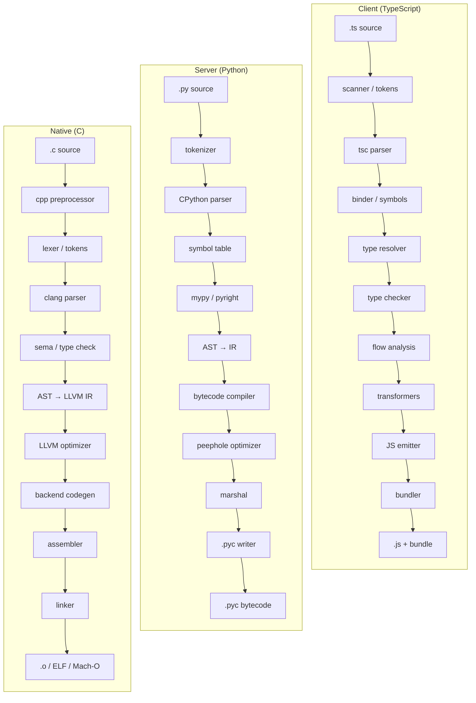
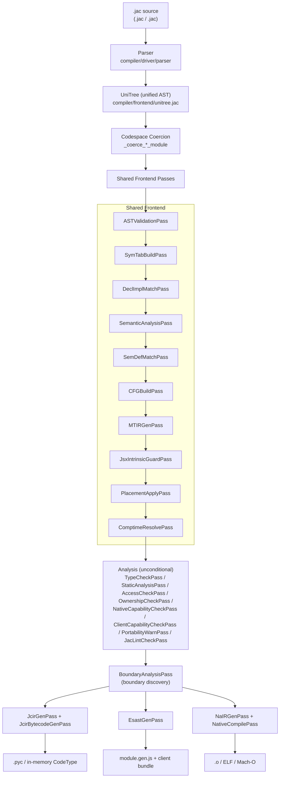
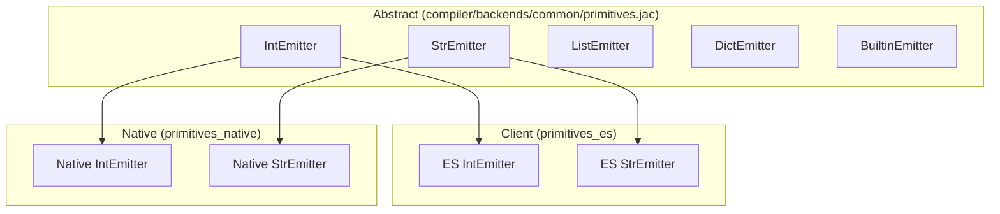

# Compiler Architecture: Three Codespaces

## Overview

Jac is a single source language that compiles to three different execution
targets, called **codespaces**:

| Codespace | Selector | Backend output | Runs on |
|-----------|----------|----------------|---------|
| **Server** | Inferred; the default, anchored by python imports, graph archetypes, `::py::` blocks, and typed context blocks; `[placement.pins]` override | Python AST → CPython bytecode | CPython |
| **Client** | **Inferred** from client-only syntax (JSX, browser globals, string-path npm imports) and symbol references; `[placement.pins]` override or a `.jac` implementation-variant file | ESTree → JavaScript | Browsers / Node |
| **Native** | **Inferred** -- whole modules by the placement solver's verdict under the native default codespace, elements from extern-decl (C-ABI FFI) imports and their users; `[placement.pins]` override, or forced module-wide by `jac build <file> --native` / `CompileOptions(force_codespace='native')` | LLVM IR → object code → executable | Bare machine (Linux / macOS, x86_64 / arm64) |

A single `.jac` file can mix all three codespaces; there is no placement
syntax (the old `sv`/`cl`/`na` markers were deleted -- `jac fix placement`
migrates marker-era sources). The compiler routes each declaration to the
correct backend, synthesises the interop bridges at the boundary, and emits
the appropriate artefact per codespace. `[placement.pins]` entries in
`jac.toml` always take precedence over inference.

This document is the architectural map of how that pipeline is wired
together. It is intended for compiler contributors. For language-level
behaviour see [Primitives & Codespace Semantics](../reference/language/primitives.md);
for the user-facing native pathway see [Native Compilation](../reference/language/native-pathway.md).

---

## The Typical Polyglot Today

A typical full-stack feature today is built from three separate toolchains
that never see each other. Each language has its own parser, type system,
and codegen, and the "interop" is whatever the developer hand-writes at the
edges (HTTP payloads, FFI declarations, JSON contracts).



Three disconnected pipelines, three languages to know, and every
cross-boundary call is a hand-rolled contract that the toolchain cannot
verify. Jac collapses this into a single front end with three backends, so
the interop boundaries become a compiler concern instead of a developer one.

---

## Pipeline at a Glance



The orchestration lives in [`compiler/driver/schedules.jac`](https://github.com/Jaseci-Labs/jaseci/blob/main/jac/jaclang/compiler/driver/schedules.jac).
Each named "schedule" function returns a list of `Transform[uni.Module, uni.Module]`
classes to run, and the `JacCompiler.compile` method walks them in order.

---

## Stage 1: Parsing and the Unified AST

Every codespace shares the **same front end**.

- Tokens are declared in [`compiler/frontend/parser/tokens.jac`](https://github.com/Jaseci-Labs/jaseci/blob/main/jac/jaclang/compiler/frontend/parser/tokens.jac).
  There are no placement keywords -- the old `sv`/`cl`/`na` tokens were
  deleted, and the parser emits a targeted "placement markers were removed"
  error (pointing at `jac fix placement`) when it sees one in legacy code.
- The grammar is in [`compiler/frontend/parser/impl/parser.impl.jac`](https://github.com/Jaseci-Labs/jaseci/blob/main/jac/jaclang/compiler/frontend/parser/impl/parser.impl.jac).
- AST nodes are defined in [`compiler/frontend/unitree.jac`](https://github.com/Jaseci-Labs/jaseci/blob/main/jac/jaclang/compiler/frontend/unitree.jac)
  (generate a node-by-node catalogue with `jac tool autodoc_uninode`).

The bootstrap compiler (`jac0.py`) and the full compiler share this front end
verbatim -- see [Abstractions Inventory](abstractions.md) for the full keyword
table.

### The tree is a graph

Since #8744 every AST class is an object-spatial `node`, and the tree's
structure is edges rather than fields. A node holds only scalars (token text,
positions, flags); each child slot the parser fills (`condition`, `body`,
`target`, ...) is a role-typed edge from
[`compiler/frontend/roles.jac`](https://github.com/Jaseci-Labs/jaseci/blob/main/jac/jaclang/compiler/frontend/roles.jac)
(`ConditionRole`, `BodyRole`, ... all subclasses of `Role`), and the ordered
token stream is a separate `Kid` edge per child. The spelling passes use is
unchanged: `nd.condition`, `nd.body`, `nd.kid` and `nd.parent` are accessors
over those edges (`unitree.impl/roles.impl.jac`: each `{ getter; }` slot
declared in `unitree.jac` reads its edge type there, and the `init` for each
class links its children through `_link`). `kid` is the Kid edges in
connection order, so the formatter and `unparse` see the same token stream as
before; `parent` is the source of the newest incoming Kid edge (or Role edge,
for a node reachable only through a slot).

Construction connects: a class's generated `init` assigns its scalars and calls
`_link(kid, roles)`, which records each child in the node's adjacency. After
that a node is data. The rewriting tools (`normalize`, the lint fixer,
`unparse`, `eject`) and the decl/impl merge do not assign fields: they
`_role_set`, `set_kids`, `replace_kid` or `link_impl`, which are connects and
disconnects. `Ability.body` after `DeclImplMatchPass` is an `ImplOf` edge to
the `ImplDef`; `ImplDef.decl_link` reads it backwards.

Compiler graphs are transient, and their edges are light. A field-less,
directed edge between unpersisted nodes is not an object: `NodeAnchor` keeps
`out_light` / `in_light`, dicts from edge class to the list of neighbour nodes
in connection order, and every `Role`, `Kid` and relation edge (`SymOf`,
`TypeOf`, `CfgSucc`, ...) lives there. Ownership follows connect direction:
out-links hold their targets, in-links are weak references, so a tree owns
its children, an interned type or codespace singleton never keeps its users
alive, and a dropped subtree is collectable with no severing. Only an edge
that carries fields (`ScopePrimary.alias`, `TypeMemberOf.name`) is an
`EdgeAnchor` in `edges`; a node that acquires persistence materializes its
light edges into rows (`NodeAnchor.all_edges`).

The compiler's source uses the language for all of it. Both lowerings
recognize the simple hop (one origin, one direction, one edge class, no
predicate, no node filter, no chain) and emit a direct adjacency read:
jac0 emits `hop0`, the py backend emits `hop`, so `[self->:Kid:->]` is one
dict lookup plus a copy, and `[self<-:Kid:<-][-1]` is `parent`. Anything
richer goes through `refs0` / `refs` as before. `del` accepts an edge set:
`del [edge self->:Kid:->];` lowers to `clear0` / `clear_edges`, which drops
the set by class without materializing it (`set_kids`, `_role_set` and every
slot setter are written that way). A `[edge ...]` query or `del` on a single
light edge works on a view (`light_edge_view`).

### The front end

Every module parses through the staged front end: the lexer and parser in
`compiler/frontend/parser/`, then the ir-gen schedule pass by pass. The
native scope (`compiler/native_scope.jac`) names the compiler modules the
kernel links; each is a native unit whose interface (`SEC_NIFACE`) and
object (`SEC_NOBJ`, materialized on demand) live in its module JIR, and `libjac_compiler` is the
link plan's artifact over them (`compiler/backends/native/link_plan.jac`),
resolved at parse time by `kernel_resolve.jac`.

---

## Stage 2: Codespace Coercion

After parsing, the compiler decides what context each top-level statement
belongs to. The `.jac` extension coerces whole modules; whole-module
native placement comes from a forced codespace or the placement solver's
verdict. Every other plain `.jac` module goes through placement inference
instead.

The coercion helpers live in
[`compiler.jac:_coerce_module`](https://github.com/Jaseci-Labs/jaseci/blob/main/jac/jaclang/compiler/driver/schedules.jac#L250)
and two wrappers around it:

| Helper | Triggered by | What it does |
|--------|--------------|--------------|
| `_coerce_client_module` | `.jac` extension | Marks the module's nodes `CodeContext.CLIENT` |
| `_coerce_native_module` | Forced placement (`CompileOptions(force_codespace='native')` -- set by `jac build <file> --native` -- or an AOT build under the native default codespace), else a passing placement-solver verdict | Marks the module's nodes `CodeContext.NATIVE` |

From this point on, every declaration carries a `CodeContext` enum value that
downstream passes use to dispatch to the correct backend.

### Codespace inference (the default path)

Plain `.jac` files get their placement decided by
the **whole-program placement solver**
([`compiler/placement/placement_solver.jac`](https://github.com/Jaseci-Labs/jaseci/blob/main/jac/jaclang/compiler/placement/placement_solver.jac)),
which consumes **placement summaries**
([`compiler/placement/placement.jac`](https://github.com/Jaseci-Labs/jaseci/blob/main/jac/jaclang/compiler/placement/placement.jac)):
per top-level element, its capability evidence (JSX, browser globals,
string-path imports, clib externs, `root` access, `pub` access, python
imports), its references to sibling elements, and its value-flow escapes.
Summaries are serialized into the module's `.jir` as a `SEC_PLACEMENT`
section and memoized on the program keyed by resolved path.

The solver owns every placement decision, in three cooperating stages:

1. **Module-granular native verdict** (parse time, from `parse_str`): when
   the effective default codespace is `native`, the summary's blocker scan
   plus a memoized walk of the import closure decides whether the whole
   module lowers native (`_coerce_native_module`) or stays server, feeding
   the same coverage and demotion memo as before. This stage runs at parse
   time because whole-module coercion rewrites the module body and must
   precede symbol tables.
2. **Per-module seeding and fixpoint** (`PlacementApplyPass`, scheduled in
   both `get_symtab_ir_sched` and `get_ir_gen_sched`): seeds are read off
   the summary (JSX and string-path imports stamp CLIENT, clib externs
   stamp NATIVE, browser-global references stamp CLIENT in unanchored
   modules), then placement flows across resolved symbol references to a
   fixpoint in two colors. A hard phase pulls transitive dependents of
   seeds unconditionally; the soft phase pulls dependencies gated by
   pullability (archetypes, endpoint-tagged abilities in anchored modules,
   and non-portable python imports stay server, where both sides bridge to
   them). An element claimed by both colors stays on the server.
   `[placement.pins]` entries feed `ElementSummary.pinned` exactly like the
   old source markers did: pinned elements never propagate and are never
   overridden.
3. **Program stage** (in `_compile_once`, after the ir schedule and before
   type checking / codegen): client-context plain imports pull their
   pullable target closures dual (`codespace_dual`) across module
   boundaries to a program-wide fixpoint, materializing missing `.jac`
   targets symtab-only and stamping every instance of a target the program
   holds. Because this runs before codegen, `jac check` sees the same
   cross-module placements as `jac build`; stale ES output is invalidated
   when stamps change.

Every stamp records an evidence note (`jac check --placements` prints the
chains). Lowering failures demote:
inferred-native modules recompile server-side, and client-pulled (dual)
elements that fail ES generation are un-stamped back to the server with a
note, their call sites bridging instead.

On the Python backend, inferred-native declarations in mixed modules are
pruned from the server projection (mirroring the client pruning), with the
module's native interop stubs attached to the first such element. Two
carve-outs: whole-module-coerced native modules (declared, forced, or
verdict-passing) keep their full legacy Python projection (so their `test`
blocks still collect and run under `jac test`), and `test` elements are
never pruned -- tests always execute server-side, reaching native code
through the interop stubs.

---

## Stage 3: Shared Frontend Analysis

These passes run regardless of codespace and are collected by
`get_ir_gen_sched` and `get_analysis_sched` in
[`compiler.jac`](https://github.com/Jaseci-Labs/jaseci/blob/main/jac/jaclang/compiler/driver/schedules.jac#L42).

The ir-gen schedule (`get_ir_gen_sched`):

| Pass | Source | Role |
|------|--------|------|
| `ASTValidationPass` | [`compiler/passes/ast_validation_pass.jac`](https://github.com/Jaseci-Labs/jaseci/blob/main/jac/jaclang/compiler/passes/ast_validation_pass.jac) | Structural validation of the parsed tree |
| `SymTabBuildPass` | [`compiler/passes/sym_tab_build_pass.jac`](https://github.com/Jaseci-Labs/jaseci/blob/main/jac/jaclang/compiler/passes/sym_tab_build_pass.jac) | Builds symbol tables; enforces sealed-field rules for archetypes |
| `DeclImplMatchPass` | [`compiler/passes/decl_impl_match_pass.jac`](https://github.com/Jaseci-Labs/jaseci/blob/main/jac/jaclang/compiler/passes/decl_impl_match_pass.jac) | Pairs declarations in `.jac` files with bodies in `.impl.jac` annexes |
| `SemanticAnalysisPass` | [`compiler/passes/semantic_analysis_pass.jac`](https://github.com/Jaseci-Labs/jaseci/blob/main/jac/jaclang/compiler/passes/semantic_analysis_pass.jac) | Name resolution, scope analysis |
| `SemDefMatchPass` | [`compiler/passes/sem_def_match_pass.jac`](https://github.com/Jaseci-Labs/jaseci/blob/main/jac/jaclang/compiler/passes/sem_def_match_pass.jac) | Matches `sem` blocks to definitions for `by llm` |
| `CFGBuildPass` | [`compiler/passes/cfg_build_pass.jac`](https://github.com/Jaseci-Labs/jaseci/blob/main/jac/jaclang/compiler/passes/cfg_build_pass.jac) | Builds control-flow graphs |
| `MTIRGenPass` | [`compiler/passes/mtir_gen_pass.jac`](https://github.com/Jaseci-Labs/jaseci/blob/main/jac/jaclang/compiler/passes/mtir_gen_pass.jac) | Generates Meaning-Typed IR for `by llm` calls (scheduled unless MTIR generation is off) |
| `JsxIntrinsicGuardPass` | [`compiler/passes/jsx_intrinsic_guard_pass.jac`](https://github.com/Jaseci-Labs/jaseci/blob/main/jac/jaclang/compiler/passes/jsx_intrinsic_guard_pass.jac) | Rejects raw HTML host tags per the project's client kind (`E1105`) |
| `PlacementApplyPass` | [`compiler/placement/placement_solver.jac`](https://github.com/Jaseci-Labs/jaseci/blob/main/jac/jaclang/compiler/placement/placement_solver.jac) | Applies the placement solver's per-module stage: summary-driven seeding plus the CLIENT/NATIVE reference fixpoint (see Stage 2) |
| `ComptimeResolvePass` | [`compiler/passes/comptime_resolve_pass.jac`](https://github.com/Jaseci-Labs/jaseci/blob/main/jac/jaclang/compiler/passes/comptime_resolve_pass.jac) | Settles every `comptime` site (bindings, `if`/`for`/`assert`, comptime-parameter arguments) through the shared `TypeEvaluator` and its `CtEvaluator`, visiting only subtrees that contain a comptime construct; marks the module `ct_resolved` so a later `TypeCheckPass` does not report the same site twice. Runs here, not in the analysis schedule, so modules compiled on import fold identically to `jac check` |

The analysis schedule (`get_analysis_sched`) -- **unconditional**, appended
on every compile:

| Pass | Source | Role |
|------|--------|------|
| `TypeCheckPass` | [`compiler/passes/type_checker_pass.jac`](https://github.com/Jaseci-Labs/jaseci/blob/main/jac/jaclang/compiler/passes/type_checker_pass.jac) | Static type checking against the type registry |
| `StaticAnalysisPass` | [`compiler/passes/static_analysis_pass.jac`](https://github.com/Jaseci-Labs/jaseci/blob/main/jac/jaclang/compiler/passes/static_analysis_pass.jac) | Unreachable code, unused variables, import refusals (`E1122`-`E1125`) |
| `AccessCheckPass` | [`compiler/passes/access_check_pass.jac`](https://github.com/Jaseci-Labs/jaseci/blob/main/jac/jaclang/compiler/passes/access_check_pass.jac) | Access-modifier (`:pub`/`:protect`/`:priv`) enforcement |
| `OwnershipCheckPass` | [`compiler/passes/ownership_check_pass.jac`](https://github.com/Jaseci-Labs/jaseci/blob/main/jac/jaclang/compiler/passes/ownership_check_pass.jac) | Ownership and borrow analysis (see the [Ownership Fact Schema](ownership-checker-spec.md)) |
| `NativeCapabilityCheckPass` | [`compiler/passes/capability_check_pass.jac`](https://github.com/Jaseci-Labs/jaseci/blob/main/jac/jaclang/compiler/passes/capability_check_pass.jac) | Stamps native capability facts (native-lowering eligibility for the placement verdict) on module nodes |
| `ClientCapabilityCheckPass` | [`compiler/passes/capability_check_pass.jac`](https://github.com/Jaseci-Labs/jaseci/blob/main/jac/jaclang/compiler/passes/capability_check_pass.jac) | Stamps client capability facts on module nodes |
| `PortabilityWarnPass` | [`compiler/passes/capability_check_pass.jac`](https://github.com/Jaseci-Labs/jaseci/blob/main/jac/jaclang/compiler/passes/capability_check_pass.jac) | Emits portability warnings (W6001-W6004) for JS-idiom violations; diagnostic-only |
| `JacLintCheckPass` | [`compiler/tools/jac_auto_lint_pass.jac`](https://github.com/Jaseci-Labs/jaseci/blob/main/jac/jaclang/compiler/tools/jac_auto_lint_pass.jac) | Lint rules (W3xxx / E3xxx) |

Type checking is not a mode: there is no gate on the analysis schedule, no
`CompileOptions` flag or `jac.toml` key to turn it off, and the only way to
stop a compile before analysis is `--parse_only`. Because type inference is
on every compile's critical path, `get_analysis_sched` calls
`require_typeshed_stubs()` first -- a missing vendored typeshed tree raises
`TypeshedUnavailableError` rather than degrading to an unchecked compile.

The pipeline uses a **re-entrancy guard** (`_ir_sched_loading`,
`_codegen_sched_loading`, `_analysis_sched_loading`) so that compiling the
compiler's own pass modules degrades gracefully to the bootstrap subset
instead of recursing forever.

Every schedule builder also degrades on `ImportError`, but only for
**absence**: a pass module a partial build does not ship, or a partially
initialized one mid-bootstrap. A compiler-source file that resolves and then
fails to compile is not absence, so `fail_loud_on_compiler_source` re-raises it
as `CompilerSourceError` naming the file and its diagnostics before any arm
degrades. Silently dropping a backend because the compiler's own source will
not parse is what made issue #8218 take a bisect to find.

---

## One Owner Per Analysis: The Analysis Contract

Every semantic fact about a Jac program is computed exactly once, by the
central analysis pipeline, and recorded on the unitree or in a registry
hanging off it. The backends are pure consumers: they read annotations
and emit target code. The contract (tracked in jaseci-labs/jaseci#6542):

1. **Single owner.** For every analysis there is one pass or module that
   computes it. A second implementation - even a "cheap local check" -
   is a defect.
2. **No fallbacks.** When a backend needs a fact and the annotation is
   absent, that is an internal-contract diagnostic (E9002), never a
   silent default.
3. **The unitree is the program.** Semantic facts live on nodes
   (annotate, never mutate surface syntax - the formatter/LSP fidelity
   constraint stands).
4. **Analysis before codegen.** Codegen passes may not invoke the type
   evaluator, walk annotation ASTs, or run symbol-table lookups; they
   read stamped facts and registries. `tests/compiler/test_backend_purity.jac`
   enforces this mechanically with a ratcheting allowlist.
5. **Tighten semantics where it simplifies.** Where backends used to
   guess independently, the semantic is defined once centrally and all
   backends hold to it (e.g. user-shadowed builtins are decided by the
   stamped call classification everywhere).
6. **Representation growth is cached growth.** New unitree fields are
   either serialized through the JIR registry with a format bump, or
   documented recompute-on-load (`postinit` fields like `Expr.type`).

### The authority map

| Fact | Owner | Stamped/queried as |
|------|-------|--------------------|
| Expression types | TypeCheckPass / TypeEvaluator | `Expr.type` (recompute-on-load) |
| Symbol storage class, rebinding | Symbol tables | `Symbol.storage`, `NameAtom.binds_new_var`, defn/uses |
| Call classification | `symbol_utils.classify_call` via checker | `FuncCall.call_kind` |
| Resolved callee | `symbol_utils.ability_of_symbol` via checker | `FuncCall.callee_decl` (recompute-on-load) |
| OSP archetype kind / event triggers | checker + unitree getters | `Archetype.arch_kind`, `Ability.event_triggers`, `Ability.event_trigger_type_names()` |
| Closure captures | scope tables | `UniScopeNode.get_enclosing_captures`, `LambdaExpr.captures` |
| Class hierarchy, MRO, vtable need | `LayoutPass` / `LayoutRegistry` | `get_layout_registry(module)` queries (no copies) |
| Result ownership (+1 transfer) | `compiler/ownership.jac` | `result_ownership(expr)`, applied at one emission seam |
| Borrowed-param promotion | `compiler/ownership.jac` | `param_plainly_rebound(sym)`, entry-block retain |
| Loop-exit release lists | `compiler/ownership.jac` | `loop_body_locals(body)` |
| Capability / portability | `capability_check_pass.jac` | declarative disqualifier + stdlib + explicit-native rejection tables, `native_capability_violations(mod)` pre-codegen sweep, W6001-W6004 |
| Foreign declarations (clib surface) | `compiler/targets/foreign.jac` | `collect_foreign_structs/fns`, `foreign_struct_layout` (declared names in, layouts out) |
| Foreign ABI classification + call plans | `compiler/targets/abi.jac` | `classify_struct(...)`, `classify_foreign_fn(...)` (pure, unit-tested) |
| Codegen-time expression-type reads | `types/type_utils.jac` | `expr_primitive_name(prog, expr)`: stamp when present, lazy authority query otherwise |

What stays per-backend by design: target IR construction and emission,
runtime libraries, backend-idiomatic lowering choices, emitter-created
temporaries (boxing, coercion buffers - their bookkeeping is driven by
the central classification of their source expressions), and
annotation-surface-shape decisions (what the user literally wrote,
which stamped types deliberately erase).

### The end-state purity contract

The relocation plan (jaseci-labs/jaseci#6542) is complete.
`tests/compiler/test_backend_purity.jac` is its standing contract:
`MIGRATION_DEBT` is empty, and every remaining analysis-API match in a
backend source is `SANCTIONED` with a per-entry rationale and an exact
count - growth means unreviewed analysis crept back in, shrink means an
entry earned tightening; both fail the test until the table is edited
deliberately.

Two design decisions bound what "fully stamped" means:

- **Lazy expression types.** `Expr.type` is the evaluator's memoization,
  populated by whatever checking rules evaluate; measured across the ES
  and OSP corpora, a present stamp never disagrees with the evaluator -
  the gap is purely coverage over arbitrary shapes (call results,
  compare results, member chains). Eager completion is unsound without a
  side-effect-free evaluator query mode (standalone evaluation binds
  member symbols and caches results, perturbing later context-aware
  checking - measured, twice). So codegen-time reads go through
  `expr_primitive_name`, which fills gaps lazily; late-query diagnostics
  ride the checker's deferral machinery.

- **Ownership seam tables (Phase 7 follow-up): not pursued.** The
  central facts that pay for themselves are landed
  (`result_ownership`, `param_plainly_rebound`, `loop_body_locals`).
  The remaining `_mark_owned`/`_is_owned` sites track emitter-created
  temporaries - values with no AST identity, created and consumed inside
  single lowering routines. A central table for them would mirror
  emission order rather than describe the program; the invariant
  (every value-consumption seam releases its owned temps) is enforced by
  the leak-check gates (chess fixture under `[native] debug`, the GC
  suite) rather than by a second bookkeeping layer.

---

## Stage 4: Boundary Discovery -- `BoundaryAnalysisPass`

[`BoundaryAnalysisPass`](https://github.com/Jaseci-Labs/jaseci/blob/main/jac/jaclang/compiler/passes/boundary_analysis_pass.jac)
runs once *before* code generation. It walks every call site and records:

1. The `CodeContext` of the **caller** and **callee** (SERVER / CLIENT / NATIVE).
2. Type information on each parameter and return value at the boundary.
3. Imports that cross from a Python module into a native-placed module (for
   native↔native linking).
4. Server-to-server calls that cross an **app boundary** (the imported
   element's `owner_app` differs from the importing module's).

Every cross-module import is classified once, by
`classify_cross_app_import` in `compiler/driver/boundary_classify.jac`, into
one of four kinds from the *app facts* the driver stamps before any pass runs
(`app`, `app_root`, `app_kind`, `owner_app` on `uni.Module`): `LOCAL` (a plain
import), `CLIENT_BRIDGE` (client context importing server-placed elements),
`SERVICE_BRIDGE` (server or native context importing server-placed elements
owned by another app), or `NATIVE_BIND` (the wasm/ctypes edge). The pass also
records each `consumer app → provider app` edge into the manifest; the driver
rejects cycles (`E5104`) and non-`pub` bridge targets (`E5106`).

The result is attached to the module as an `InteropManifest` of
`InteropBinding` entries (defined in
[`compiler/frontend/codeinfo.jac`](https://github.com/Jaseci-Labs/jaseci/blob/main/jac/jaclang/compiler/frontend/codeinfo.jac)).
Each backend reads this manifest and generates the appropriate bridge
stub: an HTTP fetch for `cl → sv`, a typed-async `__jac_sv_client` stub for
`sv → sv` across apps, a ctypes call for `sv → na`, or a direct native symbol
reference for `na → na`.

---

## Stage 5: Backend Code Generation

`get_py_code_gen` returns the codegen schedule. All three backends read the
same module facts -- [`ModuleFacts`](https://github.com/Jaseci-Labs/jaseci/blob/main/jac/jaclang/compiler/frontend/module_facts.jac)
(context-tagged statements, woven annex segments, erased type declarations)
-- and the AST-emitting passes share
[`BaseAstGenPass`](https://github.com/Jaseci-Labs/jaseci/blob/main/jac/jaclang/compiler/backends/common/ast_gen_base.jac).
**Each pass only emits nodes whose `code_context` matches its target**. A node tagged `CLIENT` is
invisible to the Python codegen and vice versa.

### Server backend

| Pass | Source | Output |
|------|--------|--------|
| `JcirGenPass` | [`compiler/passes/jcir_gen_pass.jac`](https://github.com/Jaseci-Labs/jaseci/blob/main/jac/jaclang/compiler/passes/jcir_gen_pass.jac) (+ [impl](https://github.com/Jaseci-Labs/jaseci/blob/main/jac/jaclang/compiler/passes/impl/jcir_gen_pass.impl.jac)) | The compact codegen IR container (`module.gen.jcir`) |
| `JcirBytecodeGenPass` | [`compiler/passes/jcir_bc_gen_pass.jac`](https://github.com/Jaseci-Labs/jaseci/blob/main/jac/jaclang/compiler/passes/jcir_bc_gen_pass.jac) (+ [impl](https://github.com/Jaseci-Labs/jaseci/blob/main/jac/jaclang/compiler/passes/impl/jcir_bc_gen_pass.impl.jac)) | Python `ast.Module`, unparsed source, and `types.CodeType` via `compile()` |

`JcirGenPass` makes every lowering decision -- it just writes container
opcodes instead of building `ast` objects directly. The container format is
declared in [`compiler/driver/codegen_ir.jac`](https://github.com/Jaseci-Labs/jaseci/blob/main/jac/jaclang/compiler/driver/codegen_ir.jac);
`JcirBytecodeGenPass` is a thin seat over `transcribe` and `compile_ir` in
[`compiler/driver/codegen_shim.jac`](https://github.com/Jaseci-Labs/jaseci/blob/main/jac/jaclang/compiler/driver/codegen_shim.jac),
which rebuild the Python AST, source, and code object from the container
bytes.

There are no longer any back-references from the Python AST to the Jac tree.
The Python AST is reconstructed from the container inside
`JcirBytecodeGenPass` and dies there, so nothing downstream holds a handle
back to the originating nodes.

Archetype `has` fields become dataclass fields wrapped with
`_.field(default=…)` or `_.field(factory=lambda: …)`. Walkers, nodes, and
edges descend from the corresponding `Archetype` subclasses in
[`runtime/archetype.jac`](https://github.com/Jaseci-Labs/jaseci/blob/main/jac/jaclang/runtime/archetype.jac).
Builtins and language keywords ultimately resolve to methods on
`JacRuntimeInterface` in [`runtime/runtime.jac`](https://github.com/Jaseci-Labs/jaseci/blob/main/jac/jaclang/runtime/runtime.jac).

The primitive type contract for this backend lives in
[`compiler/backends/es/primitives_es.jac`](https://github.com/Jaseci-Labs/jaseci/blob/main/jac/jaclang/compiler/backends/es/primitives_es.jac) and [`compiler/backends/native/primitives_native.jac`](https://github.com/Jaseci-Labs/jaseci/blob/main/jac/jaclang/compiler/backends/native/primitives_native.jac).

### Client backend

| Pass | Source | Output |
|------|--------|--------|
| `EsastGenPass` | [`compiler/backends/es/esast_gen_pass.jac`](https://github.com/Jaseci-Labs/jaseci/blob/main/jac/jaclang/compiler/backends/es/esast_gen_pass.jac) (+ [impl by concern](https://github.com/Jaseci-Labs/jaseci/tree/main/jac/jaclang/compiler/backends/es/esast_gen_pass.impl)) | ESTree AST + serialised JS (`module.gen.js`) |

`EsastGenPass` derives from `BaseAstGenPass` (shared with `JcirGenPass`)
so the same traversal infrastructure visits the tree but emits ESTree
nodes from [`compiler/backends/es/estree.jac`](https://github.com/Jaseci-Labs/jaseci/blob/main/jac/jaclang/compiler/backends/es/estree.jac).
Key components of the client backend:

- **Primitive emitters** -- [`primitives_es.jac`](https://github.com/Jaseci-Labs/jaseci/blob/main/jac/jaclang/compiler/backends/es/primitives_es.jac)
  provides `ESIntEmitter`, `ESStrEmitter`, etc. that satisfy the abstract
  emitter contract (see *Primitive Emitter Contract* below).
- **Unparser** -- [`es_unparse.jac`](https://github.com/Jaseci-Labs/jaseci/blob/main/jac/jaclang/compiler/backends/es/es_unparse.jac)
  walks the ESTree and prints JavaScript source.
- **Runtime** -- [`jac_runtime_js.jac`](https://github.com/Jaseci-Labs/jaseci/blob/main/jac/jaclang/compiler/backends/es/jac_runtime_js.jac)
  is the small JS runtime that ships with every client bundle (signals,
  reactive state, JSX renderer, hash router, fetch helpers).
- **JSX lowering** -- `EsJsxProcessor` in
  [`compiler/backends/es/jsx_processor.jac`](https://github.com/Jaseci-Labs/jaseci/blob/main/jac/jaclang/compiler/backends/es/jsx_processor.jac)
  lowers JSX tags for the client lane. The server lane lowers the same tags
  itself, straight into `jaclib` JSX calls, so a tag compiles consistently
  regardless of where it appears.

The client framework (built into `jaclang` core) packages the generated
`module.gen.js`, the JS runtime, and an HTML shell into a static bundle. Cross-codespace calls
(`cl → sv`) are lowered into HTTP requests against the walker / function
endpoints exposed by `jac run`. The client is currently **CSR-only**:
the server returns an HTML shell with a bootstrapping payload, and the
browser handles all rendering.

### Native backend

| Pass | Source | Output |
|------|--------|--------|
| `NaIRGenPass` | [`compiler/backends/native/na_ir_gen_pass.jac`](https://github.com/Jaseci-Labs/jaseci/blob/main/jac/jaclang/compiler/backends/native/na_ir_gen_pass.jac) | LLVM IR, built with the in-tree binding at [`compiler/backends/native/llvm/`](https://github.com/Jaseci-Labs/jaseci/blob/main/jac/jaclang/compiler/backends/native/llvm) over the `libjacllvm` shared library (llvmlite is not used) |
| `NativeCompilePass` | [`compiler/backends/native/na_compile_pass.jac`](https://github.com/Jaseci-Labs/jaseci/blob/main/jac/jaclang/compiler/backends/native/na_compile_pass.jac) | Object code (ELF or Mach-O) |

`NaIRGenPass` is unusual in that it does **not** use the visitor pattern;
LLVM requires instructions to be emitted into specific basic blocks in
order, so it walks the AST manually. The pass derives directly from
`ModuleCodegenPass`. Primitive types are defined in
[`primitives_native.jac`](https://github.com/Jaseci-Labs/jaseci/blob/main/jac/jaclang/compiler/backends/native/primitives_native.jac).

Linking is also self-contained -- no external linker is invoked:

- [`linker_common.jac`](https://github.com/Jaseci-Labs/jaseci/blob/main/jac/jaclang/compiler/backends/native/linker_common.jac)
  -- shared layout logic
- [`elf_linker.jac`](https://github.com/Jaseci-Labs/jaseci/blob/main/jac/jaclang/compiler/backends/native/elf_linker.jac)
  -- Linux ELF64 object writer
- [`macho_linker.jac`](https://github.com/Jaseci-Labs/jaseci/blob/main/jac/jaclang/compiler/backends/native/macho_linker.jac)
  -- macOS Mach-O object writer

The native backend supplies its own memory management: a 32-byte
allocation header with reference counts (see `HDR_*` globals in
`na_ir_gen_pass.jac`). Cross-codespace calls between Python and native
flow through the interop bridge generated from `BoundaryAnalysisPass`.

---

## Primitive Emitter Contract

The two lowering backends (ECMAScript and native) implement the same
abstract emitter interface, defined in
[`compiler/backends/common/primitives.jac`](https://github.com/Jaseci-Labs/jaseci/blob/main/jac/jaclang/compiler/backends/common/primitives.jac).
The server backend needs no emitters: it compiles to Python bytecode, so
CPython itself provides the reference semantics the other backends must
match. This is what makes "`'hello'.upper()` works in all three codespaces"
a guarantee rather than a convention.



Thirteen emitter families are defined: one per primitive type (`int`,
`float`, `complex`, `str`, `bytes`, `list`, `dict`, `set`, `frozenset`,
`tuple`, `range`), plus `BuiltinEmitter` for top-level functions like
`print()`, `len()`, `range()`, `sorted()`, and `ExceptionEmitter` for the
exception machinery. The codegen pass calls `StrEmitter.emit_op_add(...)`
and the backend's subclass produces an ES `BinaryExpression` or an LLVM
`call @str_concat`; the Python backend emits an ordinary `BinOp` whose
semantics come from CPython directly.

If a backend hasn't implemented an operation, the emitter returns `None`
and the compiler raises a diagnostic at compile time -- see the diagnostic
codes in [`compiler/driver/diagnostics.jac`](https://github.com/Jaseci-Labs/jaseci/blob/main/jac/jaclang/compiler/driver/diagnostics.jac).

The full list of primitives and operators per type lives in the
user-facing reference, [Primitives & Codespace Semantics](../reference/language/primitives.md).

---

## Cross-Codespace Interop

`BoundaryAnalysisPass` discovers boundaries; the backends close them.

| Direction | Bridge | Generated by |
|-----------|--------|--------------|
| `cl → sv` | HTTP `POST` to the walker / function endpoint exposed by `jac run` | `EsastGenPass` emits `fetch(...)` against the URL recorded in the binding |
| `sv → cl` | None at runtime -- the client mounts its own DOM. The server only ships the bootstrap payload | `JcirGenPass` emits the static-file route for the bundle |
| `sv → na` | In-process `ctypes.CFUNCTYPE` over the JIT'd function address (MCJIT); an AOT `--lib` build is loaded across the process boundary instead | `JcirGenPass` emits the ctypes stub; `NaIRGenPass` exposes the function with C ABI |
| `na → sv` | Python callback wrapped in a `ctypes.CFUNCTYPE` and registered as a JIT symbol (`llvm.add_symbol`), so MCJIT resolves the native call back into CPython | `interop_bridge.register_py_callbacks`, alongside the `sv → na` stub |
| `na → na` | Direct symbol reference resolved by the in-tree linker | `BoundaryAnalysisPass` records the import; `NativeCompilePass` emits the relocation |
| `sv → sv` (cross-app) | A typed-async stub keyed by the provider **app name** when an import's target is owned by a different app; in-process when the provider app is colocated, HTTP `POST` when it runs as its own process | `JcirGenPass` emits a generated `async` `__jac_sv_client` stub (`call` / `spawn_walker`; un-awaited statement spawns become `_deferred`, the outbox); the manifest's app edges drive the built-in `scale` subsystem's boot order |

Boundary types are serialised through the schemas in
[`codeinfo.jac`](https://github.com/Jaseci-Labs/jaseci/blob/main/jac/jaclang/compiler/frontend/codeinfo.jac).
The primitive contract guarantees that types like `int` and `list[str]`
mean the same thing on both sides; non-primitive types must be reachable
in both codespaces (typically as plain `obj` archetypes).

For the full interop matrix -- every ordered pair plus the foreign (C),
WebAssembly, and Python boundaries, the marshalling format, and how desktop
apps stitch several boundaries together -- see
[Cross-Codespace & Foreign Interop](interop.md).

---

## Caching

Every cached JIR carries an environment key that folds in a content digest of
the whole compiler source tree, so any compiler edit recompiles every module.
While iterating on the compiler itself, `JAC_COMPILER_DIGEST_PIN=<label>`
freezes that digest to the label: only modules whose own source changed
recompile. It is a developer knob that trusts codegen did not change; leave it
unset for anything that must be correct.

The compiler keeps two on-disk caches so the front end and back end can be
skipped when nothing has changed.

| Cache | Location | Invalidated when |
|-------|----------|------------------|
| **Bootstrap** | `~/.cache/jac/jir/bootstrap/` | A `compiler/driver/` file or `jac0.py` changes |
| **Module** | `~/.cache/jac/jir/modules/` | The full compiler's output format changes, or the source / its imports change |

Each cache entry is a **JIR file** (Jac IR) with named sections defined in
[`compiler/driver/jir.jac`](https://github.com/Jaseci-Labs/jaseci/blob/main/jac/jaclang/compiler/driver/jir.jac):

| Section | Contents |
|---------|----------|
| `SEC_BYTECODE` | Marshalled Python `CodeType` (server backend) |
| `SEC_MTIR` | Meaning-Typed IR for `by llm` calls |
| `SEC_NBITCODE` | The unit's LLVM bitcode under its native stamp (whole-program and JIT link modes) |
| `SEC_NIFACE` | The unit's native interface: link symbols, class layouts, initializer, demoted symbols, C library needs; digest-prefixed |
| `SEC_NOBJ` | The unit's relocatable object, materialized on demand from bitcode under its native stamp (incremental link mode) |
| `SEC_NCTDEPS` | Native compile-time inputs, using the shared CTDEPS codec under a native stamp |
| `SEC_INTEROP` | Serialised `InteropManifest` |
| `SEC_MODKEY` / `SEC_ENVKEY` | Content key and environment fingerprint that gate every read |
| `SEC_DEBUG_SRC` | Compressed source for traceback rendering |
| `SEC_PLACEMENT` | Per-module placement summary (whole-program solve reruns over these) |
| `SEC_CTDEPS` | Comptime file dependencies with mtimes |
| `SEC_IFACE` | The module's exported interface: typed symbols, signatures, archetype layouts, access/ownership facts, hash-prefixed |
| `SEC_DEPS` | Direct dependencies with the interface hash each had at compile time |
| `SEC_DIAG` | Delivered diagnostics, grouped by analysis profile, for warm replay |

A precompiled section is replayed via `JacCompiler._load_native_from_cache`
/ `_load_native_from_bitcode` instead of re-running the codegen pass.

The last three sections form the **analysis cache**: dependency ingestion
hydrates a cache-valid dep from `SEC_IFACE` instead of re-running its
frontend, `SEC_DEPS` hashes give early cutoff (a body-only edit rewrites a
dep's JIR but not its interface hash, so importers do not cascade), and a
warm no-edit `jac check` replays `SEC_DIAG` without running a single pass.
Hydration is always on; `JAC_REBUILD` recomputes and rewrites the cache, and
`JAC_IFACE_VERIFY=1` recomputes everything served from cache and fails on
any divergence. See [The analysis cache](analysis-cache.md) for the design.

When debugging compiler changes, clear the relevant cache:

```bash
# Bootstrap or core compiler change
rm -rf ~/.cache/jac/jir/

# Or just user modules
rm -rf ~/.cache/jac/jir/modules/
```

---

### The JIR-carries-semantics decision (Phase 10 gate)

Measured 2026-06-11 on the chess fixture (3 runs each): warm cache-hit
runs ~4.9s with the analysis pipeline fully skipped (bytecode and LLVM
sections load directly); cold compiles ~182s with inference vs ~76s
with inference disabled - inference is ~59% of a cold compile and ~0%
of a warm one. Decision: semantic annotations (`Expr.type`,
`callee_decl`, ownership facts) stay **recompute-on-load**; serializing
them as JIR TLV sections would not improve warm compiles (already
analysis-free) and cannot help the changed module on a miss (its
analysis must run regardless). The actionable cost is typeshed stub
processing inside cold-compile inference - an incremental-checking
workstream, not a cache-format one.

That gate holds for per-expression semantics and it still does: `Expr.type`
and friends remain recompute-on-load. What it was silent about is the changed
module's **import closure** and the analysis-facing paths (`jac check`, the
LSP) that never read the module cache at all. The analysis cache closes that
gap at the interface granularity instead of the expression granularity; the
measurements and the exact cacheable-versus-must-recompute split live in
[The analysis cache](analysis-cache.md).

## Key Files

A short index, organised by the role each file plays in the pipeline.

**Orchestration**

- [`compiler/driver/schedules.jac`](https://github.com/Jaseci-Labs/jaseci/blob/main/jac/jaclang/compiler/driver/schedules.jac)
  -- `JacCompiler`, schedule functions, codespace coercion
- [`compiler/driver/program.jac`](https://github.com/Jaseci-Labs/jaseci/blob/main/jac/jaclang/compiler/driver/program.jac)
  -- `JacProgram`, the module hub passes operate on
- [`compiler/passes/transform.jac`](https://github.com/Jaseci-Labs/jaseci/blob/main/jac/jaclang/compiler/passes/transform.jac)
  -- `Transform[I, O]` base class for every pass
- [`compiler/passes/uni_pass.jac`](https://github.com/Jaseci-Labs/jaseci/blob/main/jac/jaclang/compiler/passes/uni_pass.jac)
  -- `UniPass`, the walker base class every tree pass extends; passes declare
  typed abilities (`can enter_x with IfStmt entry`) and the OSP kernel
  dispatches them during a subtree-fenced `visit:0:` walk

**Shared front end**

- [`compiler/frontend/parser/`](https://github.com/Jaseci-Labs/jaseci/tree/main/jac/jaclang/compiler/driver/parser)
  -- tokens and grammar
- [`compiler/frontend/unitree.jac`](https://github.com/Jaseci-Labs/jaseci/blob/main/jac/jaclang/compiler/frontend/unitree.jac)
  -- UniTree AST nodes (`jac tool autodoc_uninode` prints the full catalogue)
- [`compiler/frontend/constant.jac`](https://github.com/Jaseci-Labs/jaseci/blob/main/jac/jaclang/compiler/frontend/constant.jac)
  -- `CodeContext`, `Tokens`, shared enums
- [`compiler/frontend/codeinfo.jac`](https://github.com/Jaseci-Labs/jaseci/blob/main/jac/jaclang/compiler/frontend/codeinfo.jac)
  -- `InteropManifest`, `InteropBinding`, `BoundaryTypeInfo`

**Server backend**

- [`compiler/passes/jcir_gen_pass.jac`](https://github.com/Jaseci-Labs/jaseci/blob/main/jac/jaclang/compiler/passes/jcir_gen_pass.jac)
  / [impl](https://github.com/Jaseci-Labs/jaseci/blob/main/jac/jaclang/compiler/passes/impl/jcir_gen_pass.impl.jac)
- [`compiler/passes/jcir_bc_gen_pass.jac`](https://github.com/Jaseci-Labs/jaseci/blob/main/jac/jaclang/compiler/passes/jcir_bc_gen_pass.jac)
  / [impl](https://github.com/Jaseci-Labs/jaseci/blob/main/jac/jaclang/compiler/passes/impl/jcir_bc_gen_pass.impl.jac)
- [`compiler/driver/codegen_ir.jac`](https://github.com/Jaseci-Labs/jaseci/blob/main/jac/jaclang/compiler/driver/codegen_ir.jac)
  -- the container format
- [`compiler/driver/codegen_shim.jac`](https://github.com/Jaseci-Labs/jaseci/blob/main/jac/jaclang/compiler/driver/codegen_shim.jac)
  -- `transcribe` / `compile_ir`
- [`compiler/backends/es/primitives_es.jac`](https://github.com/Jaseci-Labs/jaseci/blob/main/jac/jaclang/compiler/backends/es/primitives_es.jac) and [`compiler/backends/native/primitives_native.jac`](https://github.com/Jaseci-Labs/jaseci/blob/main/jac/jaclang/compiler/backends/native/primitives_native.jac)
- [`runtime/runtime.jac`](https://github.com/Jaseci-Labs/jaseci/blob/main/jac/jaclang/runtime/runtime.jac)
  -- `JacRuntimeInterface`

**Client backend**

- [`compiler/backends/es/esast_gen_pass.jac`](https://github.com/Jaseci-Labs/jaseci/blob/main/jac/jaclang/compiler/backends/es/esast_gen_pass.jac)
- [`compiler/backends/es/estree.jac`](https://github.com/Jaseci-Labs/jaseci/blob/main/jac/jaclang/compiler/backends/es/estree.jac)
- [`compiler/backends/es/es_unparse.jac`](https://github.com/Jaseci-Labs/jaseci/blob/main/jac/jaclang/compiler/backends/es/es_unparse.jac)
- [`compiler/backends/es/primitives_es.jac`](https://github.com/Jaseci-Labs/jaseci/blob/main/jac/jaclang/compiler/backends/es/primitives_es.jac)
- [`compiler/backends/es/jac_runtime_js.jac`](https://github.com/Jaseci-Labs/jaseci/blob/main/jac/jaclang/compiler/backends/es/jac_runtime_js.jac)
  -- in-browser runtime
- [`compiler/backends/es/jsx_processor.jac`](https://github.com/Jaseci-Labs/jaseci/blob/main/jac/jaclang/compiler/backends/es/jsx_processor.jac)
  -- JSX lowering

**Native backend**

- [`compiler/backends/native/na_ir_gen_pass.jac`](https://github.com/Jaseci-Labs/jaseci/blob/main/jac/jaclang/compiler/backends/native/na_ir_gen_pass.jac)
- [`compiler/backends/native/na_compile_pass.jac`](https://github.com/Jaseci-Labs/jaseci/blob/main/jac/jaclang/compiler/backends/native/na_compile_pass.jac)
- [`compiler/backends/native/elf_linker.jac`](https://github.com/Jaseci-Labs/jaseci/blob/main/jac/jaclang/compiler/backends/native/elf_linker.jac)
  / [`macho_linker.jac`](https://github.com/Jaseci-Labs/jaseci/blob/main/jac/jaclang/compiler/backends/native/macho_linker.jac)
- [`compiler/backends/native/primitives_native.jac`](https://github.com/Jaseci-Labs/jaseci/blob/main/jac/jaclang/compiler/backends/native/primitives_native.jac)

**Interop**

- [`compiler/passes/boundary_analysis_pass.jac`](https://github.com/Jaseci-Labs/jaseci/blob/main/jac/jaclang/compiler/passes/boundary_analysis_pass.jac)
- [`compiler/driver/interop_bridge.jac`](https://github.com/Jaseci-Labs/jaseci/blob/main/jac/jaclang/compiler/driver/interop_bridge.jac)

**Caching**

- [`compiler/driver/jir.jac`](https://github.com/Jaseci-Labs/jaseci/blob/main/jac/jaclang/compiler/driver/jir.jac)
  -- section format
- [`compiler/driver/bccache.jac`](https://github.com/Jaseci-Labs/jaseci/blob/main/jac/jaclang/compiler/driver/bccache.jac)
  -- cache layout

---

## Related Documents

- [Abstractions Inventory](abstractions.md) -- every user-visible keyword,
  builtin, and standard-library entry, mapped to its parser, AST node, and
  runtime.
- [Import Patterns](jac_import_patterns.md) -- how JavaScript/npm import
  patterns map to Jac client imports and what each generates.
- [Primitives & Codespace Semantics](../reference/language/primitives.md)
  -- user-facing contract that the emitters satisfy.
- [Native Compilation](../reference/language/native-pathway.md) -- user
  documentation for the native codespace.
