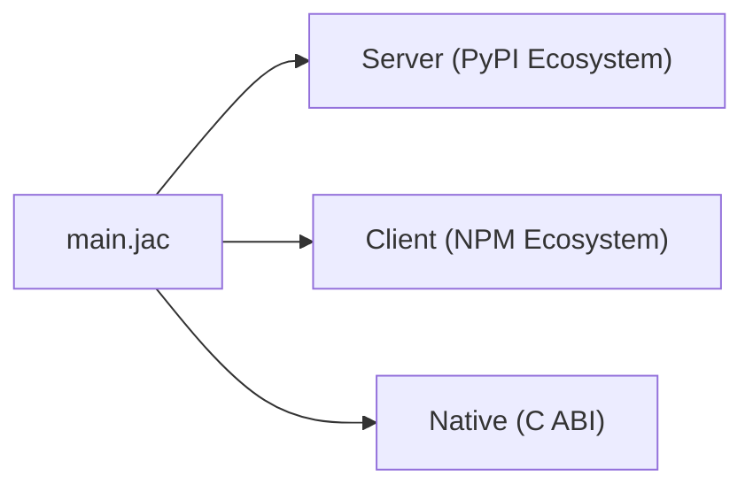
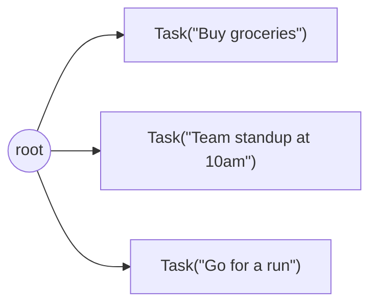

# Core Concepts

Most of Jac will be recognizable if you are familiar with another programming language like Python. Jac compiles to Python bytecode and shares many of its constructs, so functions, classes, imports, list comprehensions, and control flow all work as expected. You can explore those in depth in the [language reference](../reference/language/foundation.md).

This page introduces four concepts used throughout Jac applications. These are the ideas the rest of the documentation builds on, introduced briefly so you have the vocabulary for the tutorials that follow. (For *why* the language is shaped this way, see [The Two Ideas](ideas-behind-jac.md).) Through these concepts four important questions can be answered:

1. [How can one language target frontend, backend, and native binaries at the same time?](#1-how-can-one-language-target-frontends-backends-and-native-binaries-at-the-same-time)
2. [Graph data and persistence](#2-how-does-jac-fully-abstract-away-database-organization-and-interactions-and-the-complexity-of-multiuser-persistent-data)
3. [Walkers and traversal](#3-how-does-computation-move-to-the-data-instead-of-data-being-fetched-to-the-computation)
4. [Model-backed functions](#4-how-does-jac-abstract-away-the-laborious-task-of-promptcontext-engineering-for-ai-and-turn-it-into-a-compilerruntime-problem)

---

## The synechic surface

Codespaces and model-backed functions let an application express behavior across several execution environments. This is the *synechic* side of the language, defined in [The Two Ideas](ideas-behind-jac.md#synechic).

### 1. Execution targets and placement {#1-how-can-one-language-target-frontends-backends-and-native-binaries-at-the-same-time}

Similar to namespaces, the Jac language introduces the concept of **codespaces**. A Jac program can contain code that runs in different environments -- and you don't mark where each piece runs: the compiler derives it from what the code contains.



How inference decides:

- **JSX and npm imports are client signals.** A declaration containing JSX or a string-path npm import (`import from "react-dom" { ... }`) is client-only by construction, so the compiler places it in the client codespace automatically. Placement then propagates through references: helpers, `glob`s, and imports that client code uses join the client bundle too.
- **Extern C declarations are native signals.** An import whose braces declare C-ABI functions (`import from raylib { def InitWindow(w: i32, h: i32, title: str) -> None; }`) is an FFI surface only the native backend can satisfy, so the compiler places it -- and the declarations that use it -- in the native codespace automatically. Merely importing *from* a native module is not a native signal: that stays a server-side import, bridged by interop.
- **Server-only operations constrain server placement.** Python dependencies and persistent graph access are examples. In mixed modules, ordinary helpers follow their usage and constraints; anchor-free modules can instead prefer native compilation as described below.

Here's a file that spans two codespaces -- with nothing marking the split:

```jac
# Inferred server: plain data and logic, no client signals
node Todo {
    has title: str, done: bool = False;
}

def:pub add_todo(title: str) -> dict {
    todo = root ++> Todo(title=title);
    return {"id": jid(todo), "title": todo.title};
}

# Inferred client: the JSX in the body is a client signal
def:pub app -> JsxElement {
    has items: list = [];

    async def add -> None {
        todo = await add_todo("New");
        items = items + [todo];
    }

    <div>
        <button onClick={lambda -> None { add(); }}>
            Add
        </button>
    </div>
}
```

The compiler places `app` in the client codespace because its body contains JSX; `Todo` and `add_todo` stay on the server. The server definitions are visible to the client component -- and `def:pub` functions and walkers are never relocated by inference: they remain server endpoints, so when the client calls `add_todo(...)`, the compiler generates the HTTP call, serialization, and routing between codespaces. Likewise, a top-level `obj` referenced from both sides is shared across the boundary automatically. You write one language; the compiler produces the interop layer.

#### Overriding inference: `[placement.pins]`

There is no placement syntax in the source -- `prog.jac` is always placement-inferred. When a decision must be forced (a helper that must never ship in the JS bundle, a hot function that must compile natively), the override lives in `jac.toml`:

```toml
[placement.pins]
"main.API_KEY"  = "server"    # keep a secret out of the client bundle
"main.hot_loop" = "native"    # performance mandate
```

Keys are fnmatch patterns over `module` or `module.element` dotted paths; values are `"server"`, `"client"`, or `"native"`. A pinned element is immovable; the solver re-solves everything else around it. Review any module's placements -- with the evidence behind each decision -- via `jac check <entry> --placements`.

Two rules to keep in mind:

- **Pins always win.** Inference never moves a pinned element -- the most useful pin is `"server"` on a declaration you want kept server-side even though client code references it (the client call bridges over RPC instead).
- **Mixed-module helpers follow placement constraints.** Use a `"native"` pin or `jac build --native` when native compilation is required, and check diagnostics for unsupported constructs. Whole-module native inference follows the rule below.

- **Whole modules go native by inference.** Under the default `[placement] default = "native"`, an anchor-free module that can lower compiles native, and one that cannot demotes to the server with a note; extern C declarations seed native placement inside mixed files. To force the choice -- loud errors instead of demotion -- use `jac build --native` or `jac build --as native`.

(`.jac` still exists as an **implementation variant** -- the per-space implementation of one logical module -- not as the way ordinary code is placed. Native has no per-file spelling at all: it is inferred, pinned, or forced.)

Codespaces are similar to namespaces, but instead of organizing names, they organize where code executes. Interop between them -- function calls, spawn calls, type sharing -- is handled by the compiler and runtime.

Placement is determined within the project rather than solely by directory layout. The compiler generates supported bridges and checks the type information available at their boundaries. Library compatibility and runtime behavior still depend on the target.

!!! note "`obj` vs `class` -- choosing the right archetype"
    Cross-codespace interop requires the compiler to fully understand your type's structure. Jac's `obj` is designed for this: it enforces strict, declarative semantics -- fields declared with `has`, auto-generated constructors, no runtime monkey-patching -- so the same definition can compile to Python, JavaScript, or native code.

    If you need Python-specific class features like metaclasses, `@classmethod`, `@property`, or other decorator-heavy patterns, use a regular Python `class`. Those features are inherently tied to the Python runtime and cannot cross codespace boundaries. Jac provides the `static` keyword for static methods and fields, which covers the most common use case.

### 4. Model-backed functions {#4-how-does-jac-abstract-away-the-laborious-task-of-promptcontext-engineering-for-ai-and-turn-it-into-a-compilerruntime-problem}

Jac introduces Compiler-Integrated AI through its `by` and `sem` keywords. These two keywords allow integrating language models into programs at the language level rather than through library calls. They are the surface of Jac's [*meaning types*](../reference/plugins/byllm.md): the prompt is synthesized from your declarations, so delegating logic to a model is a typed language feature rather than string engineering.

#### `by`: delegate a function's implementation

```jac
enum Category { WORK, PERSONAL, SHOPPING, HEALTH, OTHER }

def categorize(title: str) -> Category
    by llm();
```

This function has no body. `by llm()` tells the compiler to delegate the implementation to a language model. The compiler extracts semantics from the code itself -- the function name, parameter names, types, and return type -- to construct the prompt. A well-named function like `categorize` with a typed parameter `title: str` and return type `Category` already communicates intent.

The return type specifies the output schema. The runtime attempts to produce and validate a value of that type; model calls can still fail. Schema validity does not establish that the result is correct for the task.

#### `sem`: attach semantics to bindings

The compiler can only infer so much from names and types. `sem` is the mechanism for providing additional semantic information beyond what exists in the code. It attaches a description to a specific variable binding that the compiler includes in the prompt:

```jac
obj Ingredient {
    has name: str;
    has cost: float;
    has carby: bool;
}

sem Ingredient.cost = "Estimated cost in USD";
sem Ingredient.carby = "True if this ingredient is high in carbohydrates";

def plan_shopping(recipe: str) -> list[Ingredient]
    by llm();
sem plan_shopping = "Generate a shopping list for the given recipe.";
```

Without `sem`, the LLM has only the names `cost` and `carby` to work with. With it, the compiler includes "Estimated cost in USD" and "True if this ingredient is high in carbohydrates" in the prompt, producing more accurate structured output. The `sem` on `plan_shopping` itself provides the function-level instruction.

`sem` is not a comment. It's a compiler directive that attaches semantic meaning to variable bindings -- fields, parameters, functions -- and changes what the LLM sees at runtime. It is the only way to convey intent beyond what the compiler can extract from the code and values in the program.

The runtime derives requests from the current declarations, reducing the need to maintain a separate copy of the schema in a prompt. Semantic annotations still need review when the task changes, and callers must handle model failures and validate the meaning of successful results.

---

## The topokinetic core

Nodes and edges represent connected data; walkers express computation over that topology. Persistence is available when the graph context enables it. This is the *topokinetic* side of the language, realized as Object-Spatial Programming and defined in [The Two Ideas](ideas-behind-jac.md#topokinetic).

### 2. Graph data and persistence {#2-how-does-jac-fully-abstract-away-database-organization-and-interactions-and-the-complexity-of-multiuser-persistent-data}

Jac provides **nodes** and **edges** for data organized as a graph. In a persistence-enabled application, the runtime also manages storage for persistent graph objects.

A `node` declares fields like an object and can connect to other nodes through **edges**:

```jac
node Task {
    has title: str;
    has done: bool = False;
}

with entry {
    # Create tasks and connect them to root
    root ++> Task(title="Buy groceries");
    root ++> Task(title="Team standup at 10am");
    root ++> Task(title="Go for a run");
}
```

The `++>` operator creates a node and connects it to an existing node with an edge. Your graph now looks like:



#### Persistence through `root`

The built-in `root` provides an entry point into the current graph context. In a persistence-enabled context, attaching transient nodes to persistent graph state promotes them into durable storage. Storage configuration and transaction completion determine when those changes survive a restart.

When your app serves multiple users, each user gets their **own isolated `root`**. User A's tasks and User B's tasks live in completely separate graphs -- same code, isolated data, enforced by the runtime.

#### Querying the graph

The `[-->]` syntax gives you a list of connected nodes, and Jac's filter comprehensions `[?...]` let you narrow the results:

```jac
with entry {
    # Get all nodes connected from root as a list
    everything = [root-->];

    # Filter by node type
    tasks = [root-->][?:Task];

    # Filter by field value
    pending = [root-->][?:Task, done == False];
}
```

Edges can also be **typed** with their own data, modeling relationships like schedules, dependencies, or social connections:

```jac
edge Scheduled {
    has time: str;
    has priority: int = 1;
}

with entry {
    root +>: Scheduled(time="9:00am", priority=3) :+> Task(title="Morning run");

    # Query through typed edges
    urgent = [root->:Scheduled:priority>=3:->][?:Task];
}
```

These expressions create and query graph relationships directly. The runtime manages their storage representation; the application still chooses access policy and handles schema evolution.

Connecting a node to persistent graph state and deleting a stored node are distinct operations. Removing an edge does not automatically destroy a previously persisted node. Use explicit deletion when intended, and consult the [persistence reference](../reference/persistence.md) for transaction and access rules.

---

### 3. Walkers and traversal {#3-how-does-computation-move-to-the-data-instead-of-data-being-fetched-to-the-computation}

A **walker** carries state through a graph and executes abilities at matching nodes. This provides a way to organize an algorithm around the relationships in its data, alongside ordinary function calls.

```jac
node Task {
    has title: str;
    has done: bool = False;
}

walker complete_all {
    has count: int = 0;

    can start with Root entry {
        visit [-->[?:Task]];         # queue every Task connected to root
    }
    can mark with Task entry {
        here.done = True;            # `here` is the node under the walker
        self.count += 1;             # `self` is the walker itself
    }
    can summary with Root exit {
        report f"completed {self.count} tasks";
    }
}

with entry {
    root ++> Task(title="write docs");
    root ++> Task(title="ship release");
    result = root spawn complete_all();
    print(result.reports[0]);        # completed 2 tasks
}
```

The dispatch model is the interesting part: nobody *calls* `mark`. It runs because a `complete_all` walker **arrived** at a `Task` node -- the runtime matches the walker's type against the node's type and runs whatever either side declared for that encounter (nodes can declare abilities for visiting walker types too). Dispatch by arrival, not by invocation.

Three habits shift when you program this way:

1. **Relationships stop being encodings.** No foreign-key columns or join tables -- you draw a typed edge, and the diagram you'd sketch on a whiteboard *is* the data model.
2. **Queries become paths.** "Every task scheduled after 9am" is not a join to compose but a route to name: `[root->:Scheduled:time>"9:00am":->]`.
3. **Algorithms become itineraries.** Instead of a procedure that branches on what it holds, a walker's abilities say what to do at each kind of place, and arrival does the dispatch.

This composes with the previous two concepts to produce Jac's signature moves. Because the graph persists (concept 2), a walker's world outlives the process -- which is why an **AI agent's memory** in Jac is just a topology hung from `root`, where remembering is walking and context assembly is path selection instead of vector-store glue. And because a walker's `has` fields fully describe its inputs and its `report`s describe its outputs, marking one `:pub` makes `jac run` serve it as a REST endpoint with no route table -- the declaration *is* the interface. [Object-Spatial Programming tutorial →](../tutorials/language/osp.md)

---

## How the Four Concepts Relate

Codespaces assign execution targets; `by` and `sem` describe model-backed functions. Nodes and edges represent connected data, and walkers traverse it. These constructs can be used independently or combined: a server walker might collect records, call a model-backed function, and report a result to a client.

The [two design ideas](ideas-behind-jac.md) provide background for this combination. The tutorials focus on its syntax, behavior, and operational requirements.

---

## Quick Reference

| Syntax | Meaning |
|--------|---------|
| JSX / `import from "pkg" { }` | Client placement evidence (inferred) |
| `import os;` / `node` / `walker` | Server anchor (inferred; server is the default) |
| `[placement.pins]` in jac.toml | Placement override (`"server"`/`"client"`/`"native"`) |
| `node X { has ...; }` | Declare a graph data type |
| `root` | Built-in starting node (persistence anchor) |
| `a ++> b` | Connect node `a` to node `b` |
| `[a -->]` | Get all nodes connected from `a` |
| `walker W { }` | Declare mobile computation |
| `visit [-->]` | Move walker to connected nodes |
| `by llm()` | Delegate function body to an LLM |
| `sem X.field = "..."` | Semantic hint for AI understanding |

---

## Next Steps

- [The Two Ideas](ideas-behind-jac.md): why the language is shaped this way
- [One App, Two Stacks](jac-vs-traditional-stack.md): side-by-side comparison with a traditional stack
- [Build an AI Day Planner](../tutorials/first-app/build-ai-day-planner.md): apply these concepts in a working app
- [Object-Spatial Programming](../tutorials/language/osp.md): full tutorial on nodes, edges, and walkers
- [byLLM Quickstart](../tutorials/ai/quickstart.md): build an AI-integrated function
