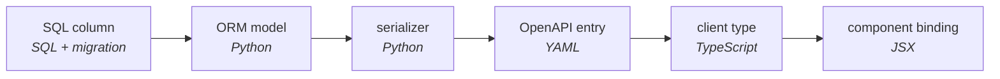

# Why Jac Exists

An application often represents the same concept in several places: a database
schema, a server model, an API response, and a client type. Changing a field can
require coordinated edits across those representations. Code generation and
contract checking help, but their coverage depends on how the tools are
connected.

Jac brings several of these declarations into one language. Its compiler can
use shared type information when checking supported client/server calls, and
its runtime provides graph storage and model-backed functions. The practical
aim is to reduce the mappings an application author must maintain.

For example, a conventional web application might carry a value through this
sequence:

Some applications generate these mappings; others maintain them by hand. Jac
lets a supported cross-tier call refer directly to the declared function and
its types. This reduces duplication, while runtime validation, authorization,
and failure handling remain necessary.

## Two assumptions, seventy years old

Jac's design explores two independent questions: how much of an application a
language can describe and check together, and how computation can be expressed
over connected data. Its research vocabulary calls the corresponding language
classes *synechic* and *topokinetic*.

The second question provides a useful juxtaposition with the von Neumann
model: instead of expressing every operation as data delivered to a fixed
procedure, a Jac walker carries state through a graph and executes abilities
at the nodes it visits. This is a programming abstraction. It does not require
a different processor architecture or imply that code physically migrates
between machines on every visit.

The first question concerns continuity across runtimes and ecosystems. Jac can
target server, browser, and native execution within one project, with placement
and interoperability rules determining which combinations are supported.
[The Two Ideas](ideas-behind-jac.md) explains this design vocabulary. You do not
need it to write your first program.

## Why this matters more in the era of AI authorship

Generated code needs the same checks as handwritten code. Shared declarations
can give a coding agent useful diagnostics when it changes a server contract
without updating a client. They do not establish that an application behaves
correctly or that a model-generated result is meaningful.

For development with an assistant, Jac bundles task-specific coding guides
with the compiler. Start with `jac guide jac-essentials`, retrieve the guide for
the task, and check and exercise the resulting program. For human learners,
the tutorials explain the same constructs through runnable examples and
observable results.

## Next steps

- [Install Jac](install.md) and run a first program.
- [Build an AI Day Planner](../tutorials/first-app/build-ai-day-planner.md) to learn through a project.
- [Core Concepts](what-makes-jac-different.md) introduces the main language features.
- [One App, Two Stacks](jac-vs-traditional-stack.md) compares two implementations of one application.
