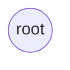
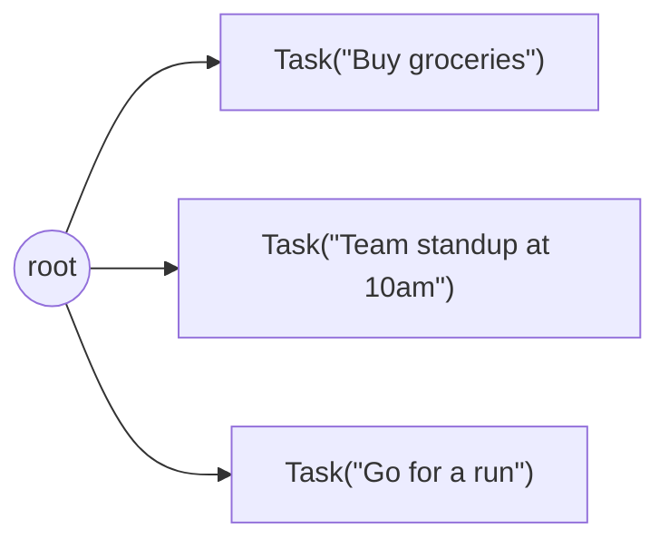

# Day Planner 2: Modeling Data with Nodes

**Outcome:** Modeling Data with Nodes. **Prerequisite:** complete [lesson 1](day-planner-01-basics.md) or restore its complete-code checkpoint.

Work through the examples in order. Partial snippets extend the current file; blocks labeled complete contain the replacement file for that stage.

## Part 2: Modeling Data with Nodes

Jac provides **nodes** and **edges** for connected data. The day planner will store its graph through the runtime; graph structures can also be used transiently in memory. This part covers the graph features the day planner needs; the thinking behind the model lives in [Object-Spatial Programming](../language/osp.md).

**What is a Node?**

A node is structurally similar to an `obj` -- it's declared with the `node` keyword and its fields use `has`, just like you learned in Part 1. The difference is what the runtime does with it:

```jac
node Task {
    has title: str,
        done: bool = False;
}
```

The syntax looks almost identical to an `obj`, but nodes have one additional capability: they can be connected to other nodes with **edges**, forming a graph. Relationships are structural, not bookkeeping you maintain through references, foreign keys, or join tables.

Every node automatically gets a unique identifier from the runtime, accessible via `jid(node)`. You never need to manage IDs manually -- Jac handles this for you. You'll see `jid()` in action starting in Part 3.

**The Root Node and the Graph**

Every Jac program has a built-in `root` node, the entry point of the graph. Like `self`, `root` is ambiently available everywhere; you never import or declare it. It points to the *current runner* of the program, whether that's you executing a script or an authenticated user making a request. Think of it as the top of a tree of everything that should persist:



In a persistence-enabled context, connecting a transient node to persistent graph state promotes it into storage. A newly created, unconnected node is transient. Once a node has been persisted, removing an edge alone does not delete it; deletion is a separate operation.

When your app serves multiple users, each user gets their **own isolated `root`** -- same code, isolated data, enforced by the runtime. We'll see this in action in [Part 6](day-planner-06-auth.md#part-6-authentication-and-multi-file-organization) when we add authentication.

**Creating and Connecting Nodes**

The `++>` operator creates a node and connects it to an existing node with an edge:

```jac
node Task {
    has title: str,
        done: bool = False;
}

with entry {
    # Create tasks and connect them to root
    root ++> Task(title="Buy groceries");
    root ++> Task(title="Team standup at 10am");
    root ++> Task(title="Go for a run");

    print("Created 3 tasks!");
}
```

Run it with `jac <your-filename>.jac`. Your graph now looks like:

!!! tip "Running examples multiple times"
    In a persistence-enabled context, connecting nodes to a persistent root can retain them between runs. Keep these exercises separate from application data, identify the nodes you create, and delete only those exercise nodes when finished. If a reference fails, use `jac guide jac-debugging` to diagnose it before resetting any data.



The `++>` operator mirrors its right-hand side: connecting to a single node returns that node (connecting to a list returns a list). You can capture it:

<!-- jac-skip -->
```jac
task = root ++> Task(title="Buy groceries");  # The new Task node
print(task.title);  # "Buy groceries"
```

**Filter Comprehensions**

Before querying the graph, one more tool: **filter comprehensions**, which work on *any* collection of objects, not just graph queries. The `[?...]` syntax filters a list by field conditions, and `[?:Type]` filters by type:

```jac
obj Dog { has name: str, age: int; }
obj Cat { has name: str, age: int; }

with entry {
    pets: list = [
        Dog(name="Rex", age=5),
        Cat(name="Whiskers", age=3),
        Dog(name="Buddy", age=2)
    ];

    # Filter by type -- keep only Dogs
    dogs = pets[?:Dog];
    print(dogs);  # [Dog(name='Rex', age=5), Dog(name='Buddy', age=2)]

    # Filter by field condition
    young = pets[?age < 4];
    print(young);  # [Cat(name='Whiskers', age=3), Dog(name='Buddy', age=2)]

    # Combined type + field filter
    young_dogs = pets[?:Dog, age < 4];
    print(young_dogs);  # [Dog(name='Buddy', age=2)]
}
```

**Querying the Graph**

The `[-->]` syntax gives you a list of connected nodes, and because filter comprehensions work on any list, they apply to graph queries seamlessly:

```jac
with entry {
    root ++> Task(title="Buy groceries");
    root ++> Task(title="Team standup at 10am");

    # Get ALL nodes connected from root
    everything = [root-->];

    # Filter by node type -- same [?:Type] syntax
    tasks = [root-->][?:Task];
    for task in tasks {
        status = "done" if task.done else "pending";
        print(f"[{status}] {task.title}");
    }

    # Filter by field value
    grocery_tasks = [root-->][?:Task, title == "Buy groceries"];
}
```

`[root-->]` reads as "all nodes connected *from* root." It returns a plain list, and `[?:Task]` filters it with the same mechanism used on any collection.

Other directions work too:

- `[node-->]` -- outgoing connections (forward)
- `[node<--]` -- incoming connections (backward)
- `[node<-->]` -- both directions

**Deleting Nodes**

Use `del` to remove a node from the graph:

<!-- jac-skip -->
```jac
for task in [root-->][?:Task] {
    if task.title == "Team standup at 10am" {
        del task;
    }
}
```

**Debugging Tip**

You can inspect the graph at any time by printing connected nodes:

<!-- jac-skip -->
```jac
print([root-->]);           # All nodes connected to root
print([root-->][?:Task]);   # Just Task nodes
```

This is useful when data isn't appearing as expected.

??? info "Advanced: Custom Edges"
    So far, the edges between nodes are generic -- they just mean "connected." Jac also supports **typed edges** with their own data:

    ```jac
    edge Scheduled {
        has time: str,
            priority: int = 1;
    }
    ```

    Connect with a typed edge using `+>: EdgeType :+>`:

    <!-- jac-skip -->
    ```jac
    root +>: Scheduled(time="9:00am", priority=3) :+> Task(title="Morning run");
    ```

    And filter queries by edge type:

    <!-- jac-skip -->
    ```jac
    scheduled_tasks = [root->:Scheduled:->][?:Task];
    urgent = [root->:Scheduled:priority>=3:->][?:Task];
    ```

    We won't use custom edges in this tutorial (default edges are sufficient), but they're useful for modeling relationships like social networks, org charts, and dependency graphs.

**What You Learned**

- **`node`** -- a persistent data type that lives in the graph
- **`has`** -- declares fields with types and optional defaults
- **`root`** -- the built-in entry point of the graph, self-referential to the current runner
- **`++>`** -- create a node and connect it with an edge
- **`[?condition]`** -- filter comprehensions on any list of objects
- **`[?:Type]`** -- typed filter comprehension, works on any collection
- **`[?:Type, field == val]`** -- combined type and field filtering
- **`[root-->]`** -- query all connected nodes (returns a list, filterable like any other)
- **`jid(node)`** -- get the built-in unique identifier of any node
- **`del`** -- remove a node from the graph

> **Deep Dive:** [Object-Spatial Programming](../../reference/language/osp.md) covers the full graph model including typed edges, walkers, and advanced traversals. [Comprehensions & Filters](../../reference/language/advanced.md) has the complete filter syntax reference.

!!! example "Try It Yourself"
    After creating three tasks, mark one as done (`task.done = True`), then use `[root-->][?:Task, done == False]` to list only pending tasks. Verify that the completed task doesn't appear.

---

## Complete graph checkpoint

Save this separate exercise as `graph-checkpoint.jac`. It uses an in-memory graph so that repeated runs do not accumulate persistent tasks:

```jac
node Day {}
node Task {
    has title: str, done: bool = False;
}
with entry:__main__ {
    day = Day();
    day ++> Task(title="Buy groceries");
    day ++> Task(title="Read Jac");
    tasks = [day-->][?:Task];
    assert len(tasks) == 2;
    print([task.title for task in tasks]);
}
```

Run `jac run graph-checkpoint.jac`. It should print `['Buy groceries', 'Read Jac']` on each run.

## Checkpoint

Run each complete graph example in its own exercise file. Confirm that the reported tasks match the nodes created by that example. Explain which expression creates an edge and which expression reads connected nodes before continuing.

[Lesson overview](build-ai-day-planner.md) · [Previous lesson](day-planner-01-basics.md) · [Next lesson](day-planner-03-backend.md)
