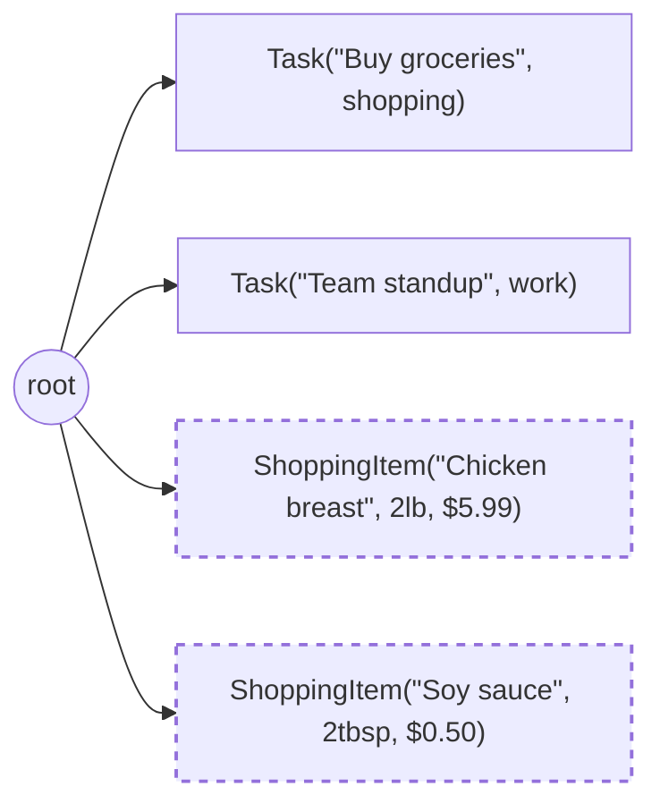

# Day Planner 5: Making It Smart with AI

**Outcome:** Making It Smart with AI. **Prerequisite:** complete [lesson 4](day-planner-04-frontend.md) or restore its complete-code checkpoint.

Work through the examples in order. Partial snippets extend the current file; blocks labeled complete contain the replacement file for that stage.

## Part 5: Making It Smart with AI

Your day planner works, but it doesn't leverage AI yet. This part introduces one of Jac's most distinctive capabilities: the ability to delegate functions to a large language model using nothing more than type signatures and semantic hints. You'll add two AI features -- **automatic task categorization** and a **meal shopping list generator** -- and in doing so, you'll see how Jac's type system becomes a bridge between traditional programming and AI.

!!! tip "Starting fresh"
    If you have leftover data from Parts 1–4, delete the `.jac/data/` directory before running Part 5. The schema changes (adding `category` to Task) may conflict with old nodes.

**Set Up the Model**

Jac's AI features need an LLM to run. The tutorial defaults to a **local model** -- Google Gemma 4 E4B, running in-process via `llama.cpp` -- so there's no API key to manage and no per-call cost. Install the local-model dependency once:

```bash
jac install 'byllm[local]'
```

The first time you run an AI feature, byLLM prompts you (in an interactive terminal) to download the ~5 GB GGUF weights, caches them under `~/.cache/jac/models/`, and uses the cached copy from then on. If you'd rather pre-fetch the weights now -- useful in CI, Docker, or just to know the download is done -- run:

```bash
jac model pull gemma-4-e4b
```

**Configure the LLM**

The model is chosen in `jac.toml` -- the project file that `jac create` generated for you. Add a `[byllm.model]` section:

```toml
[byllm.model]
default_model = "local:gemma-4-e4b"
```

That's the whole configuration. Anywhere you write `by llm()` in your Jac code, this is the model that runs. No import, no module-level variable -- swapping models means editing one line in `jac.toml`, with no code change.

!!! info "Use a cloud model instead"
    If you prefer a hosted model -- typically because you want a stronger model than runs locally, or you're on a machine without GPU/RAM headroom -- swap the `default_model` line in `jac.toml`. Jac's AI subsystem (byLLM) wraps [LiteLLM](https://docs.litellm.ai/docs/providers), so anything LiteLLM supports works here:

    | Provider | `default_model` value | Notes |
    |----------|-----------------------|-------|
    | Anthropic Claude | `"anthropic/claude-sonnet-4-6"` | Set `ANTHROPIC_API_KEY`; get credits at [console.anthropic.com](https://console.anthropic.com) |
    | Google Gemini | `"gemini/gemini-2.5-flash"` | Set `GEMINI_API_KEY`; free tier at [ai.google.dev](https://ai.google.dev/) |
    | Ollama (local daemon) | `"ollama/llama3.2:1b"` | Requires [Ollama](https://ollama.ai/) running locally |

    Whichever you pick, set the matching API key as an environment variable before `jac run` (e.g. `export ANTHROPIC_API_KEY="..."`). The rest of the tutorial code is identical.

!!! info "Alternative: configure the model in code with `glob`"
    You can also initialize the model from Jac source, which is useful when you want the choice of model to be visible in the code itself or vary by file:

    ```jac
    import from jaclang.byllm.lib { Model }

    glob llm = Model(model_name="local:gemma-4-e4b");
    ```

    `import from jaclang.byllm.lib { Model }` loads the AI subsystem. `glob` declares a module-level variable accessible throughout the file. We'll stick with the `jac.toml` form in this tutorial because it keeps source files focused on logic.

**Enums as Output Constraints**

Before using AI, you need a way to constrain its output. An **enum** defines a fixed set of named values -- and when used as a return type for an AI function, it forces the LLM to pick from your predefined options. Access values with `Category.WORK` and convert to string with `str(Category.WORK)`:

```jac
enum Category { WORK, PERSONAL, SHOPPING, HEALTH, FITNESS, OTHER }
```

This is the central concept: the enum constrains the AI to return *exactly one* of these predefined values. Without it, an LLM might return "shopping", "Shopping", "groceries", or "grocery shopping" -- all meaning the same thing but impossible to handle consistently in code. The enum eliminates that ambiguity entirely, making AI output as predictable as any other function return value.

!!! tip "Typed-base enums"
    For cases where you want enum members to behave as a primitive type, use `enum X: T { ... }`. `enum Status: str { OK = "ok", FAIL = "fail" }` makes members real `str` instances (no `.value` needed); `enum Code: int { ... }` does the same for `int`. Plain `enum` (used here) stays the right choice when the member identity matters more than the underlying value.

**by llm() -- AI Function Delegation**

Now for the core idea. Pay close attention, because this pattern is central to how Jac integrates AI:

```jac
def categorize(title: str) -> Category by llm();
sem categorize = "Categorize a task based on its title";
```

That's the **entire function**. There's no body to write -- `by llm()` tells Jac to delegate the implementation to the LLM. The compiler constructs a prompt from everything it knows about the function:

- The **function name** -- `categorize` tells the LLM what to do
- The **parameter names and types** -- `title: str` is what the LLM receives
- The **return type** -- `Category` constrains output to one of the enum values
- The **`sem` hint** -- additional context for the LLM

This is why the type annotations you learned in Part 1 matter so much. The function name, parameter names, types, and `sem` hint collectively **are the specification**. The LLM fulfills it. In other words, the same type system that catches bugs at compile time also guides the AI at runtime.

!!! info "`sem` vs docstrings"
    Use **`sem`** to provide semantic context for any declaration that the LLM needs to understand. While docstrings describe code for humans (and auto-generate API docs), `sem` is specifically designed to guide the LLM compiler. Always prefer `sem` for `by llm()` functions and their parameters.

**Wire It Into the Task Flow**

Two changes are needed. First, add a `category` field to the `Task` node:

```jac
node Task {
    has title: str,
        done: bool = False,
        category: str = "other";
}
```

Then update `add_task` to call the AI:

```jac
"""Add a task with AI categorization."""
def:pub add_task(title: str) -> Task {
    category = str(categorize(title)).split(".")[-1].lower();
    task = root ++> Task(title=title, category=category);
    return task;
}
```

`str(categorize(title)).split(".")[-1].lower()` converts `Category.SHOPPING` to `"shopping"` for clean display. Notice the return type is still `-> Task` -- the new `category` field is automatically included when the typed object crosses the client-server boundary. The other endpoints (`get_tasks`, `toggle_task`, `delete_task`) don't need any changes either, because they already return typed `Task` objects that now include the `category` field automatically.

**Structured Output with obj and sem**

Now for a more advanced use case: the shopping list. The `categorize` function returns a single enum value -- simple. But what if you need the AI to return *structured* data -- not just a string or a category, but a list of ingredients, each with a name, quantity, unit, and estimated cost? This is where `obj` and `sem` come together.

**`obj`** defines a structured data type that serves as an output schema for the LLM. Unlike `node`, objects aren't stored in the graph -- they're data containers that describe the *shape* of what the AI should return:

```jac
enum Unit { PIECE, LB, OZ, CUP, TBSP, TSP, BUNCH }

obj Ingredient {
    has name: str,
        quantity: float,
        unit: Unit,
        cost: float,
        carby: bool;
}
```

**`sem`** adds a semantic hint that tells the LLM what an ambiguous field means:

```jac
sem Ingredient.cost = "Estimated cost in USD";
sem Ingredient.carby = "True if this ingredient is high in carbohydrates";
```

Consider why this matters: without `sem`, `cost: float` is ambiguous to the LLM -- cost in what currency? Per unit or total? Per serving? With the semantic hint, the LLM knows exactly what to generate. This is a general principle: **the more precise your types and hints, the more reliable the AI output**.

Now the AI function:

```jac
def generate_shopping_list(meal_description: str) -> list[Ingredient] by llm();
sem generate_shopping_list = "Generate a shopping list of ingredients needed for a described meal";
```

The LLM returns a `list[Ingredient]` -- a list of typed objects, each with name, quantity, unit, cost, and carb flag. Jac validates the structure automatically, ensuring every field has the correct type. If the LLM produces malformed output, the runtime catches it rather than letting bad data propagate through your application.

**Shopping List Nodes and Endpoints**

Now you need to persist the AI-generated ingredients in the graph. Notice that `Ingredient` (an `obj`) is used for AI output, while `ShoppingItem` (a `node`) is used for persistence. This separation is intentional -- the AI schema and the storage schema can evolve independently:

```jac
node ShoppingItem {
    has name: str,
        quantity: float,
        unit: str,
        cost: float,
        carby: bool;
}
```

And three new endpoints:

```jac
"""Generate a shopping list from a meal description."""
def:pub generate_list(meal: str) -> list[ShoppingItem] {
    # Clear old items
    for item in [root-->][?:ShoppingItem] {
        del item;
    }
    # Generate new ones
    ingredients = generate_shopping_list(meal);
    for ing in ingredients {
        item: dict[str, any] = {"unit": str(ing.unit).split(".")[-1].lower()};
        comptime for f in fields(ShoppingItem) {
            comptime if f.name != "unit" {
                item[f.name] = get_field(ing, f.name);
            }
        }
        root ++> ShoppingItem(**item);
    }
    return [root-->][?:ShoppingItem];
}

"""Get the current shopping list."""
def:pub get_shopping_list -> list[ShoppingItem] {
    return [root-->][?:ShoppingItem];
}

"""Clear the shopping list."""
def:pub clear_shopping_list -> dict[str, bool] {
    for item in [root-->][?:ShoppingItem] {
        del item;
    }
    return {"cleared": True};
}
```

Compare these endpoints to the task endpoints -- the same pattern applies. Instead of manually constructing dictionaries with every field, you return typed objects directly. The runtime serializes all `has` fields automatically when they cross the client-server boundary. `generate_list` returns `list[ShoppingItem]` and `get_shopping_list` does the same -- no manual dict construction needed.

Notice how `generate_list` clears old shopping items before generating new ones -- this ensures you always see a fresh list. The graph now holds both task and shopping data, demonstrating how different types of nodes coexist naturally:



**Update the Frontend**

The frontend needs a two-column layout: tasks on the left, shopping list on the right. Update the component with new state, methods, and the shopping panel:

```jac
def:pub app -> JsxElement {
    has tasks: list = [],
        task_text: str = "",
        meal_text: str = "",
        ingredients: list = [],
        generating: bool = False;

    async can with entry {
        tasks = await get_tasks();
        ingredients = await get_shopping_list();
    }

    async def add_new_task {
        if task_text.strip() {
            task = await add_task(task_text.strip());
            tasks = tasks + [task];
            task_text = "";
        }
    }

    async def toggle(id: str) {
        updated = await toggle_task(id);
        tasks = [updated if jid(t) == id else t for t in tasks];
    }

    async def remove(id: str) {
        await delete_task(id);
        tasks = [t for t in tasks if jid(t) != id];
    }

    async def generate_meal_list {
        if meal_text.strip() {
            generating = True;
            ingredients = await generate_list(meal_text.strip());
            generating = False;
        }
    }

    async def clear_list {
        await clear_shopping_list();
        ingredients = [];
        meal_text = "";
    }

    remaining = len([t for t in tasks if not t.done]);
    total_cost = 0.0;
    for ing in ingredients { total_cost = total_cost + ing.cost; }

    return
        <div class="container">
            <h1>AI Day Planner</h1>
            <div class="two-column">
                <div class="column">
                    <h2>Today's Tasks</h2>
                    <div class="input-row">
                        <input
                            class="input"
                            value={task_text}
                            onChange={lambda (e: ChangeEvent) { task_text = e.target.value; }}
                            onKeyPress={lambda (e: KeyboardEvent) {
                                if e.key == "Enter" { add_new_task(); }
                            }}
                            placeholder="What needs to be done today?"
                        />
                        <button class="btn-add" onClick={add_new_task}>Add</button>
                    </div>
                    {[
                        <div key={jid(t)} class="task-item">
                            <input
                                type="checkbox"
                                checked={t.done}
                                onChange={lambda { toggle(jid(t)); }}
                            />
                            <span class={"task-title " + ("task-done" if t.done else "")}>
                                {t.title}
                            </span>
                            {(
                                <span class="category">{t.category}</span>
                            ) if t.category and t.category != "other" else None}
                            <button
                                class="btn-delete"
                                onClick={lambda { remove(jid(t)); }}
                            >
                                X
                            </button>
                        </div> for t in tasks
                    ]}
                    <div class="count">{remaining} {("task" if remaining == 1 else "tasks")} remaining</div>
                </div>
                <div class="column">
                    <h2>Meal Shopping List</h2>
                    <div class="input-row">
                        <input
                            class="input"
                            value={meal_text}
                            onChange={lambda (e: ChangeEvent) { meal_text = e.target.value; }}
                            onKeyPress={lambda (e: KeyboardEvent) {
                                if e.key == "Enter" { generate_meal_list(); }
                            }}
                            placeholder="Describe a meal, e.g. 'chicken stir fry for 4'"
                        />
                        <button
                            class="btn-generate"
                            onClick={generate_meal_list}
                            disabled={generating}
                        >
                            {("Generating..." if generating else "Generate")}
                        </button>
                    </div>
                    {(
                        <div class="generating-msg">Generating with AI...</div>
                    ) if generating else None}
                    {[
                        <div key={ing.name} class="ingredient-item">
                            <div class="ing-info">
                                <span class="ing-name">{ing.name}</span>
                                <span class="ing-qty">
                                    {ing.quantity} {ing.unit}
                                </span>
                            </div>
                            <div class="ing-meta">
                                {(
                                    <span class="carb-badge">Carbs</span>
                                ) if ing.carby else None}
                                <span class="ing-cost">${f"{ing.cost:.2f}"}</span>
                            </div>
                        </div> for ing in ingredients
                    ]}
                    {(
                        <div class="shopping-footer">
                            <span class="total">Total: ${f"{total_cost:.2f}"}</span>
                            <button class="btn-clear" onClick={clear_list}>Clear</button>
                        </div>
                    ) if len(ingredients) > 0 else None}
                </div>
            </div>
        </div>;
}
```

**Componentizing the UI**

The two-column `app` function works, but look at the code: it's mixing four different concerns -- task list state, shopping list state, the task row markup, and the ingredient row markup. As any UI grows, this single-component approach becomes harder to navigate and harder to change. The fix is the same idea that React, Vue, and Svelte use: **break the UI into smaller, focused components**.

In Jac, a component is just a `cl def:pub` function that returns `JsxElement`. Components can take parameters (called *props*), own their own `has` state, and compose into bigger components. You'll factor the app into four:

| Component | Owns state? | Purpose |
|-----------|-------------|---------|
| `TaskItem` | No | Renders one task row given a `task` and callbacks |
| `TasksColumn` | Yes (tasks, input text) | Owns the task list and fetches on mount |
| `IngredientItem` | No | Renders one ingredient row |
| `ShoppingColumn` | Yes (ingredients, meal text) | Owns the shopping list and fetches on mount |

The top-level `app` then becomes a trivial composition of `<TasksColumn/>` and `<ShoppingColumn/>` -- no shared state, no mixed concerns.

**A presentational component: `TaskItem`**

A component that takes props but owns no state is called *presentational* -- it renders what it's given, and the parent decides what happens on interaction:

```jac
"""Single task row -- presentational; toggle and delete are passed in."""
def:pub TaskItem(
    task: Task, onToggle: Callable[[], None], onDelete: Callable[[], None]
) -> JsxElement {
    return
        <div class="task-item">
            <input type="checkbox" checked={task.done} onChange={onToggle}/>
            <span class={"task-title " + ("task-done" if task.done else "")}>
                {task.title}
            </span>
            {(<span class="category">{task.category}</span>)
                if task.category and task.category != "other"
                else None}
            <button class="btn-delete" onClick={onDelete}>X</button>
        </div>;
}
```

Two things to notice. First, `task: Task` is a real typed `node` -- the same type used on the server. Because `Task` returned by `get_tasks()` crosses the client-server boundary as a typed object, `TaskItem` works on the original typed instance, not a dict. Second, `onToggle: Callable[[], None]` declares that the parent must pass a function taking no arguments and returning nothing. `Callable` is how Jac describes function signatures in type annotations.

**A stateful component: `TasksColumn`**

`TasksColumn` owns the task list and the input text. It fetches on mount, makes server calls in response to user actions, and renders `TaskItem` instances:

```jac
"""Tasks column -- owns task list state, fetches on mount."""
def:pub TasksColumn -> JsxElement {
    has tasks: list[Task] = [],
        task_text: str = "";

    async can with entry {
        tasks = await get_tasks();
    }

    async def add_new_task {
        if task_text.strip() {
            task = await add_task(task_text.strip());
            tasks = tasks + [task];
            task_text = "";
        }
    }

    async def toggle(id: str) {
        updated = await toggle_task(id);
        if updated is not None {
            tasks = [updated if jid(t) == id else t for t in tasks];
        }
    }

    async def remove(id: str) {
        await delete_task(id);
        tasks = [t for t in tasks if jid(t) != id];
    }

    remaining = len([t for t in tasks if not t.done]);

    return
        <div class="column">
            <h2>Today's Tasks</h2>
            <div class="input-row">
                <input
                    class="input"
                    value={task_text}
                    onChange={lambda (e: ChangeEvent) { task_text = e.target.value; }}
                    onKeyPress={lambda (e: KeyboardEvent) {
                        if e.key == "Enter" { add_new_task(); }
                    }}
                    placeholder="What needs to be done today?"
                />
                <button class="btn-add" onClick={add_new_task}>Add</button>
            </div>
            {[
                <TaskItem
                    key={jid(t)}
                    task={t}
                    onToggle={lambda { toggle(jid(t)); }}
                    onDelete={lambda { remove(jid(t)); }}
                /> for t in tasks
            ]}
            <div class="count">
                {remaining} {("task" if remaining == 1 else "tasks")} remaining
            </div>
        </div>;
}
```

The rendering is much easier to read now: a header, an input row, a list of `<TaskItem/>` elements, and a count. The inline lambdas for `onToggle` and `onDelete` close over `jid(t)` so each row knows which task it's acting on. This pattern -- passing callbacks that capture per-row data -- is how parent components stay in control of what happens when a child is interacted with.

**The shopping components**

`IngredientItem` and `ShoppingColumn` follow the same shape -- presentational row, then stateful column:

```jac
"""Single ingredient row -- presentational."""
def:pub IngredientItem(ing: ShoppingItem) -> JsxElement {
    return
        <div class="ingredient-item">
            <div class="ing-info">
                <span class="ing-name">{ing.name}</span>
                <span class="ing-qty">{ing.quantity} {ing.unit}</span>
            </div>
            <div class="ing-meta">
                {(<span class="carb-badge">Carbs</span>) if ing.carby else None}
                <span class="ing-cost">${f"{ing.cost:.2f}"}</span>
            </div>
        </div>;
}

"""Shopping list column -- owns ingredient state, fetches on mount."""
def:pub ShoppingColumn -> JsxElement {
    has ingredients: list[ShoppingItem] = [],
        meal_text: str = "",
        generating: bool = False;

    async can with entry {
        ingredients = await get_shopping_list();
    }

    async def generate_meal_list {
        if meal_text.strip() {
            generating = True;
            ingredients = await generate_list(meal_text.strip());
            generating = False;
        }
    }

    async def clear_list {
        await clear_shopping_list();
        ingredients = [];
        meal_text = "";
    }

    total_cost = 0.0;
    for ing in ingredients {
        total_cost = total_cost + ing.cost;
    }

    return
        <div class="column">
            <h2>Meal Shopping List</h2>
            <div class="input-row">
                <input
                    class="input"
                    value={meal_text}
                    onChange={lambda (e: ChangeEvent) { meal_text = e.target.value; }}
                    onKeyPress={lambda (e: KeyboardEvent) {
                        if e.key == "Enter" { generate_meal_list(); }
                    }}
                    placeholder="Describe a meal, e.g. 'chicken stir fry for 4'"
                />
                <button
                    class="btn-generate"
                    onClick={generate_meal_list}
                    disabled={generating}
                >
                    {("Generating..." if generating else "Generate")}
                </button>
            </div>
            {(<div class="generating-msg">Generating with AI...</div>)
                if generating
                else None}
            {[<IngredientItem key={ing.name} ing={ing}/> for ing in ingredients]}
            {(
                <div class="shopping-footer">
                    <span class="total">Total: ${f"{total_cost:.2f}"}</span>
                    <button class="btn-clear" onClick={clear_list}>Clear</button>
                </div>
            ) if len(ingredients) > 0 else None}
        </div>;
}
```

**The new `app`**

With the column components doing all the heavy lifting, `app` is now small enough to read in a breath:

```jac
def:pub app -> JsxElement {
    return
        <div class="container">
            <h1>AI Day Planner</h1>
            <div class="two-column">
                <TasksColumn/>
                <ShoppingColumn/>
            </div>
        </div>;
}
```

Step back and notice the architectural payoff. The two columns are *independent* -- each owns its own state, makes its own server calls, and renders itself. Adding a third column, swapping `<TasksColumn/>` for a routing wrapper, or reusing `<TaskItem/>` somewhere else is now a local change that doesn't touch the rest of the app. This is the same separation-of-concerns thinking that makes graphs and `def:priv` clean -- only applied to UI.

!!! info "Components live in one file -- for now"
    All four components currently live in the same `main.jac`. That's fine for a tutorial. In a real project, each component would live in its own file -- you'll see that layout in Part 6, where you'll split components into a `components/` folder.

**Update Styles**

Replace `styles.css` with the expanded version that supports the two-column layout and shopping list:

```css
.container { max-width: 900px; margin: 40px auto; font-family: system-ui; padding: 20px; }
h1 { text-align: center; margin-bottom: 24px; color: #333; }
h2 { margin: 0 0 16px 0; font-size: 1.2rem; color: #444; }
.two-column { display: grid; grid-template-columns: 1fr 1fr; gap: 24px; }
@media (max-width: 700px) { .two-column { grid-template-columns: 1fr; } }
.input-row { display: flex; gap: 8px; margin-bottom: 16px; }
.input { flex: 1; padding: 10px; border: 1px solid #ddd; border-radius: 6px; font-size: 1rem; }
.btn-add { padding: 10px 20px; background: #4CAF50; color: white; border: none; border-radius: 6px; cursor: pointer; font-weight: 600; }
.btn-generate { padding: 10px 16px; background: #2196F3; color: white; border: none; border-radius: 6px; cursor: pointer; font-weight: 600; white-space: nowrap; }
.btn-generate:disabled { opacity: 0.6; cursor: not-allowed; }
.btn-delete { background: #e53e3e; color: white; border: none; border-radius: 4px; padding: 4px 8px; cursor: pointer; font-size: 0.85rem; }
.btn-clear { background: #888; color: white; border: none; border-radius: 4px; padding: 6px 12px; cursor: pointer; font-size: 0.85rem; }
.task-item { display: flex; align-items: center; padding: 10px; border-bottom: 1px solid #eee; gap: 10px; }
.task-title { flex: 1; }
.task-done { text-decoration: line-through; color: #888; }
.category { padding: 2px 8px; background: #e8f5e9; border-radius: 12px; font-size: 0.75rem; color: #2e7d32; margin-right: 8px; }
.count { text-align: center; color: #888; margin-top: 12px; font-size: 0.9rem; }
.ingredient-item { display: flex; justify-content: space-between; align-items: center; padding: 10px; border-bottom: 1px solid #eee; }
.ing-info { display: flex; flex-direction: column; gap: 2px; }
.ing-name { font-weight: 500; }
.ing-qty { color: #666; font-size: 0.85rem; }
.ing-meta { display: flex; align-items: center; gap: 8px; }
.ing-cost { color: #2196F3; font-weight: 600; }
.carb-badge { padding: 2px 6px; background: #fff3e0; border-radius: 12px; font-size: 0.7rem; color: #e65100; }
.shopping-footer { display: flex; justify-content: space-between; align-items: center; padding: 12px 0; margin-top: 8px; border-top: 1px solid #ddd; }
.total { font-weight: 700; color: #2196F3; }
.generating-msg { text-align: center; padding: 20px; color: #666; }
```

**Run It**

??? note "Complete `main.jac` for Parts 1–5"

    ```jac
    import "./styles.css";

    # --- Enums ---

    enum Category { WORK, PERSONAL, SHOPPING, HEALTH, FITNESS, OTHER }

    enum Unit { PIECE, LB, OZ, CUP, TBSP, TSP, BUNCH }

    # --- AI Types ---

    obj Ingredient {
        has name: str,
            quantity: float,
            unit: Unit,
            cost: float,
            carby: bool;
    }

    sem Ingredient.cost = "Estimated cost in USD";
    sem Ingredient.carby = "True if this ingredient is high in carbohydrates";

    def categorize(title: str) -> Category by llm();
    sem categorize = "Categorize a task based on its title";

    def generate_shopping_list(meal_description: str) -> list[Ingredient] by llm();
    sem generate_shopping_list = "Generate a shopping list of ingredients needed for a described meal";

    # --- Data Nodes ---

    node Task {
        has title: str,
            done: bool = False,
            category: str = "other";
    }

    node ShoppingItem {
        has name: str,
            quantity: float,
            unit: str,
            cost: float,
            carby: bool;
    }

    # --- Task Endpoints ---

    """Add a task with AI categorization."""
    def:pub add_task(title: str) -> Task {
        category = str(categorize(title)).split(".")[-1].lower();
        task = root ++> Task(title=title, category=category);
        return task;
    }

    """Get all tasks."""
    def:pub get_tasks -> list[Task] {
        return [root-->][?:Task];
    }

    """Toggle a task's done status."""
    def:pub toggle_task(id: str) -> Task | None {
        for task in [root-->][?:Task] {
            if jid(task) == id {
                task.done = not task.done;
                return task;
            }
        }
        return None;
    }

    """Delete a task."""
    def:pub delete_task(id: str) -> dict[str, str] {
        for task in [root-->][?:Task] {
            if jid(task) == id {
                del task;
                return {"deleted": id};
            }
        }
        return {};
    }

    # --- Shopping List Endpoints ---

    """Generate a shopping list from a meal description."""
    def:pub generate_list(meal: str) -> list[ShoppingItem] {
        for item in [root-->][?:ShoppingItem] {
            del item;
        }
        ingredients = generate_shopping_list(meal);
        for ing in ingredients {
            item: dict[str, any] = {"unit": str(ing.unit).split(".")[-1].lower()};
            comptime for f in fields(ShoppingItem) {
                comptime if f.name != "unit" {
                    item[f.name] = get_field(ing, f.name);
                }
            }
            root ++> ShoppingItem(**item);
        }
        return [root-->][?:ShoppingItem];
    }

    """Get the current shopping list."""
    def:pub get_shopping_list -> list[ShoppingItem] {
        return [root-->][?:ShoppingItem];
    }

    """Clear the shopping list."""
    def:pub clear_shopping_list -> dict[str, bool] {
        for item in [root-->][?:ShoppingItem] {
            del item;
        }
        return {"cleared": True};
    }

    # --- Frontend Components ---

    """Single task row -- presentational; toggle and delete are passed in."""
    def:pub TaskItem(
        task: Task, onToggle: Callable[[], None], onDelete: Callable[[], None]
    ) -> JsxElement {
        return
            <div class="task-item">
                <input type="checkbox" checked={task.done} onChange={onToggle}/>
                <span class={"task-title " + ("task-done" if task.done else "")}>
                    {task.title}
                </span>
                {(<span class="category">{task.category}</span>)
                    if task.category and task.category != "other"
                    else None}
                <button class="btn-delete" onClick={onDelete}>X</button>
            </div>;
    }

    """Tasks column -- owns task list state, fetches on mount."""
    def:pub TasksColumn -> JsxElement {
        has tasks: list[Task] = [],
            task_text: str = "";

        async can with entry {
            tasks = await get_tasks();
        }

        async def add_new_task {
            if task_text.strip() {
                task = await add_task(task_text.strip());
                tasks = tasks + [task];
                task_text = "";
            }
        }

        async def toggle(id: str) {
            updated = await toggle_task(id);
            if updated is not None {
                tasks = [updated if jid(t) == id else t for t in tasks];
            }
        }

        async def remove(id: str) {
            await delete_task(id);
            tasks = [t for t in tasks if jid(t) != id];
        }

        remaining = len([t for t in tasks if not t.done]);

        return
            <div class="column">
                <h2>Today's Tasks</h2>
                <div class="input-row">
                    <input
                        class="input"
                        value={task_text}
                        onChange={lambda (e: ChangeEvent) { task_text = e.target.value; }}
                        onKeyPress={lambda (e: KeyboardEvent) {
                            if e.key == "Enter" { add_new_task(); }
                        }}
                        placeholder="What needs to be done today?"
                    />
                    <button class="btn-add" onClick={add_new_task}>Add</button>
                </div>
                {[
                    <TaskItem
                        key={jid(t)}
                        task={t}
                        onToggle={lambda { toggle(jid(t)); }}
                        onDelete={lambda { remove(jid(t)); }}
                    /> for t in tasks
                ]}
                <div class="count">
                    {remaining} {("task" if remaining == 1 else "tasks")} remaining
                </div>
            </div>;
    }

    """Single ingredient row -- presentational."""
    def:pub IngredientItem(ing: ShoppingItem) -> JsxElement {
        return
            <div class="ingredient-item">
                <div class="ing-info">
                    <span class="ing-name">{ing.name}</span>
                    <span class="ing-qty">{ing.quantity} {ing.unit}</span>
                </div>
                <div class="ing-meta">
                    {(<span class="carb-badge">Carbs</span>) if ing.carby else None}
                    <span class="ing-cost">${f"{ing.cost:.2f}"}</span>
                </div>
            </div>;
    }

    """Shopping list column -- owns ingredient state, fetches on mount."""
    def:pub ShoppingColumn -> JsxElement {
        has ingredients: list[ShoppingItem] = [],
            meal_text: str = "",
            generating: bool = False;

        async can with entry {
            ingredients = await get_shopping_list();
        }

        async def generate_meal_list {
            if meal_text.strip() {
                generating = True;
                ingredients = await generate_list(meal_text.strip());
                generating = False;
            }
        }

        async def clear_list {
            await clear_shopping_list();
            ingredients = [];
            meal_text = "";
        }

        total_cost = 0.0;
        for ing in ingredients { total_cost = total_cost + ing.cost; }

        return
            <div class="column">
                <h2>Meal Shopping List</h2>
                <div class="input-row">
                    <input
                        class="input"
                        value={meal_text}
                        onChange={lambda (e: ChangeEvent) { meal_text = e.target.value; }}
                        onKeyPress={lambda (e: KeyboardEvent) {
                            if e.key == "Enter" { generate_meal_list(); }
                        }}
                        placeholder="Describe a meal, e.g. 'chicken stir fry for 4'"
                    />
                    <button
                        class="btn-generate"
                        onClick={generate_meal_list}
                        disabled={generating}
                    >
                        {("Generating..." if generating else "Generate")}
                    </button>
                </div>
                {(<div class="generating-msg">Generating with AI...</div>)
                    if generating
                    else None}
                {[<IngredientItem key={ing.name} ing={ing}/> for ing in ingredients]}
                {(
                    <div class="shopping-footer">
                        <span class="total">Total: ${f"{total_cost:.2f}"}</span>
                        <button class="btn-clear" onClick={clear_list}>Clear</button>
                    </div>
                ) if len(ingredients) > 0 else None}
            </div>;
    }

    def:pub app -> JsxElement {
        return
            <div class="container">
                <h1>AI Day Planner</h1>
                <div class="two-column">
                    <TasksColumn/>
                    <ShoppingColumn/>
                </div>
            </div>;
    }
    ```

```bash
jac run main.jac    # builds and serves
```

!!! warning "Common issue"
    If adding a task silently fails (nothing happens), check the terminal running `jac run` for error messages. The most common culprits:

    - `byllm[local]` not installed -- re-run `jac install 'byllm[local]'`
    - Weights not downloaded yet in a non-interactive terminal -- run `jac model pull gemma-4-e4b` once, or set `BYLLM_AUTO_DOWNLOAD=1` and let `jac run` fetch them
    - If you switched to a cloud model, a missing or invalid API key causes a server error -- check the export

Open [http://localhost:8000](http://localhost:8000). The app now has two columns. Try it:

1. **Add "Buy groceries"** -- it appears with a "shopping" badge
2. **Add "Schedule dentist appointment"** -- tagged "health"
3. **Add "Review pull requests"** -- tagged "work"
4. **Type "chicken stir fry for 4"** in the meal planner and click Generate -- a structured shopping list appears with quantities, units, costs, and carb flags
5. **Restart the server** -- everything persists (both tasks and shopping list)

The AI can only pick from the enum values you defined -- `Category` for tasks, `Unit` for ingredients. This is the key takeaway of this part: **Jac's type system constrains the LLM's output automatically**. You don't write prompt-assembly logic or output parsers. The types *are* the constraints.

!!! tip "Visualize the graph"
    Visit [http://localhost:8000/graph](http://localhost:8000/graph) to see both `Task` and `ShoppingItem` nodes connected to `root`. After generating a shopping list, you'll see the graph grow with ingredient nodes alongside your tasks.

**What You Learned**

- **`[byllm.model]` in `jac.toml`** -- configure which LLM `by llm()` calls use
- **`glob`** -- module-level variables, accessible throughout the file (used here for `glob llm = Model(...)` as an alternative to `jac.toml` configuration)
- **`enum`** -- fixed set of named values, used here to constrain AI output
- **`def func(...) -> Type by llm()`** -- let the LLM implement a function from its signature
- **`obj`** -- structured data types (not stored in graph, used as data containers)
- **`sem Type.field = "..."`** -- semantic hints that guide LLM field interpretation
- **`-> list[Type] by llm()`** -- get validated structured output from the LLM
- **Jac's type system is the LLM's output schema** -- name things clearly and `by llm()` handles the rest
- **Components** -- `cl def:pub Name(props) -> JsxElement` is a reusable UI building block; presentational components take props and render, stateful components own `has` state and fetch on mount
- **`Callable[[], None]`** -- the type annotation for a callback prop (a function taking no arguments and returning nothing)
- **Composition** -- a parent component renders `<Child prop={...}/>`; per-row data is captured by inline lambdas passed as callbacks

> **Deep Dive:** [byLLM Reference](../../reference/plugins/byllm.md) covers all AI integration options including model configuration, multi-provider support, and advanced prompt control. [Structured Outputs tutorial](../ai/structured-outputs.md) has more examples of `obj` + `sem` patterns.

!!! example "Try It Yourself"
    Add `SOCIAL` and `FINANCE` to the `Category` enum. Then test how the AI categorizes tasks like "Call mom", "Pay rent", and "Gym at 6pm".

---

## Checkpoint

Use the complete `main.jac` above with the model configuration described in this lesson. Categorize a task and generate a shopping list. Check the output fields and test a failed model request; a valid schema alone does not establish that a category or ingredient is appropriate.

[Lesson overview](build-ai-day-planner.md) · [Previous lesson](day-planner-04-frontend.md) · [Next lesson](day-planner-06-auth.md)
