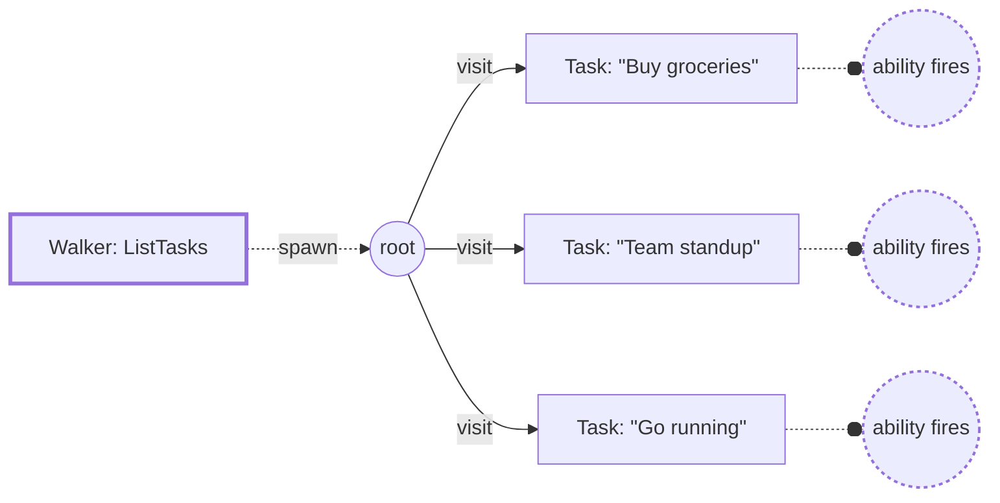

# Day Planner 7: Object-Spatial Programming with Walkers

**Outcome:** Object-Spatial Programming with Walkers. **Prerequisite:** complete [lesson 6](day-planner-06-auth.md) or restore its complete-code checkpoint.

Work through the examples in order. Partial snippets extend the current file; blocks labeled complete contain the replacement file for that stage.

## Part 7: Object-Spatial Programming with Walkers

Your day planner is complete -- tasks persist in the graph, AI categorizes them, and you can generate shopping lists, all through `def:priv` functions that directly manipulate graph nodes. This final part reimplements the same backend with Jac's most distinctive feature: **Object-Spatial Programming (OSP)**, where **walkers** (mobile units of computation) travel through the graph and **abilities** fire as they arrive at nodes. The paradigm itself is covered in [Object-Spatial Programming](../language/osp.md); here you apply it to the app. The behavior stays identical, and the approach becomes increasingly valuable as your graphs grow deeper and more complex.

**What is a Walker?**

A walker is code that moves through the graph, triggering abilities as it enters each node:



The core keywords:

- **`visit [-->]`** -- move the walker to all connected nodes
- **`here`** -- the node the walker is currently visiting
- **`self`** -- the walker itself (its own state and properties)
- **`report`** -- send data back to whoever spawned the walker
- **`disengage`** -- stop traversal immediately

**Functions vs Walkers: Side by Side**

The best way to understand walkers is to compare them directly with the functions you already know. Here's `add_task` as a `def:priv` function (what you built in Part 6):

```jac
def:priv add_task(title: str) -> Task {
    category = str(categorize(title)).split(".")[-1].lower();
    task = root ++> Task(title=title, category=category);
    return task;
}
```

And here's the same logic as a walker:

```jac
walker AddTask {
    has title: str;

    can create with Root entry {
        category = str(categorize(self.title)).split(".")[-1].lower();
        new_task = here ++> Task(
            title=self.title,
            category=category
        );
        report new_task;
    }
}
```

Study the differences carefully -- each maps directly to a concept from the function version:

- **`walker AddTask`** -- declares a walker (like a node, but mobile). Think of it as a function that *goes to* the data.
- **`has title: str`** -- data the walker carries with it, passed when spawning. This replaces function parameters.
- **`can create with Root entry`** -- an **ability** that fires when the walker enters a `Root` node. The `with Root entry` part means "execute this code when I arrive at a Root node."
- **`here`** -- the current node the walker is visiting. In the function version, you wrote `root` directly; in the walker version, `here` is whatever node the walker is currently at.
- **`self.title`** -- the walker's own properties. Since the walker *is* an object, its data is accessed through `self`.
- **`report new_task`** -- sends the typed `Task` node back to whoever spawned the walker. This replaces `return`. The reported object crosses the client-server boundary as a fully typed object, just like function return values.

Spawn it:

<!-- jac-skip -->
```jac
result = root spawn AddTask(title="Buy groceries");
print(result.reports[0]);  # The reported Task
```

**`root spawn AddTask(title="...")`** creates a walker and starts it at root. Whatever the walker `report`s ends up in `result.reports`.

**Typed Walker Reports**

Before going further, there's one best practice to apply to every walker you write: declare a typed `reports` field that mirrors what `report` will produce. Add `reports: list[Task] = []` to `AddTask`:

```jac
walker AddTask {
    has title: str,
        reports: list[Task] = [];

    can create with Root entry {
        category = str(categorize(self.title)).split(".")[-1].lower();
        new_task = here ++> Task(title=self.title, category=category);
        report new_task;
    }
}
```

`report` already collects values into `.reports` automatically -- you don't write `self.reports.append(...)`. What the `has reports: list[Task] = []` declaration adds is **type information for the report channel**: the compiler checks that every `report X` statement is assignable to `Task`, and the client side knows `result.reports[0]` is a `Task` (not `any`). Without the declaration the channel defaults to `list[any]`, which propagates `any` into the calling code and undermines the type-aware UI you built in Part 6.

The shape of the type depends on what you report:

- **One typed object per ability** -- `report new_task;` reporting a `Task` → `reports: list[Task] = []`
- **A whole list at once** -- `report self.results;` where `results: list[Task]` → `reports: list[list[Task]] = []`
- **Plain dicts** -- `report {"deleted": id};` → you can leave `reports` undeclared; the channel stays `list[any]`, which is fine for status responses

Every walker in this part will use this pattern.

**The Accumulator Pattern**

The `AddTask` walker may seem like unnecessary complexity compared to the function. The value of walkers becomes clearer with `ListTasks`, which demonstrates the **accumulator pattern** -- collecting data across multiple nodes as the walker traverses the graph:

```jac
walker ListTasks {
    has results: list[Task] = [],
        reports: list[list[Task]] = [];

    can start with Root entry {
        visit [-->];
    }

    can collect with Task entry {
        self.results.append(here);
    }

    can done with Root exit {
        report self.results;
    }
}
```

Three abilities work together:

1. **`with Root entry`** -- the walker enters root, `visit [-->]` sends it to all connected nodes
2. **`with Task entry`** -- fires at each Task node, appending `here` (the node itself) to `self.results`
3. **`with Root exit`** -- after visiting all children, the walker returns to root and reports the accumulated list

Notice `reports: list[list[Task]] = []` -- because `report self.results` reports a whole `list[Task]` in one go, the outer type is `list[list[Task]]`. This is the pattern you saw introduced above.

Walker state persists across the entire traversal, which is what makes the accumulator pattern work. And because the results are typed `Task` objects, the client receives them with all fields accessible via dot notation.

Compare this to the function version:

```jac
def:priv get_tasks -> list[Task] {
    return [root-->][?:Task];
}
```

For this simple, flat graph, the function version is more concise. Walkers earn their keep as graphs get deeper (tasks containing subtasks containing notes): `visit [-->]` at each level recurses through the whole structure with no nested loops or recursive calls. [Object-Spatial Programming](../language/osp.md) develops this in depth.

!!! warning "Common issue"
    If walker reports come back empty, make sure you have `visit [-->]` to send the walker to connected nodes, and that the node type in `with X entry` matches your graph structure.

**Node Abilities**

Abilities can also live on the **node** instead of the walker:

```jac
node Task {
    has title: str,
        done: bool = False,
        category: str = "other";

    can respond with ListTasks entry {
        visitor.results.append(self);
    }
}
```

When a `ListTasks` walker visits a `Task` node, the node's `respond` ability fires automatically. Inside a node ability, **`visitor`** refers to the visiting walker (so you can access `visitor.results`). Walker-side abilities suit logic about the traversal; node-side abilities suit logic about the data. [Object-Spatial Programming](../language/osp.md) covers the trade-offs.

**visit and disengage**

**`visit [-->]`** queues all connected nodes for the walker to visit next. You can also filter:

<!-- jac-skip -->
```jac
visit [-->][?:Task];      # Visit only Task nodes
visit [-->] else {         # Fallback if no nodes to visit
    report "No tasks found";
};
```

**`disengage`** stops the walker immediately once you've found what you're looking for:

```jac
walker ToggleTask {
    has task_id: str,
        reports: list[Task] = [];

    can search with Root entry { visit [-->]; }

    can toggle with Task entry {
        if jid(here) == self.task_id {
            here.done = not here.done;
            report here;
            disengage;  # Found it -- stop visiting remaining nodes
        }
    }
}
```

`DeleteTask` follows the same pattern, but omits `reports` because it only reports a status dict:

```jac
walker DeleteTask {
    has task_id: str;

    can search with Root entry { visit [-->]; }

    can remove with Task entry {
        if jid(here) == self.task_id {
            del here;
            report {"deleted": self.task_id};
            disengage;
        }
    }
}
```

Reporting plain dicts is fine for simple status responses where no typed data needs to cross the boundary -- the channel stays `list[any]`, which is what you want when the shape is intentionally ad-hoc.

**Multi-Step Traversals**

The `GenerateShoppingList` walker performs multiple operations in a single graph traversal. Read this carefully, because the execution order is subtle:

```jac
walker GenerateShoppingList {
    has meal_description: str,
        reports: list[list[ShoppingItem]] = [];

    can generate with Root entry {
        # Queue connected nodes for traversal after this ability completes
        visit [-->];
        # Generate new ingredients (runs before queued visits)
        ingredients = generate_shopping_list(self.meal_description);
        for ing in ingredients {
            item: dict[str, any] = {"unit": str(ing.unit).split(".")[-1].lower()};
            comptime for f in fields(ShoppingItem) {
                comptime if f.name != "unit" {
                    item[f.name] = get_field(ing, f.name);
                }
            }
            here ++> ShoppingItem(**item);
        }
        report [here-->][?:ShoppingItem];
    }

    can clear_old with ShoppingItem entry {
        del here;
    }
}
```

Here's the key to understanding this walker: when `visit [-->]` runs, it doesn't immediately move the walker. Instead, it **queues** all connected nodes for traversal **after the current ability body completes**. So the rest of `generate` runs first -- creating new `ShoppingItem` nodes and building the result list. Then, once the ability body finishes, the walker traverses to the queued nodes. If any of those are `ShoppingItem` nodes that existed *before* this ability ran, the `clear_old` ability fires and deletes them.

In the function version you needed an explicit loop to clear old items before generating new ones; here the cleanup lives in its own ability, separate from the generation logic.

The remaining shopping walkers follow familiar patterns:

```jac
walker GetShoppingList {
    has items: list[ShoppingItem] = [],
        reports: list[list[ShoppingItem]] = [];

    can collect with Root entry { visit [-->]; }

    can gather with ShoppingItem entry {
        self.items.append(here);
    }

    can done with Root exit { report self.items; }
}

walker ClearShoppingList {
    can collect with Root entry { visit [-->]; }

    can clear with ShoppingItem entry {
        del here;
        report {"cleared": True};
    }
}
```

**Spawning Walkers from the Frontend**

In the `def:priv` version, the frontend called server functions directly with `await add_task(title)`. With walkers, the frontend **spawns** them instead -- a different syntax but the same transparent client-server communication.

**Importing server walkers** works the same as importing server functions:

```jac
import from main {
    AddTask, ListTasks, ToggleTask, DeleteTask,
    GenerateShoppingList, GetShoppingList, ClearShoppingList
}
```

Walkers are server-side archetypes, so a client import of one compiles to a spawn-over-HTTP bridge -- client code can reference and spawn them with no ceremony.

Then in the frontend methods:

<!-- jac-skip -->
```jac
# Function style (Part 6):
task = await add_task(task_text.strip());

# Walker style (Part 7):
result = root spawn AddTask(title=task_text.strip());
new_task = result.reports[0];  # A typed Task object
```

Since the walker reports typed `Task` objects, the client receives them with full field access -- `new_task.title`, `new_task.done`, `new_task.category` all work directly.

!!! tip "Guard against empty reports"
    A walker that visits no matching nodes returns an empty `result.reports`. When you fetch a list, prefer the safe form:

    <!-- jac-skip -->
    ```jac
    tasks = result.reports[0] if result.reports else [];
    ```

    This avoids an index error on a fresh user with no data yet, and is the pattern the completed files below use.

**walker:priv -- Per-User Data Isolation**

Just as `def:priv` gave functions per-user isolation, walkers can be marked with access modifiers for the same purpose:

- **`walker AddTask`** -- public, anyone can spawn it
- **`walker:priv AddTask`** -- private, requires authentication

When you use `walker:priv`, the walker runs on the authenticated user's **own private root node**, giving the same per-user isolation as `def:priv`. The complete walker version above uses `:priv` on all walkers, combined with the authentication you learned in Part 6.

**The Complete Walker Version**

!!! info "Same UI, different backend"
    The UI is identical to Part 6 -- so `frontend.jac`, `components/AuthForm.jac`, `components/Header.jac`, `components/TaskItem.jac`, `components/IngredientItem.jac`, and `styles.css` are all **unchanged** from Part 6. Only three files change:

    - `main.jac` -- replaces `def:priv` functions with `walker:priv` declarations
    - `components/TasksPanel.jac` -- spawns walkers instead of calling functions
    - `components/ShoppingPanel.jac` -- same

    Focus on those three files below.

To try the walker-based version, create a new project:

```bash
jac create day-planner-v2 --kind web-static
cd day-planner-v2
```

You'll end up with the same file layout as Part 6:

```
day-planner-v2/
├── main.jac                       # Server: walkers (instead of def:priv functions)
├── frontend.jac                # Client orchestrator -- unchanged from Part 6
├── components/
│   ├── AuthForm.jac            # Unchanged from Part 6
│   ├── Header.jac              # Unchanged from Part 6
│   ├── TasksPanel.jac          # Now spawns walkers
│   ├── TaskItem.jac            # Unchanged from Part 6
│   ├── ShoppingPanel.jac       # Now spawns walkers
│   └── IngredientItem.jac      # Unchanged from Part 6
└── styles.css                     # Unchanged from Part 6
```

**Run It**

The three files that change are in the collapsible sections below. Copy the unchanged files over from your Part 6 project.

??? note "Complete `main.jac`"

    ```jac
    """AI Day Planner -- walker-based version with OSP."""

    import from jaclang.comptime { fields, get_field }
    import from frontend { app as ClientApp }

    def:pub app -> JsxElement {
        return
            <ClientApp />;
    }

    # --- Enums ---

    enum Category { WORK, PERSONAL, SHOPPING, HEALTH, FITNESS, OTHER }

    enum Unit { PIECE, LB, OZ, CUP, TBSP, TSP, BUNCH }

    # --- AI Types ---

    obj Ingredient {
        has name: str,
            quantity: float,
            unit: Unit,
            cost: float,
            carby: bool;
    }

    sem Ingredient.cost = "Estimated cost in USD";
    sem Ingredient.carby = "True if this ingredient is high in carbohydrates";

    def categorize(title: str) -> Category by llm();
    sem categorize = "Categorize a task based on its title";

    def generate_shopping_list(meal_description: str) -> list[Ingredient] by llm();
    sem generate_shopping_list = "Generate a shopping list of ingredients needed for a described meal";

    # --- Data Nodes ---

    node Task {
        has title: str,
            done: bool = False,
            category: str = "other";
    }

    node ShoppingItem {
        has name: str,
            quantity: float,
            unit: str,
            cost: float,
            carby: bool;
    }

    # --- Task Walkers ---

    walker:priv AddTask {
        has title: str,
            reports: list[Task] = [];

        can create with Root entry {
            category = str(categorize(self.title)).split(".")[-1].lower();
            new_task = here ++> Task(title=self.title, category=category);
            report new_task;
        }
    }

    walker:priv ListTasks {
        has results: list[Task] = [],
            reports: list[list[Task]] = [];

        can start with Root entry {
            visit [-->];
        }

        can collect with Task entry {
            self.results.append(here);
        }

        can done with Root exit {
            report self.results;
        }
    }

    walker:priv ToggleTask {
        has task_id: str,
            reports: list[Task] = [];

        can search with Root entry { visit [-->]; }

        can toggle with Task entry {
            if jid(here) == self.task_id {
                here.done = not here.done;
                report here;
                disengage;
            }
        }
    }

    walker:priv DeleteTask {
        has task_id: str;

        can search with Root entry { visit [-->]; }

        can remove with Task entry {
            if jid(here) == self.task_id {
                del here;
                report {"deleted": self.task_id};
                disengage;
            }
        }
    }

    # --- Shopping List Walkers ---

    walker:priv GenerateShoppingList {
        has meal_description: str,
            reports: list[list[ShoppingItem]] = [];

        can generate with Root entry {
            visit [-->];
            ingredients = generate_shopping_list(self.meal_description);
            for ing in ingredients {
                item: dict[str, any] = {"unit": str(ing.unit).split(".")[-1].lower()};
                comptime for f in fields(ShoppingItem) {
                    comptime if f.name != "unit" {
                        item[f.name] = get_field(ing, f.name);
                    }
                }
                here ++> ShoppingItem(**item);
            }
            report [here-->][?:ShoppingItem];
        }

        can clear_old with ShoppingItem entry {
            del here;
        }
    }

    walker:priv GetShoppingList {
        has items: list[ShoppingItem] = [],
            reports: list[list[ShoppingItem]] = [];

        can collect with Root entry { visit [-->]; }

        can gather with ShoppingItem entry {
            self.items.append(here);
        }

        can done with Root exit { report self.items; }
    }

    walker:priv ClearShoppingList {
        can collect with Root entry { visit [-->]; }

        can clear with ShoppingItem entry {
            del here;
            report {"cleared": True};
        }
    }
    ```

??? note "Complete `components/TasksPanel.jac` (spawns walkers)"

    ```jac
    """Tasks column -- owns task list state, spawns walkers for CRUD."""

    import from ..main { Task, AddTask, ListTasks, ToggleTask, DeleteTask }

    import from .TaskItem { TaskItem }

    def:pub TasksPanel -> JsxElement {
        has tasks: list[Task] = [],
            taskText: str = "",
            tasksLoading: bool = True;

        async can with entry {
            result = root spawn ListTasks();
            tasks = result.reports[0] if result.reports else [];
            tasksLoading = False;
        }

        async def addTask {
            if not taskText.strip() {
                return;
            }
            response = root spawn AddTask(title=taskText);
            tasks = tasks + [response.reports[0]];
            taskText = "";
        }

        async def toggleTask(id: str) {
            response = root spawn ToggleTask(task_id=id);
            updated = response.reports[0];
            tasks = [updated if jid(t) == id else t for t in tasks];
        }

        async def deleteTask(id: str) {
            root spawn DeleteTask(task_id=id);
            tasks = [t for t in tasks if jid(t) != id];
        }

        def handleKeyPress(e: KeyboardEvent) {
            if e.key == "Enter" {
                addTask();
            }
        }

        remaining = len([t for t in tasks if not t.done]);

        return
            <div class="column">
                <h2>Today's Tasks</h2>
                <div class="input-row">
                    <input
                        class="input"
                        value={taskText}
                        onChange={lambda (e: ChangeEvent) { taskText = e.target.value; }}
                        onKeyPress={handleKeyPress}
                        placeholder="What needs to be done today?"
                    />
                    <button class="btn-add" onClick={lambda { addTask(); }}>Add</button>
                </div>
                {(<div class="loading-msg">Loading tasks...</div>)
                    if tasksLoading
                    else (
                        <div>
                            {(<div class="empty-msg">No tasks yet. Add one above!</div>)
                                if len(tasks) == 0
                                else (
                                    <div>
                                        {[
                                            <TaskItem
                                                key={jid(t)}
                                                task={t}
                                                onToggle={lambda { toggleTask(jid(t)); }}
                                                onDelete={lambda { deleteTask(jid(t)); }}
                                            /> for t in tasks
                                        ]}
                                    </div>
                                )}
                        </div>
                    )}
                <div class="count">
                    {remaining} {("task" if remaining == 1 else "tasks")} remaining
                </div>
            </div>;
    }
    ```

??? note "Complete `components/ShoppingPanel.jac` (spawns walkers)"

    ```jac
    """Shopping list column -- owns ingredient state, spawns walkers."""

    import from ..main {
        ShoppingItem,
        GenerateShoppingList,
        GetShoppingList,
        ClearShoppingList
    }

    import from .IngredientItem { IngredientItem }

    def:pub ShoppingPanel -> JsxElement {
        has ingredients: list[ShoppingItem] = [],
            mealText: str = "",
            generating: bool = False;

        async can with entry {
            result = root spawn GetShoppingList();
            ingredients = result.reports[0] if result.reports else [];
        }

        async def generateList {
            if not mealText.strip() {
                return;
            }
            generating = True;
            result = root spawn GenerateShoppingList(meal_description=mealText);
            ingredients = result.reports[0] if result.reports else [];
            generating = False;
        }

        async def clearList {
            root spawn ClearShoppingList();
            ingredients = [];
            mealText = "";
        }

        def handleKeyPress(e: KeyboardEvent) {
            if e.key == "Enter" {
                generateList();
            }
        }

        totalCost = 0.0;
        for ing in ingredients {
            totalCost = totalCost + ing.cost;
        }

        return
            <div class="column">
                <h2>Meal Shopping List</h2>
                <div class="input-row">
                    <input
                        class="input"
                        value={mealText}
                        onChange={lambda (e: ChangeEvent) { mealText = e.target.value; }}
                        onKeyPress={handleKeyPress}
                        placeholder="e.g. 'chicken stir fry for 4'"
                    />
                    <button
                        class="btn-generate"
                        onClick={lambda { generateList(); }}
                        disabled={generating}
                    >
                        {("Generating..." if generating else "Generate")}
                    </button>
                </div>
                {(<div class="generating-msg">Generating with AI...</div>)
                    if generating
                    else (
                        <div>
                            {(
                                <div class="empty-msg">
                                    Enter a meal above to generate ingredients.
                                </div>
                            )
                                if len(ingredients) == 0
                                else (
                                    <div>
                                        {[
                                            <IngredientItem key={ing.name} ing={ing}/>
                                            for ing in ingredients
                                        ]}
                                        <div class="shopping-footer">
                                            <span class="total">
                                                Total: ${f"{totalCost:.2f}"}
                                            </span>
                                            <button
                                                class="btn-clear"
                                                onClick={lambda { clearList(); }}
                                            >
                                                Clear
                                            </button>
                                        </div>
                                    </div>
                                )}
                        </div>
                    )}
            </div>;
    }
    ```

```bash
jac run main.jac    # builds and serves
```

Open [http://localhost:8000](http://localhost:8000). You should see a login screen -- that's authentication working with `walker:priv`.

1. **Sign up** with any username and password
2. **Add tasks** -- they auto-categorize just like Part 5
3. **Try the meal planner** -- type "spaghetti bolognese for 4" and click Generate
4. **Refresh the page** -- your data persists (it's in the graph)
5. **Log out and sign up as a different user** -- you'll see a completely empty app. Each user gets their own graph.
6. **Restart the server** -- all data persists for both users

!!! tip "Visualize the graph"
    Visit [http://localhost:8000/graph](http://localhost:8000/graph) to see how walkers operate on the same graph structure as the function-based version. The nodes and edges are identical -- only the code that traverses them changed.

**What You Learned**

This part introduced Jac's Object-Spatial Programming paradigm:

- **`walker`** -- mobile code that traverses the graph
- **`can X with NodeType entry`** -- ability that fires when a walker enters a specific node type
- **`can X with NodeType exit`** -- ability that fires when leaving a node type
- **`visit [-->]`** -- move the walker to all connected nodes
- **`here`** -- the node the walker is currently visiting
- **`self`** -- the walker itself (its state and properties)
- **`visitor`** -- inside a node ability, the walker that's visiting
- **`report`** -- send data back (typed objects or dicts), collected in `.reports`
- **`has reports: list[T] = []`** -- type the reports channel so the compiler checks `report X` calls and the client receives typed objects (drop it only when you intentionally report ad-hoc dicts)
- **`disengage`** -- stop traversal immediately
- **`root spawn Walker()`** -- create and start a walker at a node
- **`result.reports[0] if result.reports else []`** -- safe access to the walker's reported data (handles empty traversals)
- **`walker:priv`** -- per-user walker with data isolation
- **Importing server walkers** -- a plain import bridges walkers (and node types) into client code over HTTP

**When to use each approach:**

| Approach | Best For |
|----------|----------|
| `def:pub` functions | Public endpoints, simple CRUD, quick prototyping |
| `def:priv` functions | Per-user data isolation with private root nodes |
| Walkers | Graph traversal, multi-step operations, deep/recursive graphs |
| `walker:priv` | Per-user walker with data isolation via private root nodes |
| Node abilities | When the logic naturally belongs to the data type |
| Walker abilities | When the logic naturally belongs to the traversal |

> **Deep Dive:** [Object-Spatial Programming Reference](../../reference/language/osp.md) covers advanced walker patterns, entry/exit semantics, and multi-hop traversals. [Walker Patterns](../../reference/language/walker-responses.md) has a quick reference for common walker response patterns.

!!! example "Try It Yourself"
    Write a `CountTasks` walker that reports the total number of tasks and how many are done, without collecting the full task list. Use `self.total: int` and `self.completed: int` counters that increment as the walker visits each `Task` node.

---

## Checkpoint

Use the complete walker version above, retaining unchanged configuration and components from Part 6. Repeat the create, list, update, and delete checks. Compare the reports with the function-based responses and confirm that the client consumes the expected shape.

[Lesson overview](build-ai-day-planner.md) · [Previous lesson](day-planner-06-auth.md)
